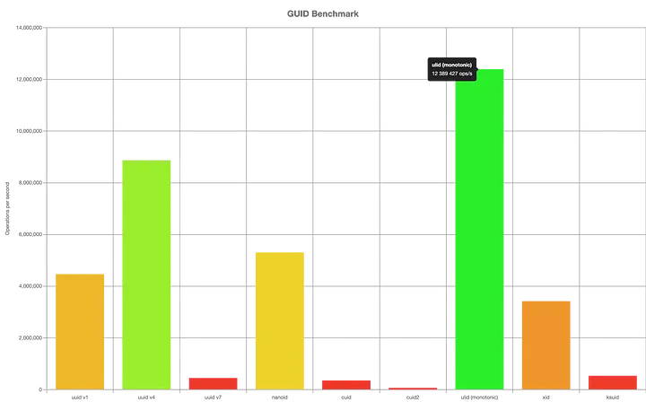

# Globally Unique Identifier a fair comparison


The idea behind this article is to share the little I learned about GUID implementations and provide education to others.

_Disclaimer: Although I carry good security foundations, I am not a cryptography expert, please take this data with a grain of salt and build your own opinions._

# Why do you need a GUID?

GUID (Globally Unique Identifier) are generators for identifiers typically used as primary keys in databases. GUID solve problems typically inherent to three tiers architectures, more precisely:

1. **Scalability** — growing hardware vertically has its limits, soon or later multiple instances are required to sustain the load. Centralized id generators have a significant (negative) impact on performance. GUID typically allow distributing generators across multiple instances.
2. **Resilience** — the ability to run multiple instances of a generator is a great way to improve its availablity and avoid a single point of failure.
3. **Security** — sequences are trivial to predict, in a distributed world different sources of entropy are used to guarantee uniqueness via a random, difficult to predict (long) string.

# How are GUID different from DB SEQUENCES?

_Sequences is a RDBMS centric solution to ease primary key generation._


Sequences vs GUID

Sequence were great for a single database supporting an internal application to local users. Nowadays, OLTP data is secured, distributed, scalable and exposed to the world. These is still place for them in a DWH or other data OLAP storages.

_Since this article is about GUID I wont’ extend more on this topic, I added a great article —_ [_The hidden dangers of numerical IDs_](https://infosecwriteups.com/how-this-easy-vulnerability-resulted-in-a-20-000-bug-bounty-from-gitlab-d9dc9312c10a)

# What are the categories of GUID?

There are mainly two categories of GUIDs: **Opaque** and **time-based**. Time based GUID trade a few bits of entropy to encode a date, they are therefore more efficient to index at the cost of a shorter randomness range.


Opaque vs Time-based GUID

# Features, Benefits & Shortcomings

The table below provides a comprehensive comparison between the major GUID implementations.


GUID Comparison table, _Please_ [_click on this link for the full version_](.\GUID Comaprison.oda)

# Benchmark

_Disclaimer, these benchmark are performed against a given architecture (JavaScript/Arm), different implementations/runtimes will likely give different results._
```
Platform info:  
\==============  
  Darwin 22.2.0 arm64  
  Node.JS: 18.12.1  
  V8: 10.2.154.15\-node.12  
  CPU: Apple M1 Pro × 8  
  Memory: 16 GB  
​  
Running "GUID Benchmark" suite...  
Progress: 100%  
​  
uuid v1:  
  4 460 889 ops/s, ±0.57%   | 63.99% slower  
​  
uuid v4:  
  8 870 032 ops/s, ±0.54%   | 28.41% slower  
​  
uuid v7:  
  443 205 ops/s, ±0.82%     | 96.42% slower  
​  
nanoid:  
  5 300 343 ops/s, ±0.48%   | 57.22% slower  
​  
cuid:  
  347 037 ops/s, ±1.15%     | 97.2% slower  
​  
cuid2:  
  60 490 ops/s, ±0.52%       | slowest, 99.51% slower  
​  
ulid (monotonic):  
  12 389 427 ops/s, ±0.64%   | fastest  
​  
xid:  
  3 417 174 ops/s, ±0.41%   | 72.42% slower  
​  
ksuid:  
  532 223 ops/s, ±1.02%     | 95.7% slower  
​  
Finished 9 cases!  
Fastest: ulid (monotonic)  
Slowest: cuid2
```



# Thoughts beyond theory

_At this point you should have a pretty good idea of the different implementations and how they compare. Let us add some context..._

## Are CSPRNG implementations broken?

Some were, others are, mostly in (old) browsers.

Remember that, even if ID generation takes place **server side,** where implementations are more stable and uniform: **you must be vigilant**. [Here](https://v8.dev/blog/math-random) is a security post on the topic regarding NodeJS (2015).

## Is Randomness a pledge for security?

Machines run algorithms that approximate randomness by selecting algorithms and trusted entropy sources. A cryptographically secure pseudo-random number generator (CSPRNG) is a algorithm with properties that make it suitable for use in cryptography. On Linux for instance, the kernel gathers noisy data from various devices and transfers them to an internal pool of entropy.

Unfortunate, not all cryptography stacks are equal. For instance, old versions of CSPRNG are famous for their poor implementations in JavaScript or PHP. Algorithms such as SHA1 also proved to be unsecured but are still used today in some GUID generators.

While ensuring that a GUID generator is cryptography certified is important, **an ID is nothing in view of a proper security architecture.**

## What are the odds of a collisions?

The answer depends on the use case and the specifics of a GUID implementation

With that said, the advertised Math is probably not a good reflection of reality: In an application, a GUID is used to create a multitude of different entities. These entities by definition do not overlap with one another and are therefore in their own _space_, further reducing the chances of collisions.

## Is there a risk to leak the id generation date?

It all depends on _requirements_.

**From a legal standpoint**, some will argue that the ID generation date is PII data. While this classification could not be validated, a lawyer friend of mine found the argument difficult to defend in a court without considering the complete architecture.

**From a security standpoint**, very unlikely but it depends on your use case. Zendesk recently wrote [an article on the topic](https://zendesk.engineering/how-probable-are-collisions-with-ulids-monotonic-option-d604d3ed2de), recommended.

## Is there a way to mitigate security and performance?

There are designs which leverage different GUID implementations where they best fit. For instance, it is common in cloud database nowadays to provide an out of the box time-based guid. if this implementation is not sufficient to satisfy security requirements, the notion of internal and external id can be implemented on entities.


## Is generation performance a key factor?

In complete honesty, it’s probably not. The fact is, in terms of pseudo-random generation, **velocity is generally not a factor of security.** Besides even the slowest implementation still generates ids at 60000 ops/s on a single machine.

# How to choose?

With so many dimensions, what are the points to consider?

1. **entropy length** — this has direct impact on collisions and predictability, I would recommend avoiding anything with an entropy length < 62 bits unless you understand what you are doing.
2. **random generator quality** — not all random generators are made equal, ensure the implementation uses a cryptography secure random. [Do not trust!](https://thenextweb.com/news/google-chromes-javascript-engine-finally-returns-actual-random-numbers) [again DO NOT trust!](https://bugs.chromium.org/p/chromium/issues/detail?id=552749)
3. **scalability** — with so many options available, I would recommend an implementation which can scale horizontally.

The remaining decision points are specific to your requirements.

When ids are stored in a RDBMS database, I had successes with ULID and UUIDv7, for transient ids typically stored in memory or in the browser, I would recommend nanoid.

# Conclusion

We reached the end of this article. We learned that picking the right GUID flavor depends entirely on your requirements. You should be vigilent to the constraints of your specific use case, the data being leaked (if any), the CSPRNG implementation it uses or if you plan to store it as a primary key.

If you are still stuck on the UUID vs Sequence as primary key, I added an excellent article in the appendix sections below. In the end it’s (Security, Scalability & Resilience) vs Performance.

# Appendix

## Articles of interests

- [From UUID to ULID, be prepared](https://darkghosthunter.medium.com/laravel-you-can-now-use-uuid-and-ulid-4ce9d3792fcb#:~:text=While%20an%20ULID%20compatible%20with,for%20your%20database%2C%20be%20prepared.)
- [New UUID formats](https://www.ietf.org/archive/id/draft-peabody-dispatch-new-uuid-format-04.html#name-uuid-version-6)
- [CUID2](https://github.com/paralleldrive/cuid2)
- [Identity Crisis: Sequence v. UUID as Primary Key](https://brandur.org/nanoglyphs/026-ids)
- [The hidden dangers of numerical IDs](https://infosecwriteups.com/how-this-easy-vulnerability-resulted-in-a-20-000-bug-bounty-from-gitlab-d9dc9312c10a)

## _Definitions_

_This section helps clarify some of the terms used in this document._

Collisions

A hash collision is a random match in hash values that occurs when a hashing algorithm produces the same hash value for two distinct pieces of data.

Coordination

The communication between the different elements of a complex activity so as to enable them to work together effectively.

Entropy

In Cryptography, refers to the randomness collected by a system for use in algorithms that require random seeds. (jargon word for “randomness”)

Monotonic

A monotonic generator ensures ids are always sorted in order. This term is particularly relevant to date based guid generators which are based on time. For a given instance, at instant T, the next id should always be sorted.

Opaque

An opaque identifier is one that doesn’t expose its inner details or structure.

Pagination

Pagination is a process that is used to divide a large data into smaller discrete pages. Commonly used in customer facing applications, pagination requires the notion of pointers on the dataset.

Predictable

A random number generator is predictable if, after observing some of its “random” output, we can make accurate predictions about what “random values” are coming up next.

Randomness

Randomness (entropy) is the cornerstone of cryptography. The more random the numbers, the more secure the cryptographic system. The challenge then, becomes one of generating true randomness.