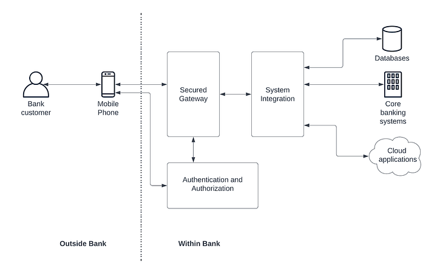
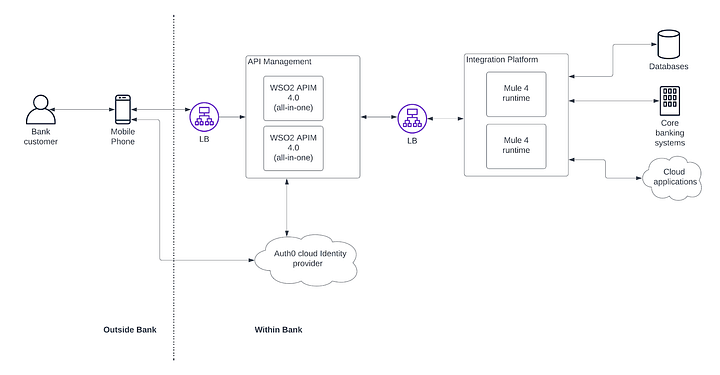

# What is Solution Architecture

An informal introduction to Solution Architecture

## Introduction

The term Solution Architecture refers to a high-level blueprint of a solution that was developed to solve one or more business problems within an enterprise using a technological approach. Building a proper solution architecture requires

- A good understanding of the business problem or problems (domain knowledge)
- Comprehensive knowledge of the technologies used in the enterprise world (technical knowledge)
- Experience in building similar solutions in the past (experience)

A good solution architecture can be used to perform critical tasks such as

- Designing and implementing innovative solutions for the consumers of the business
- Maintain excellent user experience with higher degrees of service availability
- Perform calculations on return on investment (ROI) and total cost of ownership (TCO)

Solution architecture tries to compact a gigantic set of details into a set of diagrams so that different stakeholders understand what is actually going on inside the enterprise software systems. It is helpful for highly technical people such as software developers, software architects, and CTOs as well we moderately technical people such as project managers, business analysts, and citizen developers.

## Types of architectures in solution architecture

The first step in solving any problem is understanding the business requirements of the client. To include all the critical information related to the business use case, we can come up with something called a “business architecture” which contains different types of applications, users, and their interactions at a very high level. We sometimes call this architecture “Level 0” architecture.

### Business architecture (Level-0 architecture)

The idea of business architecture is to come up with a possible solution to a real-world problem or problems and depict that in the form of a diagram or a document using the systems, applications, and users that are considered in the scenario with minimum technical details. This component is mainly useful for business executives and other non-technical stakeholders so that they can understand what technical solution is going to be built using this architecture. Given below is a “business architecture” diagram that we came up with for a mobile banking application.

Figure: The business architecture of a mobile banking application

The preceding figure depicts the various components associated with the solution in which we are building a mobile banking application for a given bank. It showcases the components such as gateway, integration, and security component as high-level building blocks to design a solution for this problem.

The next step in designing the solution architecture is to use this and design a technical architecture with the finer details about products and tools.

### Technical architecture (Level-1 architecture)

This is the type of diagram that includes details of specific vendors, products, and tools required to build a real-world software system using the business architecture blueprint. Coming up with a technical architecture requires the proper analysis of vendors and tools as well as the current and future business requirements and TCO/ROI calculations. The below diagram depicts a simplified version of a technical architecture for the business architecture we discussed before.

Figure: Technical architecture of a mobile banking solution

In this diagram, we have mentioned the specific vendors that we are going to use to fulfill the certain functionalities that we identified during the business architecture design phase. As an example, the diagram depicts that we are going to use the WSO2 API Manager solution as the API gateway which exposes the services to the mobile application. Similarly, it shows that we are going to use Mulesoft and Auth0 for respective functionalities. In addition to that, we can also depict information about which cloud platforms and container technologies we are going to use if we decided to go with a container-based solution.

Once the product vendors and tools are identified, the next step is to go further down into the actual deployment details and showcase the infrastructure level details that can be used by the developers as well as the operations teams to build the actual infrastructure for the solution.

### Deployment architecture (Level-2 architecture)

This architecture diagram showcases how the technical architecture looks like in a real computing infrastructure such as a data center or a cloud platform. It contains details on network-level segmentation, the number of replicas (instances), traffic routing components such as load balancers or firewalls, and many other details related to the actual deployment of the solution. The figure below depicts a simplified version of a deployment architecture that we can come up with for the mobile banking solution that we discussed before.

Figure: Deployment architecture for mobile banking solution

The preceding figure depicts the product versions, the number of replicas, and the deployment model of each component along with the traffic routing components (load balancers).