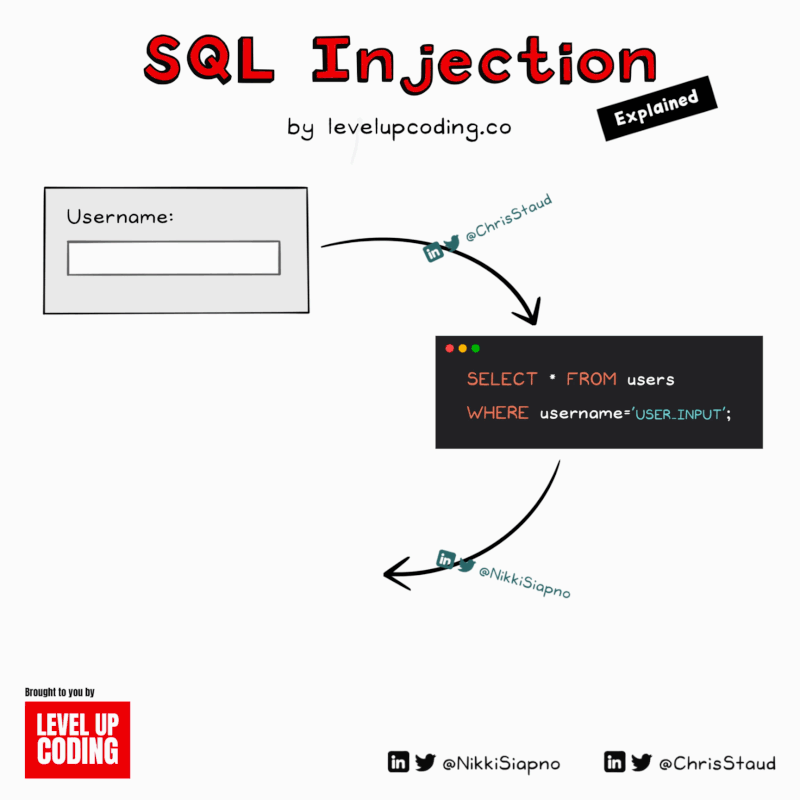

𝗛𝗼𝘄 𝗦𝗤𝗟 𝗶𝗻𝗷𝗲𝗰𝘁𝗶𝗼𝗻𝘀 𝘄𝗼𝗿𝗸, 𝗮𝗻𝗱 𝗵𝗼𝘄 𝘁𝗼 𝗽𝗿𝗼𝘁𝗲𝗰𝘁 𝘆𝗼𝘂𝗿 𝘀𝘆𝘀𝘁𝗲𝗺 𝗳𝗿𝗼𝗺 𝘁𝗵𝗲𝗺:  
  
SQL injection is a type of attack where the attacker runs damaging SQL commands by inserting malicious SQL code into an application input field or URL.  
  
For example, imagine an app that returns all your information after logging in.  
  
That query may look like the following:  
  
SELECT \* FROM users  
WHERE username = 'USER\_INPUT';  
  
If an attacker were to submit a malicious input, the query could change to the following:  
  
SELECT \* FROM users  
WHERE username = '' OR '1'='1';  
  
This query will return all users as '1'='1' will always return true.  
  
𝗬𝗼𝘂 𝗰𝗮𝗻 𝗽𝗿𝗼𝘁𝗲𝗰𝘁 𝘆𝗼𝘂𝗿 𝘀𝘆𝘀𝘁𝗲𝗺 𝗳𝗿𝗼𝗺 𝗦𝗤𝗟 𝗶𝗻𝗷𝗲𝗰𝘁𝗶𝗼𝗻 𝗯𝘆 𝗱𝗼𝗶𝗻𝗴 𝘁𝗵𝗲 𝗳𝗼𝗹𝗹𝗼𝘄𝗶𝗻𝗴:  
  
𝟭. 𝗨𝘀𝗲 𝗽𝗿𝗲𝗽𝗮𝗿𝗲𝗱 𝘀𝘁𝗮𝘁𝗲𝗺𝗲𝗻𝘁𝘀 𝗼𝗿 𝗽𝗮𝗿𝗮𝗺𝗲𝘁𝗲𝗿𝗶𝘇𝗲𝗱 𝗾𝘂𝗲𝗿𝗶𝗲𝘀:  
  
User input cannot be executed because prepared statements and parameterized queries ensure a distinct separation between user input and SQL code.  
  
𝟮. 𝗩𝗮𝗹𝗶𝗱𝗮𝘁𝗲 𝗮𝗻𝗱 𝗰𝗹𝗲𝗮𝗻 𝗶𝗻𝗽𝘂𝘁𝘀:  
  
Use expected formats and constraints to validate user input, and clean inputs to get rid of characters that may be interpreted as SQL code.  
  
𝟯. 𝗙𝗼𝗹𝗹𝗼𝘄 𝘁𝗵𝗲 𝗹𝗲𝗮𝘀𝘁 𝗽𝗿𝗶𝘃𝗶𝗹𝗲𝗴𝗲 𝗽𝗿𝗶𝗻𝗰𝗶𝗽𝗹𝗲:  
  
Limit the permissions for database accounts used by applications and services to only what is required for their functionality. This limits the system's vulnerability to SQL injection attacks.  
  
𝟰) 𝗦𝗲𝘁 𝗪𝗲𝗯 𝗔𝗽𝗽𝗹𝗶𝗰𝗮𝘁𝗶𝗼𝗻 𝗙𝗶𝗿𝗲𝘄𝗮𝗹𝗹𝘀 (𝗪𝗔𝗙)  
  
By setting up WAFs, common threats and attacks from HTTP/S traffic like SQL injections can be identified and blocked before they ever reach your application.

