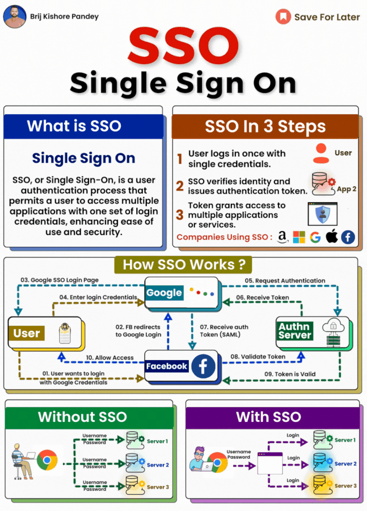

Single Sign-On (SSO) has become an essential part of managing user access in modern IT environments. With SSO, users can access multiple applications with one set of login credentials. This improves security and convenience for end users.  
  
Here's a quick overview of how SSO works:  
  
\- An organization sets up an SSO server that acts as an identity provider. This server manages user credentials and authentication. Popular SSO solutions include Okta, OneLogin, and PingIdentity.  
  
\- Applications that want to use SSO are set up as service providers. They connect to the SSO server to validate user logins.  
  
\- When a user logs into the SSO server, they are authenticated and an encrypted token is generated.  
  
\- When the user tries to access a connected application, they are redirected to the SSO server. If valid, the SSO server sends the encrypted token to the application.  
  
\- The application decrypts the token to validate the user's identity. The user is logged in without needing to re-enter credentials.  
  
\- The token usually includes user attributes like name, email, roles etc. So the application can provision access without separate user setup.  
  
Key benefits of SSO:  
  
\- Convenience for end users with one set of credentials  
\- Increased security with centralized authentication  
\- Quick access to new applications without re-registration  
\- Automated provisioning based on user attributes  
  
SSO has become a must-have for security and productivity. It reduces password fatigue while allowing IT teams to easily control user access. Implementing a robust identity provider enables seamless sign-on across all applications.

