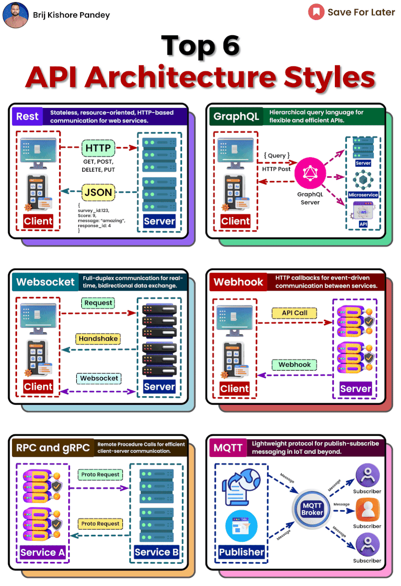

# Top API architectural Styles

# Knowing when to use the right API architecture is crucial for any tech pro.  
  
Let's quickly cover the top styles:  
  
## REST

Leverages HTTP methods like GET and POST. Uses JSON and stateless calls. Ideal for most web APIs.  
  
## GraphQL

Clients query exactly the data they need. Single endpoint flexibly handles requests. Great for complex, evolving APIs.  
  
## WebSocket

Opens a persistent, bi-directional connection enabling real-time data flow. Perfect for chat apps and live updates.  
  
## Webhook

User-defined callbacks enable event-driven behavior. Used to connect and extend platforms.  
  
## RPC/gRPC

Directly call procedures on servers. gRPC adds efficiency and streaming over HTTP/2.  
  
## MQTT

Pub/sub messaging for IoT and unreliable networks. Decouples systems and ensures delivery.  

## Summary
  
Choosing the right style comes down to factors like use case, data needs, and scalability requirements.  
  
REST works great for basic CRUD APIs while GraphQL shines for complex queries.  
  
WebSockets enable real-time apps and MQTT is optimized for IoT messaging.

