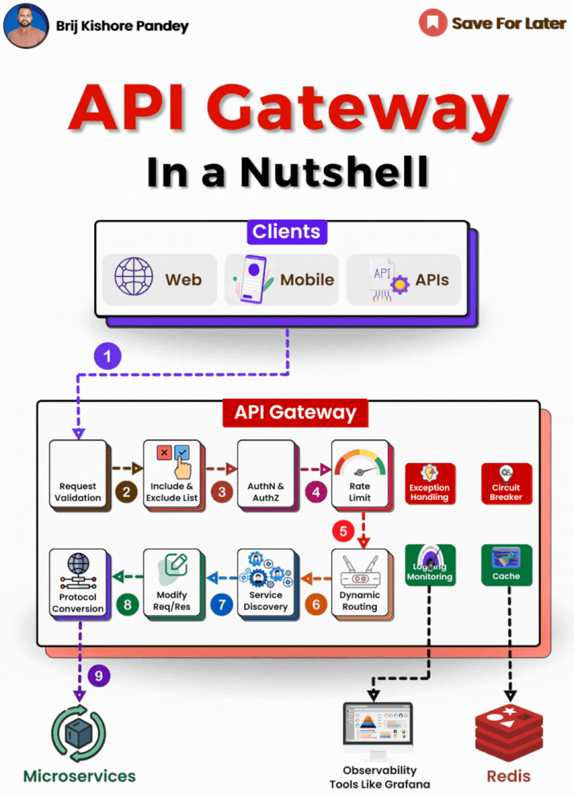

API Gateway: A Deeper Technical Dive  
  
1\. Routing and Request Aggregation:  
API Gateways play a crucial role in handling requests by routing them to the appropriate microservices. For example, if you have separate services for user authentication, product information, and order management, the API Gateway will direct requests to these services based on the request path or other criteria. Furthermore, it can aggregate results from multiple services into a single response to streamline client-side processing.  
  
2\. Load Balancing and Service Discovery:  
In a microservices architecture, a single service might be running on multiple instances for load distribution and redundancy. An API Gateway often includes a load balancer to distribute incoming requests evenly across these instances. It also integrates with service discovery mechanisms to route requests to available service instances dynamically.  
  
3\. Security:  
API Gateways enhance security in several ways:  
\- 𝗔𝘂𝘁𝗵𝗲𝗻𝘁𝗶𝗰𝗮𝘁𝗶𝗼𝗻 𝗮𝗻𝗱 𝗔𝘂𝘁𝗵𝗼𝗿𝗶𝘇𝗮𝘁𝗶𝗼𝗻: It can enforce authentication and authorization policies, ensuring that only valid and permitted requests reach backend services.  
\- 𝗧𝗵𝗿𝗲𝗮𝘁 𝗣𝗿𝗼𝘁𝗲𝗰𝘁𝗶𝗼𝗻: It acts as a shield against common security threats such as SQL injection, cross-site scripting (XSS), and others by validating request formats and payloads.  
\- 𝗥𝗮𝘁𝗲 𝗟𝗶𝗺𝗶𝘁𝗶𝗻𝗴 𝗮𝗻𝗱 𝗤𝘂𝗼𝘁𝗮𝘀: To protect backend services from being overwhelmed by too many requests, the API Gateway can impose rate limits and quotas on clients.  
  
4\. API Transformation and Orchestration:  
API Gateways can transform requests and responses to and from backend services. This includes transforming protocols (e.g., from HTTP to WebSocket), rewriting request paths, or converting data formats. It can also orchestrate complex service interactions, making it easier to implement composite services or workflows.  
  
5\. Monitoring and Analytics:  
By being the entry point for all service requests, API Gateways are in a prime position to monitor traffic and gather data. They can track metrics such as request count, response times, and error rates, providing valuable insights for performance optimization and capacity planning.  
  
6\. Caching:  
To reduce the load on backend services and improve response times, API Gateways can cache responses. For instance, data that doesn’t change frequently (like product descriptions in a catalog) can be cached at the gateway level.  
  
7\. Version Management and Canary Releases:  
API Gateways facilitate API versioning, allowing clients to use different versions of an API simultaneously. They also support canary releases (gradual rollouts of new features), directing a subset of traffic to new service versions for testing purposes.  
  
The key players in API Gateway Landscape -  
  
1\. AWS API Gateway  
2\. Microsoft Azure API Management  
3\. Google Cloud Endpoints  
4\. Kong  
5\. Apigee  
6\. MuleSoft Anypoint Platform  
7\. NGINX  
8\. Red Hat 3scale

