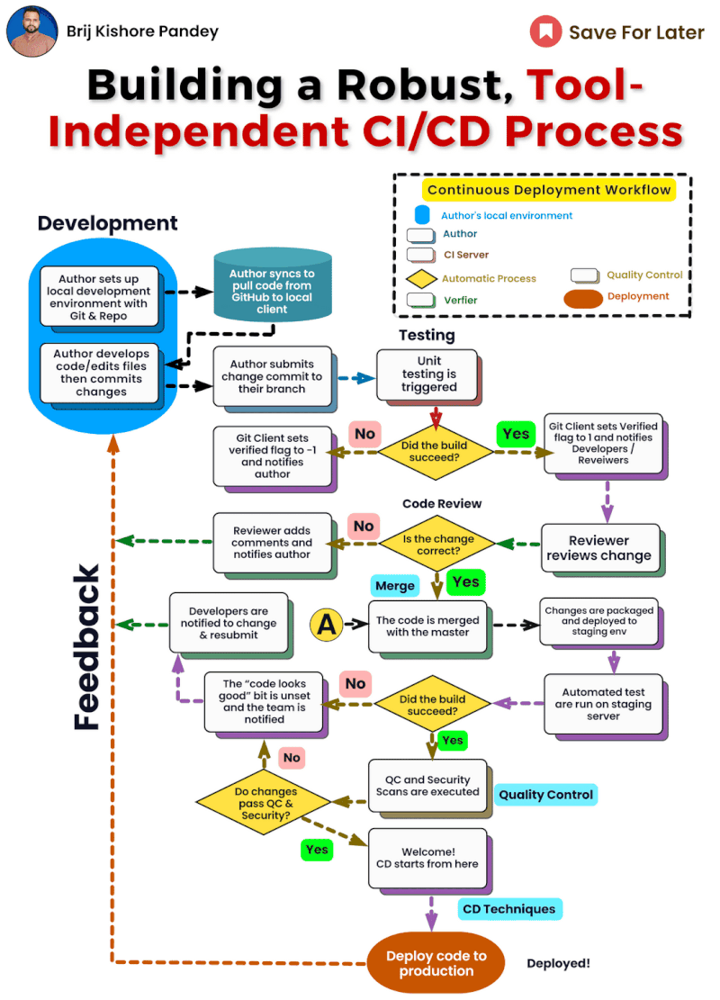

# Tool Agnostic CI/CD: Building Pipelines that Adapt and Thrive 

Here's how you can break free from tool dependence and create a CI/CD pipeline that adapts and thrives:

𝟭. 𝗙𝗼𝗰𝘂𝘀 𝗼𝗻 𝘁𝗵𝗲 𝗣𝗿𝗼𝗰𝗲𝘀𝘀, 𝗡𝗼𝘁 𝘁𝗵𝗲 𝗧𝗼𝗼𝗹𝗯𝗼𝘅:

- Define your 𝗰𝗼𝗿𝗲 𝗖𝗜/𝗖𝗗 𝘀𝘁𝗮𝗴𝗲𝘀: code building, testing, deployment, and monitoring.
- Understand the "𝘄𝗵𝘆" 𝗯𝗲𝗵𝗶𝗻𝗱 𝗲𝗮𝗰𝗵 𝘀𝘁𝗮𝗴𝗲 𝗮𝗻𝗱 𝗶𝘁𝘀 𝗱𝗲𝘀𝗶𝗿𝗲𝗱 𝗼𝘂𝘁𝗰𝗼𝗺𝗲.
- Don't get bogged down in specific tool features; focus on the overall workflow.

𝟮. 𝗘𝗺𝗯𝗿𝗮𝗰𝗲 𝗜𝗻𝗳𝗿𝗮𝘀𝘁𝗿𝘂𝗰𝘁𝘂𝗿𝗲 𝗮𝘀 𝗖𝗼𝗱𝗲 (𝗜𝗮𝗖):

- Use IaC tools like Terraform or Ansible to 𝗱𝗲𝗳𝗶𝗻𝗲 𝗶𝗻𝗳𝗿𝗮𝘀𝘁𝗿𝘂𝗰𝘁𝘂𝗿𝗲 𝗰𝗼𝗻𝗳𝗶𝗴𝘂𝗿𝗮𝘁𝗶𝗼𝗻𝘀 𝗶𝗻 𝗰𝗼𝗱𝗲.
- This makes your pipeline 𝗽𝗼𝗿𝘁𝗮𝗯𝗹𝗲 𝗮𝗻𝗱 𝗶𝗻𝗱𝗲𝗽𝗲𝗻𝗱𝗲𝗻𝘁 𝗼𝗳 𝘀𝗽𝗲𝗰𝗶𝗳𝗶𝗰 𝗰𝗹𝗼𝘂𝗱 𝗽𝗿𝗼𝘃𝗶𝗱𝗲𝗿𝘀 𝗼𝗿 𝗽𝗹𝗮𝘁𝗳𝗼𝗿𝗺𝘀.
- Changes are easily tracked and versioned, ensuring consistency and repeatability.

𝟯. 𝗟𝗲𝘃𝗲𝗿𝗮𝗴𝗲 𝗖𝗼𝗻𝘁𝗮𝗶𝗻𝗲𝗿𝘀 𝗳𝗼𝗿 𝗣𝗼𝗿𝘁𝗮𝗯𝗶𝗹𝗶𝘁𝘆:

- Package your applications in containers using Docker or similar technologies.
- Containers run consistently across different environments, making deployment flexible and reliable.
- You can focus on building and testing within containers, independent of the target environment.

𝟰. 𝗣𝗿𝗶𝗼𝗿𝗶𝘁𝗶𝘇𝗲 𝗢𝗽𝗲𝗻 𝗦𝘁𝗮𝗻𝗱𝗮𝗿𝗱𝘀 𝗮𝗻𝗱 𝗔𝗣𝗜𝘀:

- Choose tools that integrate seamlessly with open standards and APIs like Docker Hub or Kubernetes.
- This opens up a wider range of compatible tools and services in the future.
- Avoid vendor lock-in and maintain flexibility to switch tools if needed.

𝟱. 𝗕𝘂𝗶𝗹𝗱 𝗮 𝗦𝘁𝗿𝗼𝗻𝗴 𝗧𝗼𝗼𝗹𝗰𝗵𝗮𝗶𝗻 𝗙𝗼𝘂𝗻𝗱𝗮𝘁𝗶𝗼𝗻:

- Select core tools for specific tasks (e.g., version control, testing frameworks).
- Ensure they are widely adopted and have strong communities for support and updates.
- Choose tools with good documentation and active development to future-proof your pipeline.

𝟲. 𝗙𝗼𝘀𝘁𝗲𝗿 𝗮 𝗖𝘂𝗹𝘁𝘂𝗿𝗲 𝗼𝗳 𝗘𝘅𝗽𝗲𝗿𝗶𝗺𝗲𝗻𝘁𝗮𝘁𝗶𝗼𝗻:

- Don't be afraid to try different tools and workflows within your tool-agnostic framework.
- Encourage collaboration and knowledge sharing among team members.
- Continuously iterate and refine your pipeline based on results and feedback.

𝗥𝗲𝗺𝗲𝗺𝗯𝗲𝗿: Building a tool-agnostic CI/CD pipeline is not about avoiding tools altogether. It's about 𝘂𝘀𝗶𝗻𝗴 𝘁𝗵𝗲𝗺 𝘀𝘁𝗿𝗮𝘁𝗲𝗴𝗶𝗰𝗮𝗹𝗹𝘆 𝘄𝗶𝘁𝗵𝗶𝗻 𝗮 𝘄𝗲𝗹𝗹-𝗱𝗲𝗳𝗶𝗻𝗲𝗱 𝗳𝗿𝗮𝗺𝗲𝘄𝗼𝗿𝗸. This approach empowers you to adapt to changing technologies, embrace innovation, and build pipelines that deliver true value.

