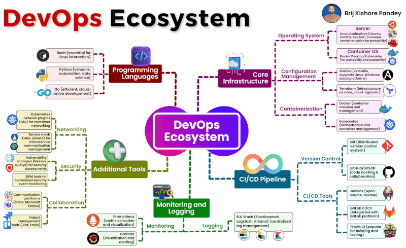

Don't Get Lost in the Tool Box: Focus on the Process!  
  
This infographic is a great starting point, but remember: 𝗶𝘁'𝘀 𝗷𝘂𝘀𝘁 𝗮𝗻 𝗲𝘅𝗮𝗺𝗽𝗹𝗲!  
  
The true essence of becoming an engineer lies in 𝘂𝗻𝗱𝗲𝗿𝘀𝘁𝗮𝗻𝗱𝗶𝗻𝗴 𝗮𝗻𝗱 𝗺𝗮𝘀𝘁𝗲𝗿𝗶𝗻𝗴 𝘁𝗵𝗲 𝗽𝗿𝗼𝗰𝗲𝘀𝘀, not just memorizing specific tools.  
  
Here's why:  
  
Tools are fleeting: Technologies evolve rapidly. What's hot today might be obsolete tomorrow. ️ By focusing solely on tools, you risk becoming outdated and unemployable. ❌  
  
The process is timeless: The core principles of DevOps, like collaboration, automation, and continuous feedback, remain constant.  Mastering these principles allows you to adapt to any toolchain or technology. ️  
  
Become a problem-solver, not a button-pusher: Deep process understanding empowers you to troubleshoot issues effectively, regardless of the specific tools involved. ️‍♀️  
  
𝗥𝗲𝗺𝗲𝗺𝗯𝗲𝗿:  
  
Focus on the "why" behind each tool. What problem does it solve? How does it fit into the overall workflow?  
  
Develop a strong foundation in core DevOps concepts. CI/CD, infrastructure as code, version control - these are your building blocks.  
  
Be adaptable and eager to learn. New tools and technologies will emerge constantly. Embrace them, but never lose sight of the core process.

