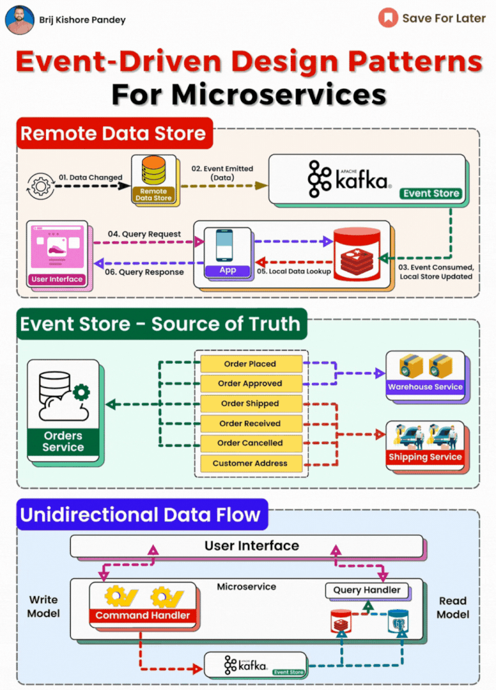

𝗘𝘃𝗲𝗻𝘁-𝗗𝗿𝗶𝘃𝗲𝗻 𝗔𝗿𝗰𝗵𝗶𝘁𝗲𝗰𝘁𝘂𝗿𝗲: 𝗗𝗲𝗳𝗶𝗻𝗶𝘁𝗶𝗼𝗻 𝗮𝗻𝗱 𝗣𝘂𝗿𝗽𝗼𝘀𝗲  
  
Event-Driven Architecture (EDA) is a design paradigm where the flow of the program is determined by events or changes in state. In the realm of microservices, EDA is used to create highly responsive and flexible systems. By decoupling service interactions into asynchronous events, systems can scale more effectively and manage complex workflows.  
  
𝗔𝗽𝗽𝗹𝗶𝗰𝗮𝘁𝗶𝗼𝗻 𝗶𝗻 𝗠𝗶𝗰𝗿𝗼𝘀𝗲𝗿𝘃𝗶𝗰𝗲𝘀  
  
EDA is particularly beneficial in microservices environments where independent services operate in a distributed system. It allows for loosely-coupled interactions, leading to systems that are more resilient to changes and failures.  
  
𝗞𝗲𝘆 𝗖𝗼𝗺𝗽𝗼𝗻𝗲𝗻𝘁𝘀 𝗼𝗳 𝗘𝗗𝗔 𝗶𝗻 𝗠𝗶𝗰𝗿𝗼𝘀𝗲𝗿𝘃𝗶𝗰𝗲𝘀  
  
1\. 𝗥𝗲𝗺𝗼𝘁𝗲 𝗗𝗮𝘁𝗮 𝗦𝘁𝗼𝗿𝗲: This is where the data is stored and is the initiator of change events.  
2\. 𝗘𝘃𝗲𝗻𝘁 𝗘𝗺𝗶𝘀𝘀𝗶𝗼𝗻: When a change occurs in the data store, an event is emitted, capturing the data state change.  
3\. 𝗕𝗿𝗼𝗸𝗲𝗿/𝗔𝗽𝗮𝗰𝗵𝗲 𝗞𝗮𝗳𝗸𝗮: Acts as an intermediary that manages the stream of events, ensuring they're processed and stored reliably.  
4\. 𝗘𝘃𝗲𝗻𝘁 𝗦𝘁𝗼𝗿𝗲: Functions as the ledger of events, holding the history of all state changes in the system.  
5\. 𝗘𝘃𝗲𝗻𝘁 𝗖𝗼𝗻𝘀𝘂𝗺𝗽𝘁𝗶𝗼𝗻: Microservices consume these events to update their local stores and trigger business processes.  
  
𝗛𝗼𝘄 𝗜𝘁 𝗪𝗼𝗿𝗸𝘀  
  
\- Data changes in the remote data store trigger events.  
\- These events are emitted to Kafka, which then forwards them to the event store.  
\- Microservices subscribe to relevant events. When an event is consumed, the microservice updates its local store and carries out any associated business logic.  
\- For read operations, microservices utilize query handlers to retrieve data, which ensures that the read operations are separate from the write operations, aligning with the CQRS pattern.  
  
𝗔𝗱𝘃𝗮𝗻𝘁𝗮𝗴𝗲𝘀 𝗼𝗳 𝗘𝗗𝗔  
  
\- 𝗦𝗰𝗮𝗹𝗮𝗯𝗶𝗹𝗶𝘁𝘆: Services can scale independently based on their individual load.  
\- 𝗥𝗲𝘀𝗶𝗹𝗶𝗲𝗻𝗰𝗲: The system can continue to function even if one or more services are down.  
\- 𝗙𝗹𝗲𝘅𝗶𝗯𝗶𝗹𝗶𝘁𝘆: New services can be added without disrupting existing functionality.  
\- 𝗠𝗮𝗶𝗻𝘁𝗮𝗶𝗻𝗮𝗯𝗶𝗹𝗶𝘁𝘆: Each microservice can be updated or replaced without affecting the rest of the system.

