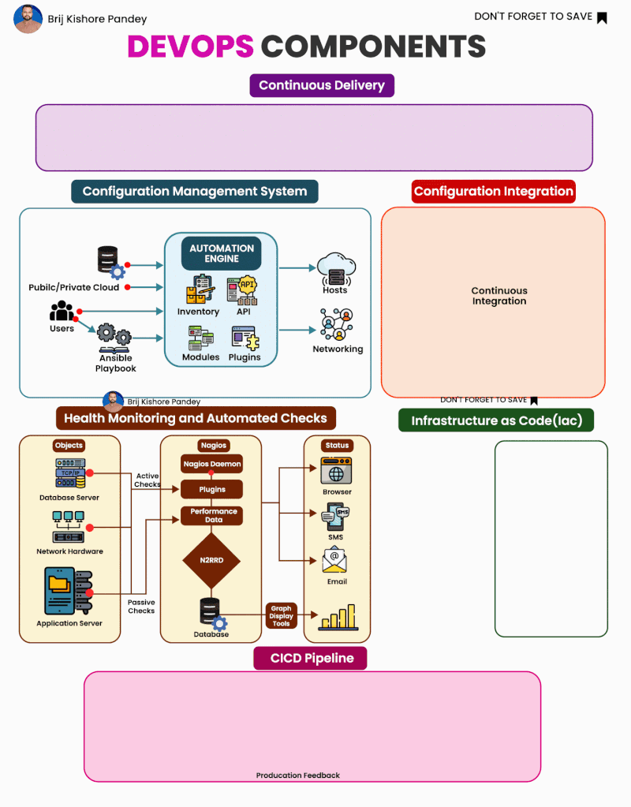

𝗨𝗻𝗱𝗲𝗿𝘀𝘁𝗮𝗻𝗱𝗶𝗻𝗴 𝘁𝗵𝗲 𝟲 𝗘𝘀𝘀𝗲𝗻𝘁𝗶𝗮𝗹 𝗖𝗼𝗺𝗽𝗼𝗻𝗲𝗻𝘁𝘀 𝗼𝗳 𝗗𝗲𝘃𝗢𝗽𝘀: 𝗔 𝗩𝗶𝘀𝘂𝗮𝗹 𝗕𝗿𝗲𝗮𝗸𝗱𝗼𝘄𝗻  
  
DevOps is an essential practice in modern software development, emphasizing collaboration, automation, and continuous improvement.  
  
By dissecting the attached visual, we can highlight six critical components that form the backbone of an effective DevOps environment:  
  
1️⃣ 𝗖𝗼𝗻𝘁𝗶𝗻𝘂𝗼𝘂𝘀 𝗗𝗲𝗹𝗶𝘃𝗲𝗿𝘆: This element ensures that code changes are automatically built, tested, and prepared for a release to production, fostering a faster and more reliable delivery process.  
  
2️⃣ 𝗖𝗼𝗻𝗳𝗶𝗴𝘂𝗿𝗮𝘁𝗶𝗼𝗻 𝗠𝗮𝗻𝗮𝗴𝗲𝗺𝗲𝗻𝘁 𝗦𝘆𝘀𝘁𝗲𝗺: Central to DevOps, this system maintains computer systems, servers, and software in a desired, consistent state. It's the nerve center that enables scalable and manageable technology landscapes.  
  
3️⃣ 𝗖𝗼𝗻𝗳𝗶𝗴𝘂𝗿𝗮𝘁𝗶𝗼𝗻 𝗜𝗻𝘁𝗲𝗴𝗿𝗮𝘁𝗶𝗼𝗻: This process merges development work with the main branch as often as possible, validating each integration with an automated build and test. It's all about keeping the codebase stable and accelerating the development cycle.  
  
4️⃣ 𝗛𝗲𝗮𝗹𝘁𝗵 𝗠𝗼𝗻𝗶𝘁𝗼𝗿𝗶𝗻𝗴 𝗮𝗻𝗱 𝗔𝘂𝘁𝗼𝗺𝗮𝘁𝗲𝗱 𝗖𝗵𝗲𝗰𝗸𝘀: Proactive monitoring tools like Nagios keep tabs on system health and performance, triggering automated checks to ensure everything is running smoothly and efficiently.  
  
5️⃣ 𝗜𝗻𝗳𝗿𝗮𝘀𝘁𝗿𝘂𝗰𝘁𝘂𝗿𝗲 𝗮𝘀 𝗖𝗼𝗱𝗲 (𝗜𝗮𝗖): This paradigm uses machine-readable definition files, rather than manual processes, to manage and provision the IT infrastructure. It ensures the environment is replicable, transparent, and consistent.  
  
6️⃣ 𝗖𝗜/𝗖𝗗 𝗣𝗶𝗽𝗲𝗹𝗶𝗻𝗲: The combination of Continuous Integration (CI) with Continuous Delivery (CD) automates the delivery of applications to various environments, streamlining and speeding up the release process.  
  
Together, these components interlink to create a robust ecosystem that supports the DevOps methodology's goals: accelerating deployments, enhancing reliability, and building a culture of continuous improvement.

