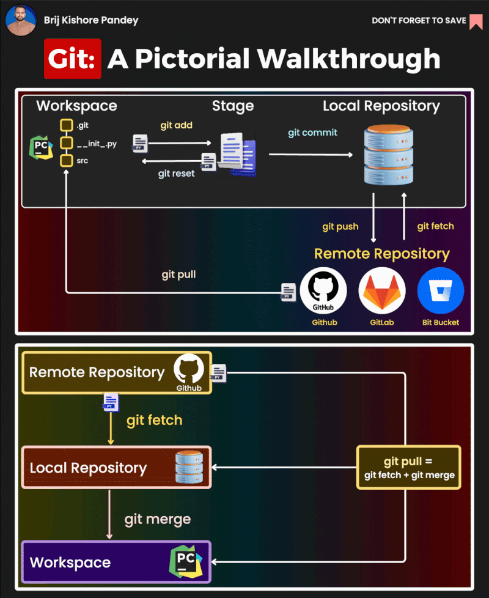
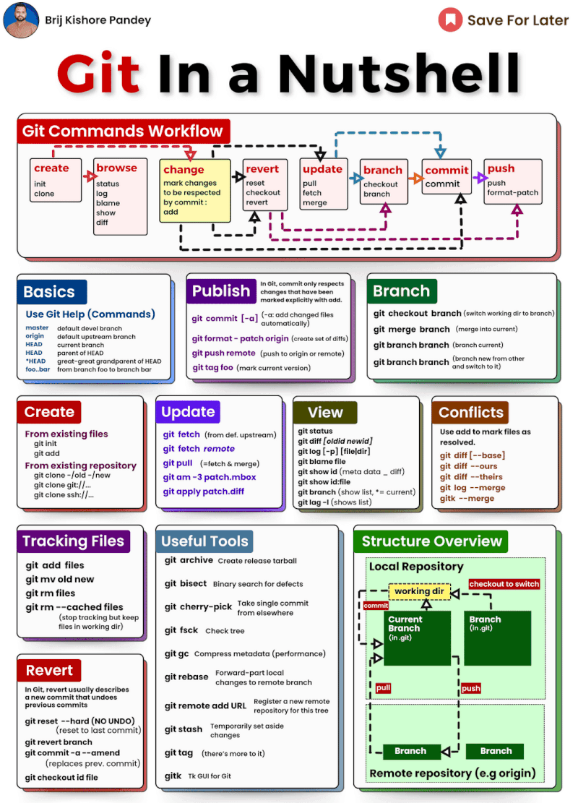
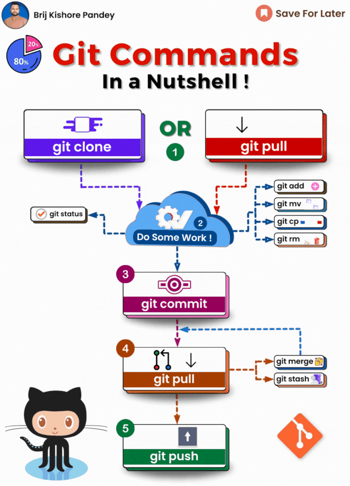
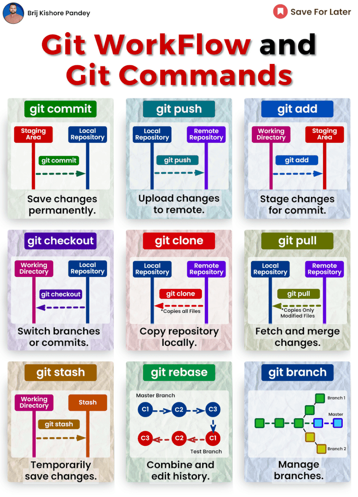

Learning Git for the first time? 

No worries, I'm here to walk you through the basics. 

First things first - let's initialize a new Git repository. Just use 'git init' and Git will set up a repo for you in your current folder. Easy peasy!

Now you'll want to connect your local repo to a remote one, like on GitHub. 'git clone' is your friend here. It'll copy down the remote repo so you have your own local version to work on. 

Made some changes to your files? Use 'git status' to see what's been updated. This helps you keep track of what still needs to be committed.

Ready to commit those changes? First 'git add' the files you want to include. This stages them for committing. 

You can commit all changed files at once with 'git add .' too. Up to you! 

When you're ready, 'git commit' with a message explaining your changes. Now they're safely committed to your local repo.

Working on a new feature? Create a branch with 'git branch' so your changes stay isolated. 

To switch branches, 'git checkout' does the trick. Go back and forth between branches to work on different things!

When you're done with a branch, 'git merge' it back into your main branch to bring the changes together. 

To share your awesome work, 'git push' your commits to the remote repo. This lets others access it.

If others worked on the repo too, 'git pull' to fetch their changes so you stay up to date.

Key concepts:  
  
\- Repository - Where your project files and commit history are stored  
\- Commit - A snapshot of changes, like a version checkpoint  
\- Branch - A timeline of commits that lets you work on parallel versions  
\- Merge - To combine changes from separate branches  
\- Pull request - Propose & review changes before merging branches  
  
Key commands:  
  
\- git init - Initialize a new repo  
\- git status - View changed files not staged for commit  
\- git add - Stage files for commit  
\- git commit - Commit staged snapshot  
\- git branch - List, create, or delete branches  
\- git checkout - Switch between branches  
\- git merge - Join two development histories (branches)  
\- git push/pull - Send/receive commits to remote repo

