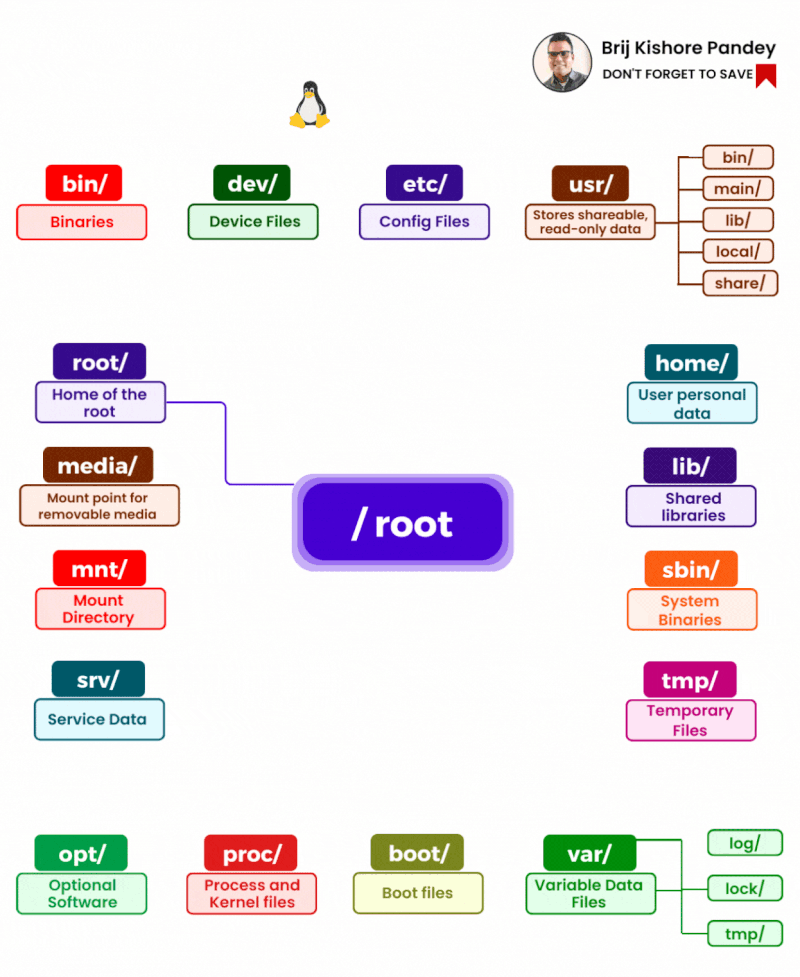

Mastering the Linux file system is an invaluable skill for any IT professional. 

The Linux file system is meticulously organized like a well-structured library, with each directory having a distinct, specific purpose:

/bin - Contains essential user command binaries accessible by all users. 

/sbin - Houses system admin binaries for maintenance and troubleshooting.

/etc - System configuration files act as Linux's control panel. 

/dev - Home to device files like hard disks, USB, CD-ROM, etc. 

/proc - A virtual directory with system and process information.

/var - Stores variable data like logs, mail, print spools, etc.

/tmp - Temporary files created by the system and users. 

/usr - Multi-user utilities, applications, and libraries.

/home - User home directories.

/lib - System libraries needed by the system and users. 

/opt - Optional or third-party software.

/mnt - For mounting temporary file systems.

/media - Temporary mount point for removable devices.

/srv - Server-specific services-related data. 

/boot - Boot loader files.

/root - Home directory for root user.

/run - tmpfs for application information.

/usr/local - User-installed programs from source.

/lib64 - 64-bit library files.

