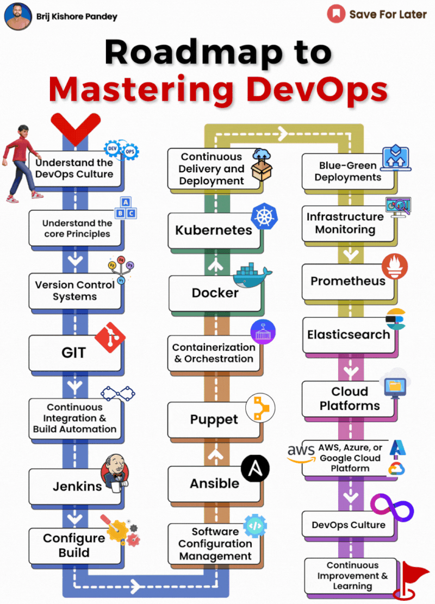

# 𝗠𝗮𝘀𝘁𝗲𝗿𝗶𝗻𝗴 𝗗𝗲𝘃𝗢𝗽𝘀: 𝗔 𝗩𝗶𝘀𝘂𝗮𝗹 𝗚𝘂𝗶𝗱𝗲  
  
This roadmap provides a great introduction to DevOps and the different technologies and concepts you'll need to master. Whether you're a seasoned developer or just starting out in IT operations, this roadmap can help you on your DevOps journey.  
  
## 𝗧𝗵𝗲 𝗕𝗮𝘀𝗶𝗰𝘀  
  
The roadmap starts with the foundational concepts of DevOps, including the DevOps culture, continuous delivery and deployment, and blue-green deployments. It's important to understand these core principles before you dive into the more technical aspects of DevOps.  
  
## 𝗘𝘀𝘀𝗲𝗻𝘁𝗶𝗮𝗹 𝗧𝗲𝗰𝗵𝗻𝗼𝗹𝗼𝗴𝗶𝗲𝘀  
  
Next, the roadmap dives into some of the essential technologies used in DevOps, such as:  
  
Version control systems: Git is the most popular version control system, and it's essential for tracking changes to code and infrastructure.  
  
Containerization and orchestration: Docker and Kubernetes are the leading containerization and orchestration technologies, respectively. They allow you to package applications into portable containers and then deploy and manage them at scale.  
  
Infrastructure monitoring: Prometheus and Elasticsearch are popular tools for monitoring infrastructure performance and health.  
  
Cloud platforms: AWS, Azure, and Google Cloud Platform are the major cloud providers, and they offer a wide range of DevOps tools and services.  
  
Configuration management: Ansible and Puppet are popular tools for managing infrastructure configuration. They allow you to automate the provisioning and configuration of servers and other infrastructure components.  
  
Continuous integration and continuous delivery (CI/CD): Jenkins is a popular CI/CD tool that helps you automate the software build, test, and deployment process.  
  
## 𝗖𝗼𝗻𝘁𝗶𝗻𝘂𝗼𝘂𝘀 𝗜𝗺𝗽𝗿𝗼𝘃𝗲𝗺𝗲𝗻𝘁  
  
The roadmap also emphasizes the importance of continuous improvement and learning. DevOps is a journey, not a destination, so it's important to stay up-to-date on the latest trends and technologies.  

