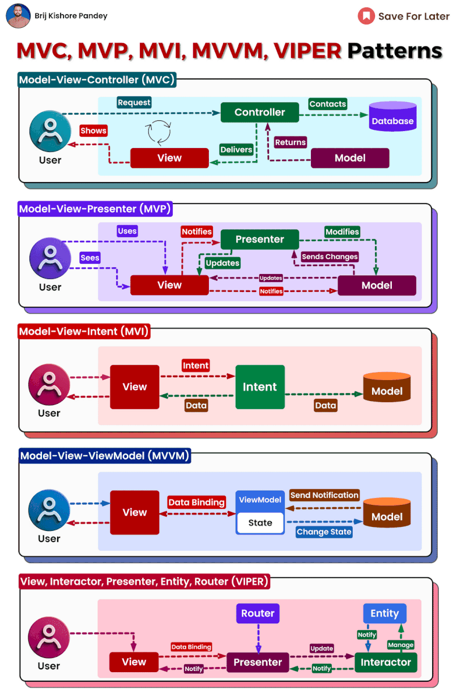

Choosing the right architecture for a software project is crucial to building a maintainable and scalable application. In this post, we will demystify some of the most common software architecture patterns used today - MVC, MVP, MVI, MVVM, and VIPER.  
  
MVC (Model-View-Controller) is one of the oldest and most widely used patterns. It separates concerns into three components - the model holds the data and business logic, the view displays the UI, and the controller handles user input and coordinates the model and view. MVC enables easier code maintenance by decoupling the UI from the business logic.  
  
MVP (Model-View-Presenter) is similar to MVC but has a presenter that mediates communication between the view and model. The presenter contains all the business logic, unlike in MVC where it's split between the controller and model. MVP provides better isolation and testability.  
  
MVI (Model-View-Intent) focuses on unidirectional data flow. The view emits intents to the model which processes them and returns new states. This pattern has a predictable data flow and is great for managing complex state. However, it can have a high learning curve.  
  
MVVM (Model-View-ViewModel) builds on MVC and MVP by abstracting the view with a view model that exposes data and commands. The view binds to the view model observables. MVVM enables declarative UIs and is popular for cross-platform dev. But data flows can be harder to trace.  
  
VIPER (View-Interactor-Presenter-Entity-Router) further modularizes MVP by splitting responsibilities. Each component has clear roles making VIPER scalable but complex. It shines for large codebases but involves more files and classes.  
  
  
𝗕𝘂𝘁 𝘄𝗵𝗶𝗰𝗵 𝗽𝗮𝘁𝘁𝗲𝗿𝗻 𝗿𝗲𝗶𝗴𝗻𝘀 𝘀𝘂𝗽𝗿𝗲𝗺𝗲?  The answer, like any good recipe, depends on the ingredients (your project's needs)! Consider factors like:  
  
Project size and complexity: For smaller projects, MVC might suffice. For larger ones, MVVM or VIPER offer better scalability.  
  
Development team experience: If your team is comfortable with reactive programming, MVI could be a good fit.  
  
Testing requirements: VIPER shines in testability, while MVC might require more effort.  
  
𝗥𝗲𝗺𝗲𝗺𝗯𝗲𝗿, 𝘁𝗵𝗲 𝗯𝗲𝘀𝘁 𝗽𝗮𝘁𝘁𝗲𝗿𝗻 𝗶𝘀 𝘁𝗵𝗲 𝗼𝗻𝗲 𝘁𝗵𝗮𝘁 𝗲𝗺𝗽𝗼𝘄𝗲𝗿𝘀 𝘆𝗼𝘂𝗿 𝘁𝗲𝗮𝗺 𝘁𝗼 𝗯𝘂𝗶𝗹𝗱 𝗺𝗮𝗶𝗻𝘁𝗮𝗶𝗻𝗮𝗯𝗹𝗲, 𝘀𝗰𝗮𝗹𝗮𝗯𝗹𝗲, 𝗮𝗻𝗱 𝘁𝗲𝘀𝘁𝗮𝗯𝗹𝗲 𝘀𝗼𝗳𝘁𝘄𝗮𝗿𝗲. ️

