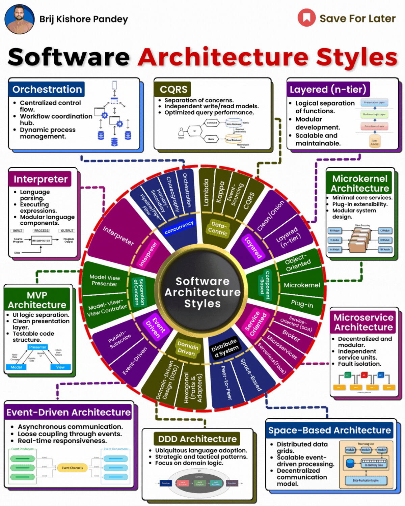

The architecture of a software system is crucial to its success  
  
The architectural style provides a blueprint for how the system is structured and how its components interact.  
  
Choosing the right style can lead to software that is scalable, maintainable, and adaptable to change. Understanding architectural styles is key for any software professional.  
  
Architectural styles emerged in the late 1960s as a way to manage complexity and tame "software crises."  
  
Early styles like structured programming enforced discipline in code.  
  
Later styles like object-oriented programming focused on modeling real-world entities.  
  
Styles evolved to enable distributed systems and microservices.  
  
Some influential architectural styles include:  
  
\- Layered architecture separates concerns into hierarchical layers like presentation, business logic, and data access. This is a tried and true way to structure applications.  
  
\- Event-driven architecture has become popular for highly scalable apps. Components publish and react to events from other components asynchronously.  
  
\- Microkernel architecture minimizes shared core software and implements other functionality in external modules. This provides flexibility.  
  
\- Space-based/actor model architecture implements objects/actors that communicate via asynchronous messaging. This is ideal for concurrent distributed systems.  
  
In 2024, architectural trends focus on scaling, resilience, and flexibility:  
  
\- Serverless architectures using cloud services like AWS Lambda scale automatically without provisioning servers.  
  
\- Mesh app architectures build on a distributed data layer so features can be added without monolithic rewrites.  
  
\- Integrating event streaming and Complex Event Processing (CEP) enables real-time response to diverse events.  
  
\- Using reactive principles and non-blocking communication facilitates resilience and elasticity.  
  
The architecture of complex modern software requires creative solutions.  
  
Understanding architectural styles equips software leaders to make optimal technical decisions as demands evolve.  
  
While foundational styles remain relevant, new innovations enable transformative capabilities.

