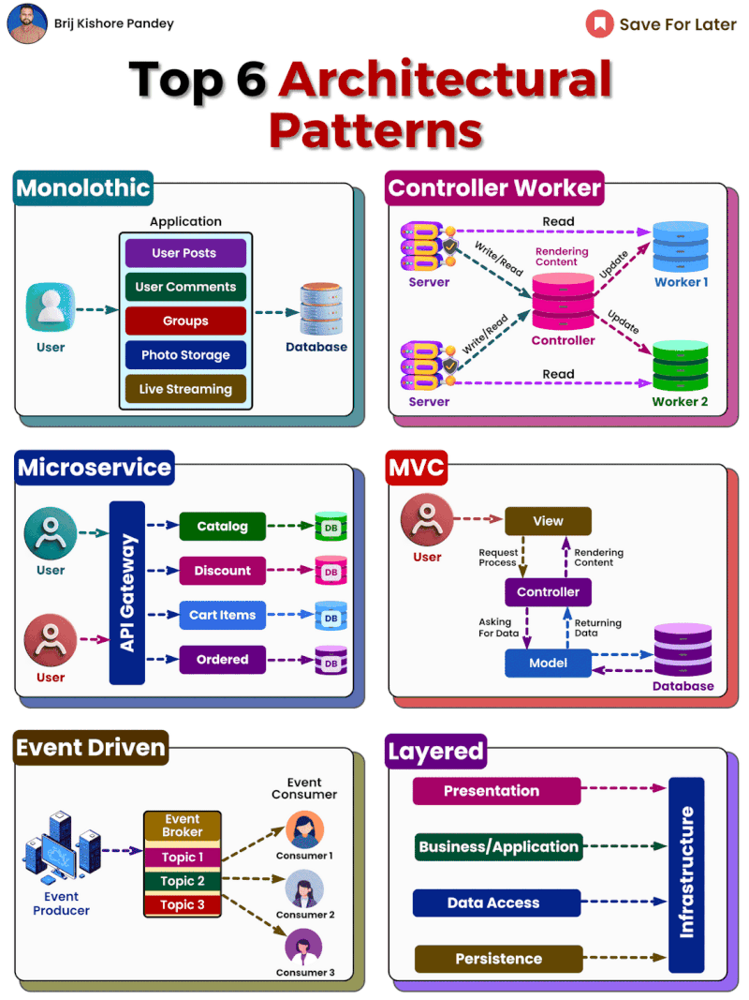

Choosing the right software architecture is crucial for building scalable, maintainable, and secure applications.  
  
The architecture provides the high-level blueprint for how components and data flow through a system.  
  
While there are many architectural patterns, some of the most common include:  
  
Monolithic - This traditional pattern builds the application as a single unified unit. It's simple to develop and test, but lacks flexibility to scale.  
  
Microservices - The app is split into independent modules that communicate via APIs. This promotes loose coupling and scalability, but adds complexity.  
  
MVC - The classic model-view-controller pattern separates data (model), UI (view), and logic (controller). It makes Web apps testable and maintainable.  
  
Event-Driven - Components react to events triggered through a message broker. This enables asynchronous processing but can be hard to debug.  
  
Layered - Code is organized into layers of responsibility. This encourages modularity but can reduce performance.  
  
Controller - Worker : A variation on monolithic where a controller server manages read/write operations and worker handle read-only tasks. This can improve scalability for read-heavy applications.  
  
When evaluating architectures, consider factors like performance, scalability, security, and team skills.  
  
For example, monoliths can work well for simple apps where scalability isn't a concern. Microservices make sense for large systems needing independent scaling.  
  
Blending patterns is also an option.  
  
Many apps use a hybrid approach, like MVC controllers with microservices for specific subsystems.  
  
There is no "one size fits all" solution.  
  
The best architecture depends on your specific goals and constraints.  
  
Understanding the trade-offs helps guide your decision and set up the project for success.

