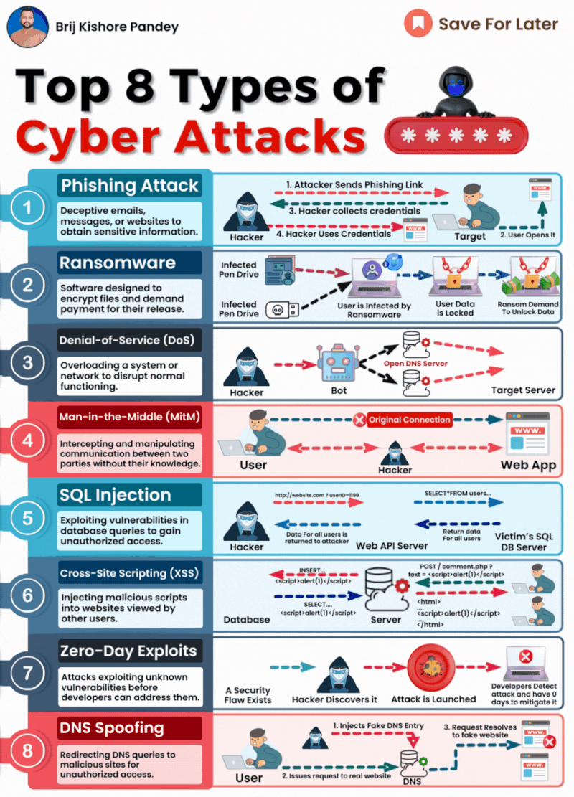

As technology underpins nearly every aspect of business today, basic cybersecurity knowledge is an essential skill for all IT professionals.  
  
Understanding core security concepts allows IT teams to effectively safeguard their organizations.  
  
Being well-versed in core concepts is crucial for identifying and mitigating risks that could severely impact organizations.  
  
Key areas IT professionals should grasp:  
  
\- Phishing - Recognizing phishing scams can prevent costly data breaches that damage reputations.  
  
\- Ransomware - Knowledge of ransomware tactics ensures business continuity and protects against financial losses.  
  
\- Denial-of-Service (DoS) - Understanding DoS attacks helps maintain service availability, critical for customer trust.  
  
\- Man-in-the-Middle (MitM) - MitM attack awareness safeguards confidential communications vital for internal and client interactions.  
  
\- SQL Injection - Expertise in preventing SQL injection protects database integrity, often the backbone of digital infrastructure.  
  
\- Cross-Site Scripting (XSS) - For web developers, awareness of XSS threats is essential for application integrity and trust.  
  
\- Zero-Day Exploits - Knowing potential zero-day exploits encourages proactive security and constant vigilance.  
  
\- DNS Spoofing - Grasping DNS spoofing risks prevents misdirection leading to data theft and unauthorized access.  
  
As IT professionals, we have a responsibility to understand and mitigate these top cyber risks to safeguard our digital ecosystem.  
  
Ongoing education in this crucial discipline is key to our success.

