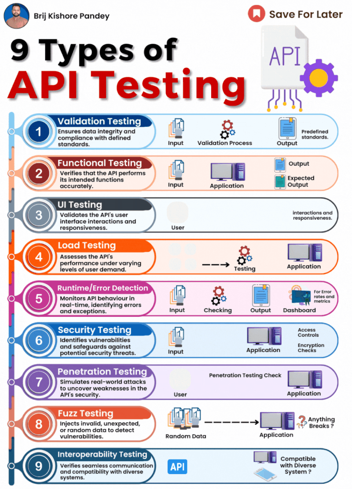

# 𝟵 𝗧𝘆𝗽𝗲𝘀 𝗼𝗳 𝗔𝗣𝗜 𝗧𝗲𝘀𝘁𝗶𝗻𝗴 𝘁𝗼 𝗘𝗻𝘀𝘂𝗿𝗲 𝗥𝗼𝗯𝘂𝘀𝘁 𝗮𝗻𝗱 𝗦𝗲𝗰𝘂𝗿𝗲 𝗔𝗣𝗜𝘀

APIs are the backbone of modern software development, enabling seamless communication between different applications and services. But just like any other software component, APIs need thorough testing to guarantee reliability, performance, and security. 

This post delves into the nine crucial types of API testing you should consider:

1. 𝗩𝗮𝗹𝗶𝗱𝗮𝘁𝗶𝗼𝗻 𝗧𝗲𝘀𝘁𝗶𝗻𝗴: Ensures data integrity and adherence to predefined standards. Imagine it as checking your ID before entering a building – you need to meet the criteria.

2. 𝗙𝘂𝗻𝗰𝘁𝗶𝗼𝗻𝗮𝗹 𝗧𝗲𝘀𝘁𝗶𝗻𝗴: Verifies that the API performs its intended functions accurately. Think of it as testing different functionalities of a vending machine to ensure it dispenses the correct product and amount.

3. 𝗨𝗜 𝗧𝗲𝘀𝘁𝗶𝗻𝗴: Validates the API's user interface interactions and responsiveness. This is like testing the buttons and display of the vending machine to ensure they work smoothly.

4. 𝗟𝗼𝗮𝗱 𝗧𝗲𝘀𝘁𝗶𝗻𝗴: Assesses the API's performance under varying levels of user demand. Imagine simulating a rush of people trying to use the vending machine at the same time to see if it can handle the load.

5. 𝗥𝘂𝗻𝘁𝗶𝗺𝗲/𝗘𝗿𝗿𝗼𝗿 𝗗𝗲𝘁𝗲𝗰𝘁𝗶𝗼𝗻: Monitors API behavior in real-time, identifying errors and exceptions. This is like having a security guard monitoring the vending machine for any malfunctions or suspicious activity.

6. 𝗦𝗲𝗰𝘂𝗿𝗶𝘁𝘆 𝗧𝗲𝘀𝘁𝗶𝗻𝗴: Identifies vulnerabilities and safeguards against potential security threats. Think of it as penetration testing the vending machine to ensure no one can tamper with it or steal your snacks.

7. 𝗣𝗲𝗻𝗲𝘁𝗿𝗮𝘁𝗶𝗼𝗻 𝗧𝗲𝘀𝘁𝗶𝗻𝗴: Simulates real-world attacks to uncover weaknesses in the API's security. Imagine a hacker trying to exploit the vending machine's security flaws to get free snacks.

8. 𝗙𝘂𝘇𝘇 𝗧𝗲𝘀𝘁𝗶𝗻𝗴: Injects invalid, unexpected, or random data to detect vulnerabilities. This is like throwing weird objects into the vending machine to see if it crashes or dispenses something unexpected.

9. 𝗜𝗻𝘁𝗲𝗿𝗼𝗽𝗲𝗿𝗮𝗯𝗶𝗹𝗶𝘁𝘆 𝗧𝗲𝘀𝘁𝗶𝗻𝗴: Verifies seamless communication and compatibility with diverse systems. Imagine ensuring the vending machine works with different payment methods and currencies.

