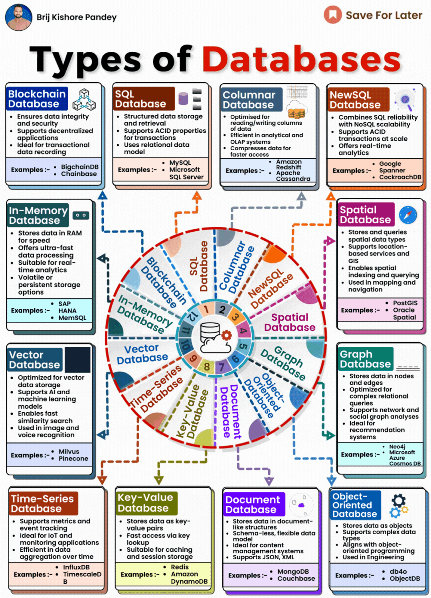

# Types of Databases 

Understanding database options is key for any tech professional. Let's explore the main database types and their best uses:  
  
## Relational Databases (RDBMS)  
  
The most common type, including MySQL, Oracle, SQL Server. Organize data into tables with defined relations. Great for complex queries and ensuring data integrity. Used for most business applications.  
  
## NoSQL Databases  
  
Non-relational databases like MongoDB and Cassandra. Flexible schemas, handle unstructured data. Faster performance for large amounts of data. Used for big data, content management, and real-time apps.  
  
## Graph Databases  
  
Store data in nodes and relationships like Neo4j. Optimal for networked data and social relationships. Used for fraud detection, recommendations, and knowledge graphs.  
  
## Time Series Databases  
  
Optimized for timeseries data that is timestamped and sequenced like InfluxDB. Used for IoT, DevOps, and sensor data analytics.  
  
## Object Databases  
  
Store data as objects like db4o. Useful for working with media files, search engines, and engineering design systems.  
  

