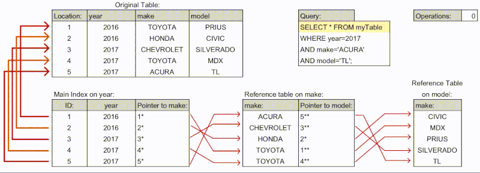

Imagine managing a large-scale database:

Database Size: 𝟱𝟬𝟬 𝗚𝗕
Average Query Search Time Without Index: 𝟱 𝘀𝗲𝗰𝗼𝗻𝗱𝘀
Number of Records: 𝟱𝟬 𝗺𝗶𝗹𝗹𝗶𝗼𝗻

𝗟𝗲𝘁'𝘀 𝗱𝗶𝘃𝗲 𝗶𝗻𝘁𝗼 𝘁𝗵𝗲 𝘄𝗼𝗿𝗹𝗱 𝗼𝗳 𝗗𝗮𝘁𝗮𝗯𝗮𝘀𝗲 𝗜𝗻𝗱𝗲𝘅𝗶𝗻𝗴:

1️⃣ 𝗪𝗵𝗮𝘁 𝗶𝘀 𝗗𝗮𝘁𝗮𝗯𝗮𝘀𝗲 𝗜𝗻𝗱𝗲𝘅𝗶𝗻𝗴?

A database index is like a book index, helping you find data faster than scanning the entire database.

2️⃣ 𝗧𝘆𝗽𝗲𝘀 𝗼𝗳 𝗜𝗻𝗱𝗲𝘅𝗲𝘀:

• B-Tree Index: Balanced tree structure, great for a range of querying.
• Hash Index: Best for equality comparisons.
• Composite Index: Combines multiple columns for multi-column queries.
• Bitmap Index: Ideal for columns with few distinct values.
• Clustered Index: Stores data rows in the table based on their key values.
• Non-Clustered Index: Contains data pointers to the data rows.
• Partial Index: Indexes a subset of the table, useful for large tables.
• Covering Index: Includes all the columns required for a query.
• Spatial Index: Used for geographical data.
• Full-Text Index: Designed for text-based searches in string columns.
  
3️⃣ 𝗜𝗺𝗽𝗹𝗲𝗺𝗲𝗻𝘁𝗶𝗻𝗴 𝗮 𝗕-𝗧𝗿𝗲𝗲 𝗜𝗻𝗱𝗲𝘅:

Let's say you create an index on the 'user_id' column.
Index Size: Approximately 10% of the data size (50 GB).

4️⃣ 𝗣𝗲𝗿𝗳𝗼𝗿𝗺𝗮𝗻𝗰𝗲 𝗔𝗻𝗮𝗹𝘆𝘀𝗶𝘀:

Before Indexing: Full table scan for queries.
After Indexing: Direct navigation to relevant data points.
Average Search Time After Indexing: Reduced to 0.5 seconds.
Performance Improvement: 90%

𝗦𝗰𝗲𝗻𝗮𝗿𝗶𝗼-𝗕𝗮𝘀𝗲𝗱 𝗨𝗻𝗱𝗲𝗿𝘀𝘁𝗮𝗻𝗱𝗶𝗻𝗴:

➡️ 1. How does indexing affect Insert, Update, Delete operations?

Each operation requires the index to be updated.
Insert: Slight slowdown as the index needs to be updated.
Update/Delete: Depends on whether the indexed column is affected.

➡️ 2. When should you avoid indexing a column?

Columns with a lot of duplicate values.
Columns that are not often used in search conditions.

➡️ 3. How to decide which columns to index?

Analyze query patterns; prioritize columns used in WHERE clauses.

➡️ 4. How does indexing affect storage?

Additional storage is required for indexes (10% increase in this scenario).

➡️ 5. Can indexing solve all performance issues?

Not always. It's crucial for queries but doesn't replace good database design and query optimization.

