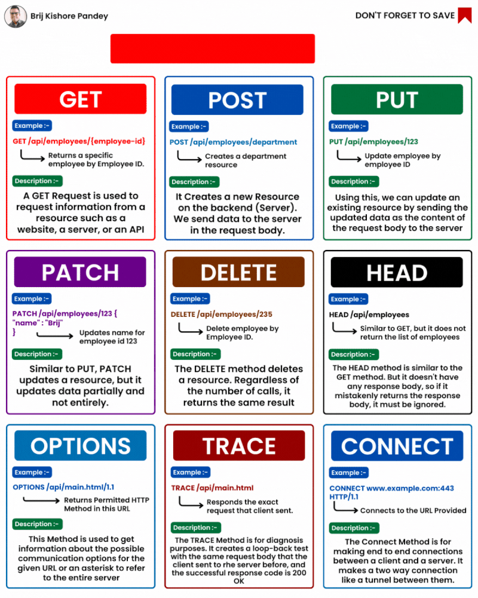

Although most people only use GET, POST, PUT, and DELETE when working with HTTP, there are actually 39 different actions, or "verbs", in the official list.  
  
  
In this post, we'll look at 9 of the most popular ones.  
  
1️⃣ GET Method: Gets data from a server.  
  
2️⃣ POST Method: Sends data to a server to create something new.  
  
3️⃣ PUT Method: Changes something that's already on a server.  
  
4️⃣ PATCH Method: Changes part of something on a server.  
  
5️⃣ DELETE Method: Removes something from a server.  
  
6️⃣ HEAD Method: Gets information about something on a server.  
  
7️⃣ OPTIONS Method: Tells you how you can interact with something on a server.  
  
8️⃣ TRACE Method: Shows the path of communication between you and the server.  
  
9️⃣ CONNECT Method: Makes a special kind of connection to a server.

