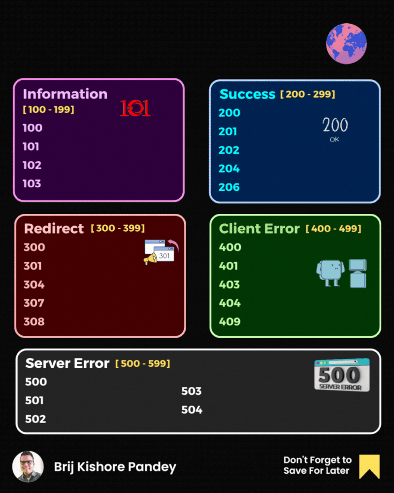

HTTP status codes are like short notes that servers pass to your browser - tiny but mighty messages that tell you what's happening behind the scenes.  
  
Let's take a look at some of the most important ones! 🗝️  
  
🔹 𝟮𝟬𝟬 𝗢𝗞 - The gold standard! It means "All is well" and your request was successful. This little number is the thumbs-up you're always hoping for.  
  
🔹 𝟯𝟬𝟭 𝗠𝗼𝘃𝗲𝗱 𝗣𝗲𝗿𝗺𝗮𝗻𝗲𝗻𝘁𝗹𝘆 - This is the web's way of saying, "We've moved, but don't worry, I'll show you where." It's essential for SEO and user experience.  
  
🔹 𝟰𝟬𝟰 𝗡𝗼𝘁 𝗙𝗼𝘂𝗻𝗱 - The infamous! It's like knocking on a door and realizing nobody's home. This tells you that the page you're looking for doesn't exist.  
  
🔹 𝟰𝟬𝟯 𝗙𝗼𝗿𝗯𝗶𝗱𝗱𝗲𝗻 - This is the web's stern "Access Denied" sign. It means you're not allowed to see the content, no matter how much you refresh!  
  
🔹 𝟱𝟬𝟬 𝗜𝗻𝘁𝗲𝗿𝗻𝗮𝗹 𝗦𝗲𝗿𝘃𝗲𝗿 𝗘𝗿𝗿𝗼𝗿 - The SOS signal of HTTP codes. It's a general alert that something has gone wrong on the website's server.  
  
🔹 𝟱𝟬𝟯 𝗦𝗲𝗿𝘃𝗶𝗰𝗲 𝗨𝗻𝗮𝘃𝗮𝗶𝗹𝗮𝗯𝗹𝗲 - Picture a "Closed for Maintenance" sign. This code indicates that the server is temporarily offline, maybe for repairs or upgrades.  
  
Remember, each HTTP status code has a story to tell and a problem to solve.

