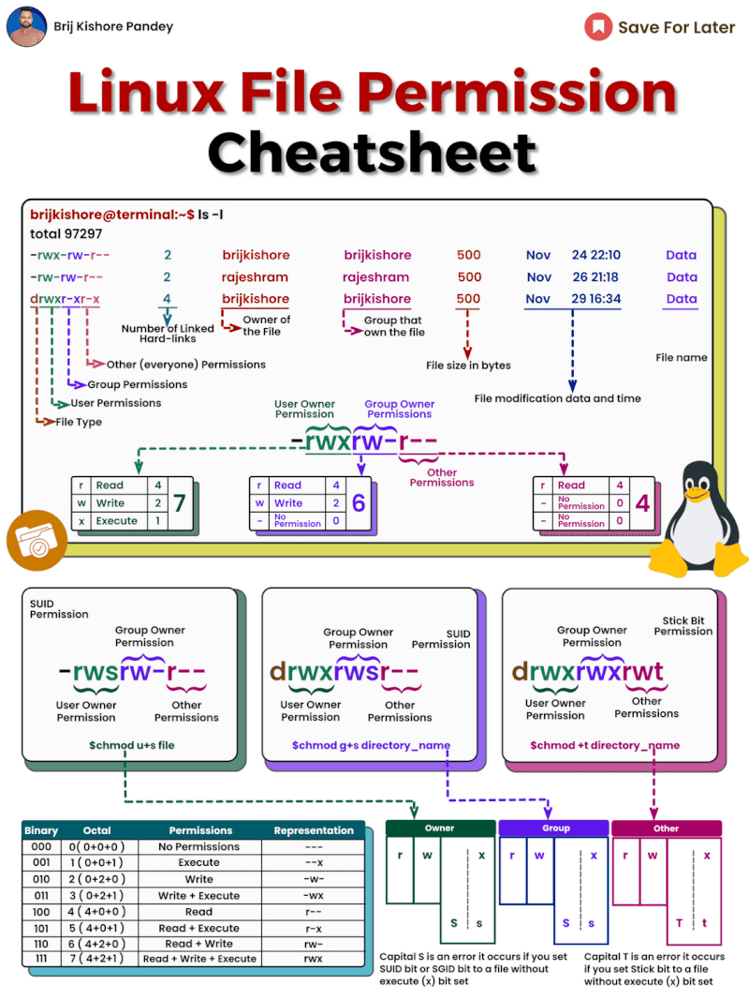

No matter your role in IT, gaining even a basic understanding of Linux is incredibly valuable. It's the driving force behind numerous everyday technologies!  
  
Today, we'll demystify Linux file permissions. While they may seem daunting at first, they're incredibly practical once you understand them.  
  
𝗪𝗵𝗮𝘁 𝗮𝗿𝗲 𝗟𝗶𝗻𝘂𝘅 𝗙𝗶𝗹𝗲 𝗣𝗲𝗿𝗺𝗶𝘀𝘀𝗶𝗼𝗻𝘀?  
  
In Linux, file permissions determine who can read, write, or execute a file. These permissions are categorized as follows:  
  
\- 𝗨𝘀𝗲𝗿 𝗣𝗲𝗿𝗺𝗶𝘀𝘀𝗶𝗼𝗻𝘀: Dictate what actions the file's owner can perform.  
\- 𝗚𝗿𝗼𝘂𝗽 𝗣𝗲𝗿𝗺𝗶𝘀𝘀𝗶𝗼𝗻𝘀: Define what members of the file's group can do.  
\- 𝗢𝘁𝗵𝗲𝗿 𝗣𝗲𝗿𝗺𝗶𝘀𝘀𝗶𝗼𝗻𝘀: Set permissions for all other users.  
  
𝗨𝗻𝗱𝗲𝗿𝘀𝘁𝗮𝗻𝗱𝗶𝗻𝗴 𝘁𝗵𝗲 𝗖𝗵𝗲𝗮𝘁𝘀𝗵𝗲𝗲𝘁  
  
Our cheatsheet presents file permissions in both binary and octal formats. Although the binary format is more intuitive, the octal format is widely used in practice.  
  
To convert from binary to octal, sum the values represented by 'r' (read), 'w' (write), and 'x' (execute) in each set of permissions. For instance, the binary permission 'rwxr-xr-x' translates to the octal permission 755:  
  
\- r = 4 (read)  
\- w = 2 (write)  
\- x = 1 (execute)  
\- - = 0 (no permission)  
  
𝗖𝗼𝗺𝗺𝗼𝗻 𝗙𝗶𝗹𝗲 𝗣𝗲𝗿𝗺𝗶𝘀𝘀𝗶𝗼𝗻𝘀 𝗘𝘅𝗽𝗹𝗮𝗶𝗻𝗲𝗱  
  
\- 𝟳𝟱𝟱: Typical for executables. The owner has full permissions, while group members and others can read and execute.  
\- 𝟲𝟰𝟰: Common for regular files. The owner can read and write, but others can only read.  
\- 𝟳𝟳𝟳: Grants full permissions to everyone. It's generally unsafe and should be used cautiously.  
  
𝗖𝗵𝗮𝗻𝗴𝗶𝗻𝗴 𝗙𝗶𝗹𝗲 𝗣𝗲𝗿𝗺𝗶𝘀𝘀𝗶𝗼𝗻𝘀  
  
Use the 𝚌𝚑𝚖𝚘𝚍 command to modify file permissions. For example:  
  
\- To set permissions to 755: 𝚌𝚑𝚖𝚘𝚍 𝟽𝟻𝟻 𝚖𝚢𝚏𝚒𝚕𝚎  
\- To add execute permission for all: 𝚌𝚑𝚖𝚘𝚍 +𝚡 𝚖𝚢𝚏𝚒𝚕𝚎  
  
Additionally, the 𝚌𝚑𝚖𝚘𝚍 command can be used with symbolic notation, allowing more direct modifications. For instance:  
  
\- To add write permission for the group: 𝚌𝚑𝚖𝚘𝚍 𝚐+𝚠 𝚖𝚢𝚏𝚒𝚕𝚎  
\- To remove execute permission for others: 𝚌𝚑𝚖𝚘𝚍 𝚘-𝚡 𝚖𝚢𝚏𝚒𝚕𝚎  
  
𝗗𝗲𝗰𝗼𝗱𝗶𝗻𝗴 𝗙𝗶𝗹𝗲 𝗦𝘆𝘀𝘁𝗲𝗺 𝗜𝗻𝗳𝗼𝗿𝗺𝗮𝘁𝗶𝗼𝗻  
  
\- 𝗙𝗶𝗹𝗲 𝗧𝘆𝗽𝗲 𝗜𝗻𝗱𝗶𝗰𝗮𝘁𝗼𝗿: The first character indicates the file type (e.g., '-' for a regular file, 'd' for a directory).  
\- 𝗡𝘂𝗺𝗯𝗲𝗿 𝗼𝗳 𝗟𝗶𝗻𝗸𝘀: Shows the count of hard links to the file.  
\- 𝗢𝘄𝗻𝗲𝗿 𝗮𝗻𝗱 𝗚𝗿𝗼𝘂𝗽 𝗡𝗮𝗺𝗲𝘀: Identify the file's owner and the group.  
\- 𝗙𝗶𝗹𝗲 𝗦𝗶𝘇𝗲: Displays the size of the file in bytes.  
\- 𝗦𝗽𝗲𝗰𝗶𝗮𝗹 𝗣𝗲𝗿𝗺𝗶𝘀𝘀𝗶𝗼𝗻𝘀: Symbols like 's' or 't' represent special permissions, such as executing a file with the owner's privileges.

