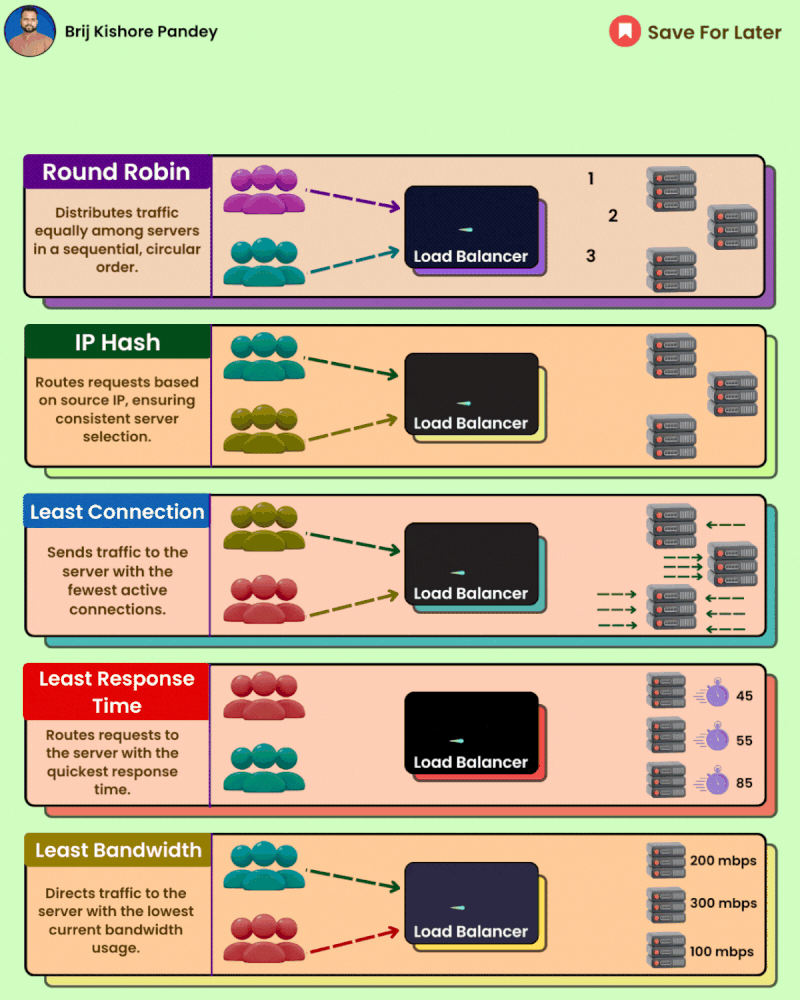

Load balancing distributes incoming requests across multiple servers, ensuring optimal performance, availability, and scalability.

But with so many methods, choosing the right one can be tricky.

𝗛𝗲𝗿𝗲'𝘀 𝗮 𝗯𝗿𝗲𝗮𝗸𝗱𝗼𝘄𝗻 𝗼𝗳 𝘁𝗵𝗲 𝘁𝗼𝗽 𝟱 𝗰𝗼𝗻𝘁𝗲𝗻𝗱𝗲𝗿𝘀:

𝟭. 𝗥𝗼𝘂𝗻𝗱 𝗥𝗼𝗯𝗶𝗻: The OG of load balancing, it sends requests in a circular fashion, ensuring everyone gets a turn. Think of it as a classroom attendance sheet – fair and simple!

𝟮. 𝗜𝗣 𝗛𝗮𝘀𝗵: This method assigns requests to a specific server based on the client's IP address. It's like having a personalized queue – users connect with the same server each time, building a rapport (and potentially faster response times).

𝟯. 𝗟𝗲𝗮𝘀𝘁 𝗖𝗼𝗻𝗻𝗲𝗰𝘁𝗶𝗼𝗻: Don't overload the busy servers! This method directs requests to the server with the fewest active connections, spreading the workload evenly. Imagine a buffet line – everyone heads to the shortest queue.

𝟰. 𝗟𝗲𝗮𝘀𝘁 𝗥𝗲𝘀𝗽𝗼𝗻𝘀𝗲 𝗧𝗶𝗺𝗲: Need lightning-fast responses? This method prioritizes the server with the quickest response time, ensuring users don't wait in laggy purgatory. Think of it as a VIP lane for the speediest servers.

𝟱. 𝗟𝗲𝗮𝘀𝘁 𝗕𝗮𝗻𝗱𝘄𝗶𝗱𝘁𝗵: Bandwidth hogging servers? Not on our watch! This method sends traffic to the server with the lowest current usage, optimizing bandwidth allocation. It's like a traffic cop directing cars to the least congested lanes.

𝗕𝘂𝘁 𝗿𝗲𝗺𝗲𝗺𝗯𝗲𝗿, 𝘁𝗵𝗲𝗿𝗲'𝘀 𝗻𝗼 𝗼𝗻𝗲-𝘀𝗶𝘇𝗲-𝗳𝗶𝘁𝘀-𝗮𝗹𝗹 𝘀𝗼𝗹𝘂𝘁𝗶𝗼𝗻! The best method depends on your specific needs and traffic patterns. Consider factors like:

𝗧𝗿𝗮𝗳𝗳𝗶𝗰 𝘃𝗼𝗹𝘂𝗺𝗲: How much traffic are you expecting?
𝗦𝗲𝗿𝘃𝗲𝗿 𝗰𝗮𝗽𝗮𝗯𝗶𝗹𝗶𝘁𝗶𝗲𝘀: What are your servers' performance limitations?
𝗔𝗽𝗽𝗹𝗶𝗰𝗮𝘁𝗶𝗼𝗻 𝘁𝘆𝗽𝗲: Is your application latency-sensitive?

