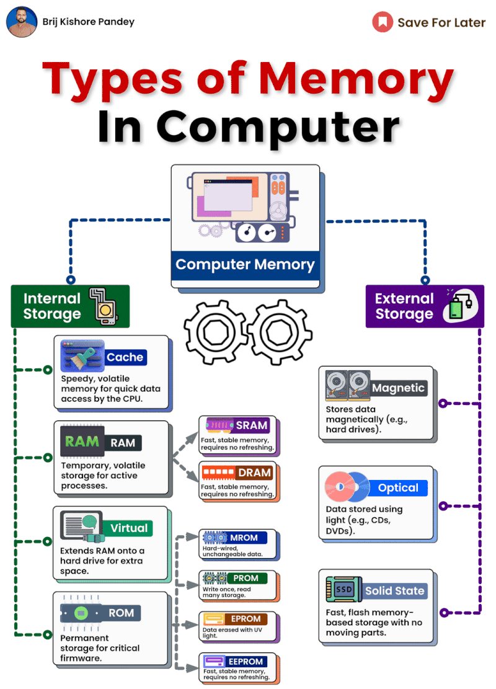

Understanding Computer Memory  
  
RAM - Random Access Memory is considered short-term memory for computers. It temporarily stores data that the CPU needs to access quickly, like programs and files that are currently open. RAM is volatile, meaning it is erased when the computer is powered off. The amount of RAM impacts how many programs can run at once without slowing down.  
  
ROM - Read-Only Memory contains permanent data like instructions needed to boot up the computer and perform diagnostics. This data cannot be modified or erased. ROM chips contain firmware, which provides essential functions.  
  
HDD - Hard Disk Drives offer larger, long-term storage capacity. Data written to a HDD stays there even when powered off. Current PCs have HDDs ranging from 250GB to 2TB. Larger capacity allows you to store more programs, files, music, movies and other data.  
  
SSD - Solid State Drives are faster than HDDs because they contain no moving parts. Information is saved on microchips versus magnetic platters. SSDs have become more affordable and are now commonly used as the primary storage in laptops, tablets and even desktop PCs.  
  
Cache - Cache memory is high-speed memory that temporarily stores data for quick access by the CPU. Level 1 cache is built into the CPU chip, while level 2 may be on a separate chip directly connected to the CPU. Cache improves processing speeds.  
  
USB Flash Drives - These portable solid state drives can store data externally that can be accessed across devices. The plug-and-play functionality makes transferring files easy.  
  
While this may sound basic, refreshing our understanding of the strengths of each memory type helps explain the role they play in computer operations.

