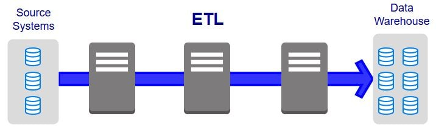

# ETL

Extract, Transform, Load

ETL is short for extract, transform, load, three database functions that
are combined into one tool to pull data out of one database and place it
into another database.

- Extract is the process of reading data from a database. In this
    stage, the data is collected, often from multiple and different
    types of sources.

- Transform is the process of converting the extracted data from its
    previous form into the form it needs to be in so that it can be
    placed into another database. Transformation occurs by using rules
    or lookup tables or by combining the data with other data.

- Load is the process of writing the data into the target database.\
    Data from one or more sources is extracted and then copied to the
    data warehouse. When dealing with large volumes of data and multiple
    source systems, the data is consolidated. ETL is used to migrate
    data from one database to another, and is often the specific process
    required to load data to and from data marts and data warehouses,
    but is a process that is also used to large convert (transform)
    databases from one format or type to another.

    

