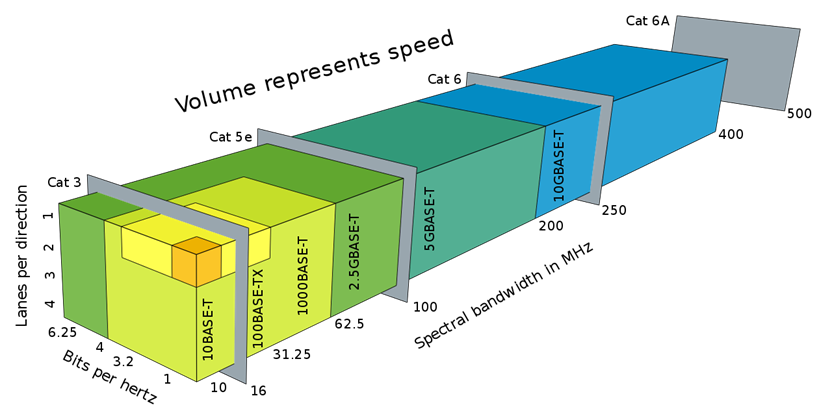

# Ethernet over twisted pair

Ethernet over twisted-pair technologies use twisted-pair cables for the
physical layer of an Ethernet computer network. They are a subset of all
Ethernet physical layers.

Early Ethernet used various grades of coaxial cable, but in 1984,
StarLAN showed the potential of simple unshielded twisted pair. This led
to the development of 10BASE-T and its successors 100BASE-TX, 1000BASE-T
and 10GBASE-T, supporting speeds of 10 and 100 megabit per second, then
1 and 10 gigabit per second respectively.

Two new variants of 10 megabit per second Ethernet over a single twisted
pair, known as 10BASE-T1S and 10BASE-T1L, were standardized in IEEE Std
802.3cg-2019.\[2\] 10BASE-T1S has its origins in the automotive industry
and may be useful in other short-distance applications where substantial
electrical noise is present. 10BASE-T1L is a long-distance Ethernet,
supporting connections up to 1 km in length. Both of these standards are
finding applications implementing the Internet of things.

