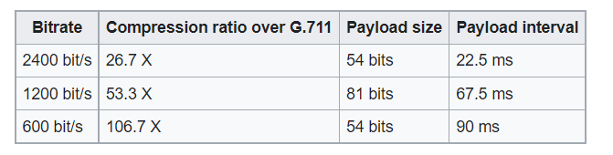

# MELP

Mixed-excitation linear prediction

Mixed-excitation linear prediction (MELP) is a United States Department
of Defense speech coding standard used mainly in military applications
and satellite communications, secure voice, and secure radio devices.
Its standardization and later development was led and supported by NSA,
and NATO.\
Compression level\
MELPe is intended for the compression of speech. Given an audio input
sampled at 8 kHz, the MELPe codec yields the following compression
ratios over a 64 kbit/s μ-Law G.711 datastream, discounting the effects
of protocol overhead:

\
Generally, speech coding involves a trade-off of different aspects
including bit-rate, speech quality, delay (frame size and lookahead),
computational complexity, robustness to different speakers and
languages, robustness to different background noises, channel error
robustness, and also codec state recovery in the face of packet loss.
Since the MELPe's lower rates (600 and 1200 bit/s) are supersets of the
2400 bit/s rate, the algorithm complexity (e.g. in MIPS) is about the
same for all rates. The lower rates use increased frames and lookahead,
as well as codebook size, therefore they require more memory.  

