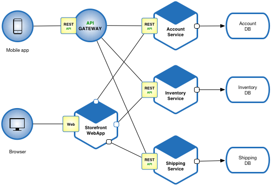

# Microservice

Microservices - also known as the microservice architecture - is an
architectural style that structures an application as a collection of
services that are

- Highly maintainable and testable

- Loosely coupled

- Independently deployable

- Organized around business capabilities.

    The microservice architecture enables the continuous
    delivery/deployment of large, complex applications. It also enables
    an organization to evolve its technology stack.

    

    

