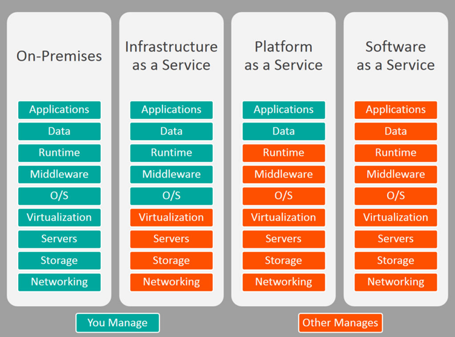

# PaaS

Platform As A Service

Platform as a Service (PaaS) or Application Platform as a Service
(aPaaS) or platform-based service is a category of cloud computing
services that provides a platform allowing customers to develop, run,
and manage applications without the complexity of building and
maintaining the infrastructure typically associated with developing and
launching an app

