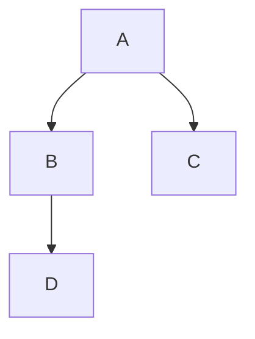

Render PDF from Markdonw that using mermaid
===========================================

You will need:

- [Pandoc](https://pandoc.org/installing.html)

```
sudo apt install pandoc -y
```

- [pandoc mermaid-filter](https://github.com/raghur/mermaid-filter)

```
# Assuming you have nodejs and npm installed
# (I have try to install it with yarn, and failed.)
npm i -g mermaid-filter
```

- `pdflatex` and font, get it from textlive

```
sudo apt-get -y install texlive-latex-recommended \
  texlive-pictures texlive-latex-extra texlive-fonts-recommended
```

After everything installed (assume that `pandoc` and `mermaid-filter` are
available in your `$PATH`)

```
pandoc  -F mermaid-filter -o mermaid-pandoc-guide.pdf \
  mermaid-pandoc-guide.md
```

Note
----

- Pandoc in this setup doens't play well with github code fence. Hence,
  I intentionally omit that.
- Unlike HTML, PDF has fixed witdh, hence, the code is split in multiple line.
- The chart won't look nice on big screen :(

Example graph
-------------


