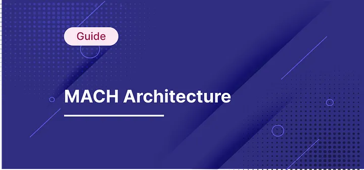
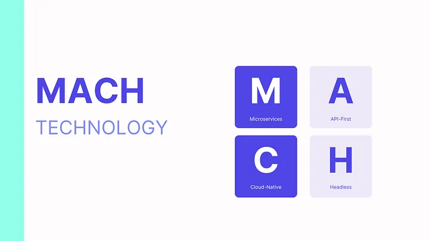
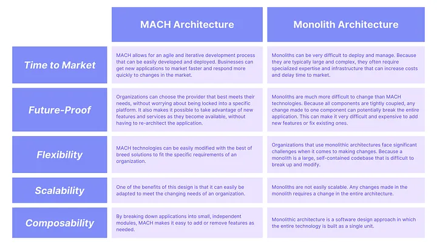
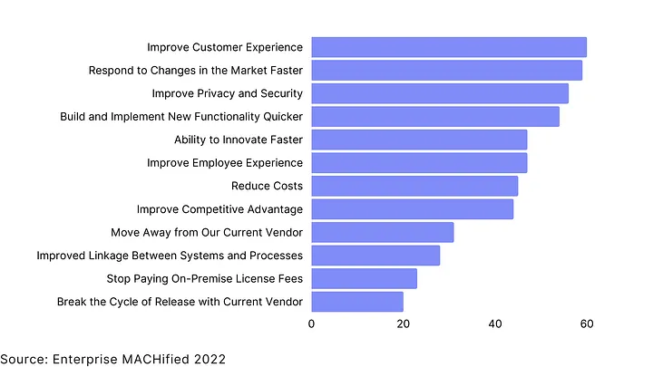

# A Comprehensive Guide to MACH Architecture in 2023

## **MACH: M**icroservices-Based, **A**PI-First, **C**loud-Native, and **H**eadless

In the tech world, change is constant.

Technologies come and go, and what was once cutting-edge is replaced by the new and improved. It’s no secret that the technology landscape is constantly evolving, so it’s important for organizations to plan ahead and stay ahead of the curve.

Then the question is, _how do you stay ahead of the curve when new technologies are introduced daily?_

This is where the **MACH Architecture** comes into the picture. MACH architecture is

- agile
- flexible
- future-proof
- scalable

For all these reasons, it’s no secret that MACH architecture is on the rise. With its growing popularity, many people are curious about MACH architecture and how it works.

In this comprehensive guide, we’ll look at **MACH architecture**, how it works, and what benefits it can offer your business in 2023.

Whether you’re just starting out with MACH architecture or you’re looking to expand your knowledge base, this guide has everything you need to get up to speed.

# What Is MACH Technology?

If you’re not familiar with composable digital experience space, you might ask yourself, ‘what does MACH mean?’ **MACH** is an acronym that stands for:

- **M**icroservices-Based
- **A**PI-First
- **C**loud-Native
- **H**eadless

The **MACH technology** is a powerful approach to software development that focuses on developing microservices-based, API-first, cloud-native applications that are headless. This innovative approach allows developers to create highly scalable, efficient, and flexible applications that can easily adapt to changing business needs.

The MACH technology stems from the principles of agile development, which emphasizes rapid delivery and continuous improvement. By breaking down large applications into smaller modular units called microservices, MACH enables teams to iterate quickly and respond effectively to new requirements or changes in the market.

## Microservices-Based

Microservices is an approach to software development whereby an application is decomposed into a number of small, independently developed, and deployable services.

This approach has a number of benefits over traditional, monolithic development techniques.

Firstly, it enables much greater flexibility in terms of deployment and scalability. Secondly, it allows for greater reuse of code and easier maintenance. Finally, it facilitates a more rapid development cycle as features can be developed and deployed independently of one another.

As a result, microservices-based applications are becoming increasingly popular, particularly in the cloud computing domain.

## API-First

An API-First approach is a strategy for designing and developing software applications in which the application’s programming interface (API) is given priority over other components.

The advantage of this approach is that it allows developers to create an API that can be easily integrated into other software applications, making it easier to share data and functionality between different systems.

In addition, using an API-first approach can also help to ensure that the application’s UI is consistent with the underlying API, making it easier for users to understand and use the application.

## Cloud-Native

The term “Cloud-Native” is used to describe applications that are designed specifically for deployment in the cloud.

Cloud-Native apps are typically built using microservices, which are small, self-contained components that can be deployed and scaled independently. This approach differs from traditional monolithic applications, which are large and complex, with tightly coupled dependencies.

Cloud-native apps are also designed to be highly resilient, with each microservice being independently scalable and replaceable. This approach enables organizations to quickly adapt to changing conditions and ensure that their apps remain available even in the event of an outage.

As the demand for cloud-based applications continues to grow, the need for cloud-native solutions will become increasingly important.

## Headless

Headless architecture is a type of software architecture that decouples the front-end user interface from the back-end logic enabling a framework-agnostic technology structure.

In a headless system, the backend provides an API that delivers content to the frontend. This separation of concerns allows for greater flexibility and scalability.

By decoupling the frontend and backend, developers can more easily make changes to either one without affecting the other. This approach also makes it easier to scale individual components of the system as needed.

# MACH Alliance

The **MACH Alliance** is a global industry consortium of forward-thinking organizations that are committed to driving innovation in the rapidly evolving digital landscape and promoting the development of enterprise technology ecosystems that are open and of the best of the breed.

At its core, MACH Alliance is about educating the industry as a whole on what to watch out for while shifting away from legacy infrastructure and turning composable, and helping businesses stay competitive in an increasingly digital world. By embracing emerging technologies like microservices, MACH members gain a significant edge over their competitors by being able to quickly develop and deliver new products and services to customers at scale.

Overall, MACH Alliance is at the forefront of innovation in the digital space, empowering businesses all around the world to thrive in the age of digital transformation. Whether you’re an established enterprise looking for new ways to build competitive advantage or a startup looking for support and guidance as you navigate the rapidly changing digital landscape.

# MACH Architecture

## What Is MACH Architecture?

The **MACH architecture** is a software architecture that is composed of independent components, meaning it is built from smaller components that can be combined to form a complete system.

This composability allows software systems to be built from interchangeable parts that can be composed into various configurations. The advantage of this approach is that it allows different parts of the system to be continuously improved and optimized for specific purposes, which can lead to better performance and experience overall.

## What Are the Benefits and Advantages of MACH Architecture?

The advantages and benefits of MACH architecture include the following:

**Scalability**

MACH architecture is a type of software architecture that is designed to be scalable. One of the benefits of this design is that it can easily be adapted to meet the changing needs of an organization.

For example, if an organization needs to grow, the MACH technologies can be scaled up to accommodate the additional load.

**Flexibility and Composability (Tailor-Made Architecture )**

Additionally, MACH architecture is also designed to be flexible, meaning that it can be easily modified with the best-of-breed solutions to fit an organization’s specific requirements.

This flexibility makes MACH solutions ideal for organizations that need to respond to changes in their business environment rapidly.

As a result, the MACH technology stack provides organizations with a high degree of scalable and flexible enterprise technologies, making it a popular choice for many businesses.

**Future-Proof**

The need for faster and more efficient data and content processing will only grow as the world becomes increasingly digitized.

MACH ecosystem technologies are designed to meet this demand by providing a scalable and flexible architecture that can be easily adapted to changing needs.

Additionally, the MACH technology stack is also highly future-proof, meaning that it can be used for years to come without becoming outdated. This is due to its modular design, which allows new components to be added as needed.

As a result, businesses investing in MACH-first software can be confident that they are making a sound investment that will pay off for years.

**Faster Time to Market**

MACH architecture is a microservices-based approach that enables organizations to develop and deploy software faster.

By breaking down applications into small, independent services that can be developed and deployed independently, MACH reduces the time it takes to get new features and functionality to market.

In addition, because MACH services are loosely coupled, they are easier to change and update, reducing the risk of errors and making it easier to roll out new features and functionality quickly and efficiently.

As a result, MACH can help organizations to achieve faster time-to-market, increased agility, and better overall software quality.

## Challenges About MACH Architecture

The MACH architecture has been widely increasing its adoption in recent years as a future-proof, high-performance alternative to traditional architectures. However, MACH architectures are not without their challenges:

- **What you see is NOT what you get.**
- **Coordination problems between software providers.**
- **Lack of collaboration between business and development teams.**

## Traditional (Monolith) Architecture vs. MACH Architecture

Digital experience platforms are powerful tools to create, manage, and organize customer expectations. However, monolith architectures have some serious limitations in meeting evolving business requirements.

The problem is that most monolith architectures don’t offer the flexibility or features for the upcoming needs of business functionality. MACH architecture is a perfect solution for businesses looking to get the most out of their digital experience efforts.

## Adoption of MACH Architecture and MACH Technologies

The [study](https://machalliance.org/insights/our-2022-research-shows-mach-adoption-is-high-on-the-agenda-for-tech-leaders), published in March 2022, surveyed over 200 senior-level technology decision-makers from companies around the world to gauge awareness and adoption of MACH technology.

The findings of the ‘Enterprise MACHified’ are a strong indication that MACH is gaining momentum in the market and is poised to have a significant impact on the enterprise software landscape.

- Decision makers put a high value on offering superior CX quickly in the face of rapidly growing expectations.
- The move to MACH is being driven by CX, market developments, and privacy/security concerns.
- MACH’s motivations are closely connected to those who believe they are ahead of their competitors.

Let’s deep dive into this research to explore how top decision-makers for corporate organizations see MACH architecture:

**Decision makers see MACH as the future of architecture.**

**MACH intentions are strongly correlated with perceptions of outpacing competitors.**

75% of respondents think that they’re ahead of the competition — one-third believe their organization is significantly ahead of the competition, while two-fifths say they are slightly ahead of their competitors.

**Increased customer experience, faster adaptation, and improved privacy/security are driving reasons for the transition to MACH.**

The customer experience is the backbone of most businesses. Providing a great customer experience increases your customers’ likelihood to interact positively with you. For this reason, it’s a leading factor why increasing customer experience is one of the top reasons for switching to a MACH platform, with 60% ranking it as a number one priority.

In today’s business world, change is the only constant. Markets shift and evolve at an ever-increasing pace, and businesses must be able to adapt just as quickly to stay competitive. That’s why responding to changes in the market faster (59%) and building and implementing new functionality quicker (54%) are other significant reasons for the transition to MACH.

Last but not least, improved privacy (56%) is another major reason for choosing MACH solutions over traditional ones.

**Barriers to MACH are more likely to be around implementation.**

- Two-fifths (39%) of decision-makers said resistance to change from their development team is their main barrier to moving to a MACH-based infrastructure.
- 35% of companies rely more on their current vendors for business continuity, suggesting that existing B2B relationships impact business function.
- A third (33%) are unclear about the trade-off between initial investment and long-term benefits.

# How to Evaluate MACH Architecture and MACH Technologies

The MACH architecture provides a number of benefits that make it an attractive option for businesses. Perhaps most importantly, it is designed to be scalable, making it easy to add new applications without needing to reconfigure the entire system. This highly modular architecture allows businesses to customize their deployment to meet their specific needs.

When evaluating the MACH architecture, businesses should consider their specific needs and requirements. Here are a couple of questions you can ask when evaluating a potential MACH tool:

1. Can you add and replace services gradually over time?
2. Does it support adding or replacing best-of-breed systems and services independently?
3. Is it created using APIs from the ground up, or is an API built later?
4. Can you access technical documentation (demonstrating platform capabilities and resources) easily?
5. In terms of cloud infrastructure, does it have infinite scalability?
6. Do updates and upgrades take place through continuous delivery without causing any disruptions?
7. Can you freely and flexibly design and deploy the user experience?

With MACH architecture, businesses can digitally transform and evolve with the future. This is an essential technology for any company that wants their business in line with new trends as they come about.

# Is MACH Architecture the Future of Digital Customer Experience

MACH is a new approach to digital customer experience that is gaining popularity among businesses.

Unlike traditional monolithic architectures, MACH separates each component of the customer experience into its own microservice that enables to use of full capabilities. This allows businesses to update their customer experience more quickly and easily without having to redeploy the entire system.

Additionally, MACH provides greater flexibility, capabilities, and scalability than monolithic architectures, making it well-suited for businesses that are growing quickly.

While MACH is still relatively new, it has already been adopted by some of the world’s leading companies and is widely considered to be the future of digital customer experience. As a result, it is not surprising that MACH architecture is quickly becoming the new standard for digital customer experience.