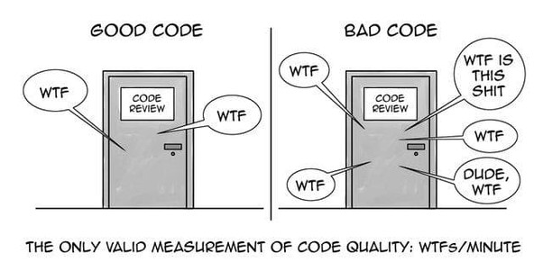

# Code Review Checklist

The following is a basic checklist on items to consider when doing code
reviews.

 

## **Functionality**

- F-1. Does the code match the design and the system requirements?
- F-2. Does the code do what it should be doing?
- F-3. Does the code do anything it should not be doing?
- F-4. Can the code be made simpler while still doing what it needs to do?
- F-5. Are available building blocks used when appropriate? (algorithms, data structures, types, templates, libraries, RTOS functions)
- F-6. Does the code use good patterns and abstractions? (e.g., state charts, no copy-and paste)
- F-7. Can this function be written with a single point of exit? (no returns in middle of function)
- F-8. Are all variables initialized before use?
- F-9. Are there unused variables?
- F-10. Is each function doing only one thing? (Does it make sense to break it down into smaller modules that each do something different?)
- F-11. Has reusable functionality been pulled out into utility functions?

## **Style**

- S-1. Does the code follow the style guide? (e.g. formatting, commenting)
- S-2. Is the header information for each file and each function descriptive enough?
- S-3. Is there an appropriate amount of comments? (frequency, location, and level of detail)
- S-4. Is the code well structured? (typographically and functionally)
- S-5. Are the variable and function names descriptive and consistent in style?
- S-6. Are \"magic numbers\" avoided? (use named constants rather than numbers)
- S-7. Is there any "dead code" (commented out code or unreachable code) that should be removed?
- S-8. Is the code too complicated? (Did you have to think hard to understand what it does?)
- S-9. Did you have to ask the author what the code does? (code should be self-explanatory)
- S-10. Is there commented out code that should be removed?
- S-11. Are the compilation and/or Static Analysis checks 100% warning-free? (are warnings enabled?)
- S-12. Are there comments for saying what the code is doing rather than why it is doing it? (does it specify about any hacks, workaround and temporary fixes. Additionally, does it mention pending tasks in to-do comments, which can be tracked easily)

## **Architecture**

- A-1. Is the function too long? (e.g., longer than fits on one printed page)
- A-2. Can this code be reused? Should it be reusing something else?
- A-3. Is there minimal use of global variables? Do all variables have minimum scope?
- A-4. Are classes and functions that are doing related things grouped appropriately? (cohesion)
- A-5. Is the code portable? (especially variable sizes, e.g., "int32" instead of "long")
- A-6. Are specific types used when possible? (e.g., "unsigned" and typedef, not just \"int\")
- A-7. Are there any if/else structures nested more than two deep? (consecutive "else if" is OK)
- A-8. Are there nested switch or case statements? (they should never be nested)
- A-9. Is there any hard coding of values? (use constants/configuration values)
- A-10. Has security been considered? (e.g SQL injections, Cross Site Scripting and API security)

## **Exception handling**

- E-1. Are input parameters checked for proper values (sanity checking)?
- E-2. Are error return codes/exceptions generated and passed back up to the calling function?
- E-3. Are error return codes/exceptions handled by the calling function?
- E-4. Are null pointers and negative numbers handled properly?
- E-5. Do switch statements have a default clause used for error detection?
- E-6. Are arrays checked for out of range indexing? Are pointers similarly checked?
- E-7. Is garbage collection being done properly, especially for errors/exceptions?
- E-8. Is there a chance of mathematical overflow/underflow?
- E-9. Are error conditions checked and logged? Are the error messages/codes meaningful?

## **Logging**

- L-1. Are we logging relevant information ?
- L-2. Are we logging at the correct priority?
- L-3. Is the log message clear (i.e access to code is not required to understand it and it clearly describes what has occurred)?

## **Timing**

- T-1. Is the worst-case timing bounded? (no unbounded loops, no recursion)
- T-2. Are there any race conditions? (especially multi-byte variables modified by an interrupt) T-3. Is appropriate code thread safe and re-entrant?
- T-4. Are there any long-running ISRs? Are interrupts masked for more than a few clocks?
- T-5. Is priority inversion avoided or handled by the RTOS?
- T-6. Is the watchdog timer turned on? Is the watchdog kicked only if every task is executing?
- T-7. Has code readability been sacrificed for unnecessary optimization?

## **Hardware**

- H-1. Do I/O operations put the hardware in correct state?
- H-2. Are min/max timing requirements met for the hardware interface?
- H-3. Are you sure that multi-byte hardware registers can't change during read/write?
- H-4. Does the software ensure that the system resets to a well-defined hardware system state?
- H-5. Have brownout and power loss been handled?
- H-6. Is the system correctly configured for entering/leaving sleep mode (e.g. timers)?
- H-7. Have unused interrupt vectors been directed to an error handler?
- H-8. Has care been taken to avoid EEPROM corruption? (e.g., power loss during write)

## **Commit**

- C-1. Do the commit comments explain what the change is and why?
- C-2. Do the commit comments reference the appropriate JIRA issue?
- C-3. Is the merge for one change only? (do not resolve multiple issues in one merge)
