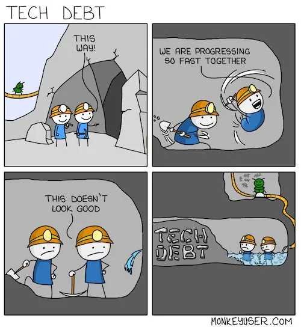

# HLD

## What is a HLD?

HLD is the big picture of the solution. The purpose of HLD is to provide a common understanding of the system’s architecture among all stakeholders. This helps to ensure that everyone is on the same page and that the system is developed in a consistent manner. HLD also helps to identify potential risks and challenges early on, so that they can be addressed before they become major problems

## Next is “HOW”. How to write a good HLD?

The key to writing a good HLD is to write it in the form a story, a story so good that the reader is engaged with its plot, the backstories of the characters and is on the edge of his/her seat with every plot twist(Okey we don’t have to go as far as adding plot twists). The idea is to keep the keep the design simple to understand, easy to follow and clear about assumptions and tradeoffs. So naturally the first step is knowing your audience. A good HLD should be able to communicate your thoughts to your expected audience.

Hence a general pattern to follow is

- **Context** — Scope out and clearly define the objective and context of problem you are solving.
- **Design Overview**—State the requirements of the solution with additional context like assumptions, back of the envelope calculation of number of users, size of data, etc.
- **Detailed Design** — This contains your actual design of the solution.
- **Alternatives considered** — This helps you convey comparison between tradeoffs. This is good place to focus of potential bottlenecks with each alternative.
- **Quality Attributes** — Shed light on property of the system like security, Reliability, Data Integrity, Privacy, Scalability, Latency, etc.
- **Operations** — Plan for maintenance of code like the monitoring, alerting and logging strategy.

Find below a template which you can refer and follow. Based on your audience, not all sections will apply to your HLD. Use your judgement to delete a section and introduce new ones. Have fun!

## Context

### Objective

In one of two sentences, describe at high level what you are solving using this design. This section should not describe the problem (use “Background”) or propose a solution(use “Design”), not should it got into implementation details like stating list of requirements and features.

### Background

Provide context for an unfamiliar reader to understand the proposal. In a crisp way cover what the problem is, why it is important to solve the problem and the historical context as appropriate. If the background requires a large write up or the reason to for solving the problem becomes verbose, separate docs like PRDs should be created first and linked here. Note: this is background, do not write about your design or ideas to solve the problem here.

## Design

### Overview

This contains high level overview of your design. Should be understandable by a non-engineer not working on the project. Diagrams can be especially useful to quickly convey the shape of the solution. This is going to be the trailer of your story, so keep it clean and concise.

### Functional Requirements

Describe in brief the various aspects of the problem space like  
1\. What will the users do  
2\. Where are users based out of geographically  
3\. Which platforms, like mobile/web/physical would the users be using.

### Capacity Estimates

Calculate approximates for the key data points. You can use below calculation for reference.  
**Active Users** — 2 Billion(B) Daily Active Users(DAU), 3B Monthly Active Users(MAU) — Approximate FB traffic estimate  
**Read vs Write** — 100:1  
**Queries Per Second** —  
Reads — (2B DAU)\*(100Read)/(24\*60\*60) — 2.4M req/sec  
Writes — (2B DAU)\*(1Write)/(24\*60\*60) — 24k req/sec  
**Storage** — (Assuming for 5 years)  
No of objects — (2B DAU)\*(5Y\*12M\*30D) — 3.6 Trillion(T)  
Each Object Size — ~ 500 bytes  
Total Object size — 3.6T\*500 bytes — 1.8 PB  
**Throughput** —  
Reads — (2.4M QPS)\*(500bytes) — 1200 MB/s  
Writes — (24K QPS)\*(500bytes) — 12 MB/s  
Cache — Following 80–20 rule. 20 % users would use 80% of objs) — (1200 MB/s)\*(60m\*60s)\*(0.2) — 864 GB per hour  
**Number of Instances required** —  
Application Services —  
Assuming 100 MB/s per instance as bottleneck— (1200MBps/100MBps)=12  
Database —  
Assuming 10 TB per instance as bottleneck— 1.8PB/10TB= 180  
Assuming 50 MBps disk throughput per instance as bottleneck — 1200MB/s/50 MB/s= 24  
Caching — Assuming each instance offers 32 GB — 864/64 = 14

### Interfaces

List out key interaction points between user and your system. Typically this has your API details like request and response parameters at a high level.

### Data Model

This describes key entities of your solution. This space usually helps you to decide till which granularity do you want to break down your entities

## Detailed Design

### Details

Get into the detail of the design. Diagrams are best way to express the thought process here. You can start by drawing out the components( which has one or more Data Models identified in earlier section) and connecting them to each other(This is usually called “[Component Diagram](https://en.wikipedia.org/wiki/Component_diagram)” and shows high level overview of how components are placed and interact with each others and users of the system).

Optionally, based on complexity of the proposal, you can have multiple types of diagrams like the [Sequence Diagram](https://en.wikipedia.org/wiki/Sequence_diagram) (Good for representing a solution with cross-section of multiple use-cases across components and actors), [Activity Diagram](https://en.wikipedia.org/wiki/Activity_diagram)(Helpful in representing how multiple components can be clubbed together), [Deployment Diagram](https://en.wikipedia.org/wiki/Deployment_diagram)(If you want to get to lower level details), etc. Please choose diagrams which best explain your solution as every problem statement, and every solution is different.

### Dependencies

Discuss your dependencies on other components and services. The fall-back plan when they’re unavailable for a period of time? Which services  
must be running for your job to start up?  
Are you introducing any cycles, such as blocking on a service that can’t run if your jobs aren’t already up?

### Migrations

Describe any data or system migrations which might be needed. Incomplete migrations hurt a system in the long run; they add  
enormous complexity, hurt reliability, and make programming unpleasant. If existing systems must be turned down to achieve the proposed design, describe how that transition will happen. “How do we get there from here?” is difficult, but often overlooked.

### Technical debt

Things to consider

1. Is there known technical debt incurred by implementing this design?
2. Is there a risk associated with technical debt (e.g., deprecation of underlying technologies) incurred by implementing this design?
3. How will technical debt identified during the execution of this design be tracked and followed up with?
4. Are there libraries or code paths that would be deprecated? If so, what is the plan to migrate the usage to the new piece.
5. Are there libraries or code paths that would be obsolete? When will they be deleted?
6. Are there any servers that could be turned down? If so, please document the turndown process.

### Potential patents

Are there potentially patentable inventions in the project?  
The work may be patentable if the design:  
● Provides for something not otherwise commercially available.  
● Does something better/faster/cheaper than what currently exists.  
● Addresses an unresolved need.

## Alternatives considered

Clearly list the other potential approaches to meeting the objective that you considered and why the current proposal was ultimately selected. In the rare cases where requirements or system constraints only allow for one possible high-level approach, that should be highlighted here and alternatives to specific details should still be discussed in-line in the detailed design section.  
An effective strategy is to compare dimensions of the solution space and how they vary across alternatives, such as latency, data staleness, cpu cost, engineering investment, etc. A color-coded table explaining favorability in that dimension and how important it is from green through yellow, orange and red quickly conveys the rationale to a reader, though this is just  
one possible approach to explain the trade-offs. For example:

## Quality attributes

### Security

Think about potential attacks on your system and describe the counter-measures you have in-place to prevent or mitigate each  
attack. For each attack describe the worst case impact it would have. Also, list any known vulnerabilities or potentially insecure dependencies. If  
somehow your application doesn’t have security considerations, explicitly state so and why.

Please consider attacks from a variety of sources, including both external and internal risks. When evaluating insider risk, include both insider risk from your co-employees as well as insider risk for customers (e.g. for enterprise products, employees of an enterprise; for consumer products,  
family members or friends of customers)

### Reliability

Discuss handling of local data loss, transient errors (e.g., temporary outages) and how they affect your system. Bear in mind that reliability issues with your dependencies can often cause reliability issues for your system.

What do you use that inherently provides reliability and redundancy for data? What do you use that requires data to be backed up? How is the data backed up? How is it restored? What happens between the time data is lost and the time it’s restored? In the case of a partial loss, can you keep serving and can you restore only missing portions of your backups to your serving datastore?

What are the costs of replicating your data?

### Data integrity

Discuss how you will detect, provision for and recover from data corruption and loss.

How will you find out about data corruption or loss in your datastores? What sources of data loss are detected? (User error, application bug, storage platform bug, site/replica disaster.)

How long will it take to notice each of these types of losses? What is your plan to recover from each of these types of losses?

### Privacy

Does your solution cover privacy standards in place? Is the customer PII protected by sufficient firewalls and encryptions? Are your private keys sufficiently protected?

### Scalability

How does your system scale? Consider both data size increase (if applicable) and traffic increase (if applicable).

Please consider the current machine situation: adding more machines might take much longer than you think or might not happen during the lifetime of your project. What initial resources will you need? Plan early and carefully. Also, general machine utilization is a concern, using  
more resources than you need will block expansion of your service.

### Latency

This section can be skipped if you are not designing a server on a human facing path. What latency do you need/expect? In particular, make sure you understand the bottlenecks of the pieces you’re reusing. All services should define latency targets.

### Testability

Specify the test plan. What are the sub-units of your system that will be independently testable?

How do you plan to test them? For example,

- Build a test harness around it that simulates its environment  
- _Generate random/carefully controlled input data_  
- Compare with golden results/maintain state in the test harness

Are you tests run automatically by the CI/CD pipelines

What load can your server handle, and how will you verify that value?

If there are changes envisaged in your future work, would your tests verify the base functionality? If some of your tests cannot be easily automated, how will you document the needed special procedures?

Consider the external systems your system depends on  
- How fast will your unit test cycle run?  
- What test infrastructure (e.g. test doubles) from external systems will you use?  
- Does the external system have a test instance for integration testing?  
- Do you need any tests that run outside of the standard unit test cycle (e.g. presubmit, postsubmit, or release)?  
Consider future systems that will depend on yours. What test facilities (e.g. test doubles, local instances for exploratory integration tests) will you provide so that they can run integration tests?

Why you should have a good test!

## Operations

### SLAs

If your application makes any service level guarantees, what mechanisms are in place for auditing, monitoring, etc.? And how can you guarantee the stated level of reliability?

### Monitoring & alerting

Is there a mechanism for monitoring and alerting for the running system. Is there an oncall and escalation metrics?

### Logging plan

All systems must log information at various levels for the log analysis system to collect and analyze. Log information allows us to understand system user behavior and system related business metrics. In this section, describe the information that you are going to log.

### Rollback strategy

In order to improve incident management response, which will result in reduced time to mitigate issues, teams should document and test their ability to rollback major change surfaces. This includes, but is not limited to:  
- Documenting the overall rollback strategy;  
- Identifying surface areas which are not able to be rolled back and defining a fix-forward strategy.