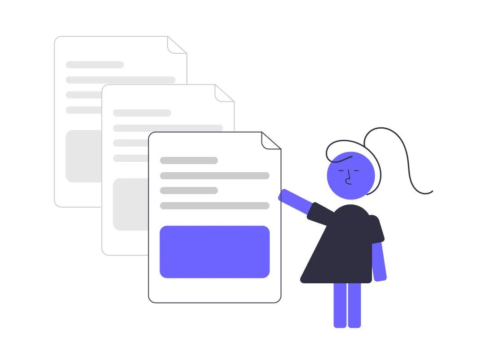
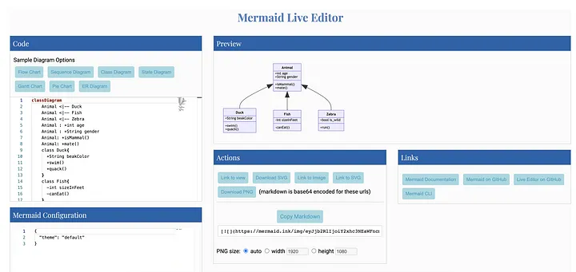

# Best Practices When Documenting Your Code for Software Engineers

It’s all about clear, asynchronous communication

As a software engineer, it is very important to acquire the skill of writing high-quality documentation. Due to the recent increase in remote work, it has become even more important to be better at asynchronous communication. Remote company GitLab does an excellent job of [defining asynchronous communication](https://about.gitlab.com/company/culture/all-remote/asynchronous/):

> “Asynchronous communication is the art of communicating and moving projects forward without the need for additional stakeholders to be available at the same time your communique is sent.”

High-quality documentation is an easier way to achieve effective asynchronous communication. In this article, I am going to talk about some interesting tips that I have found very useful in my personal experience.

## Google Tech Writing Course

Google offers a free tech writing course for software engineers. It starts with the fundamentals of tech writing. There are two courses and the content is as shown below:

TOC — Google Tech Writing One

TOC — Google Tech Writing Two

Being good at tech writing does not happen overnight. It takes practice. I personally prefer visiting this course each month to remind myself of the best practices.

## Using the Divio Documentation Framework

Amongst all other documentation frameworks, I personally like [Divio](https://www.divio.com/) the best. The documentation systems suggested there are easy and universally applicable.

The framework suggests classifying documentation in the following types:

- Tutorials — Learning-oriented
- How-To Guides — Problem-solving-oriented
- Explanation — Understanding-oriented
- Reference — Information-oriented

The scheme is [widely adopted](https://documentation.divio.com/adoption/#adoption) by a lot of famous open source projects and enterprises.

Here is a great video explaining the details of the framework:

## Use Markdown-Based Systems for Documentation

In a typical enterprise, there are various ways you can maintain your documentation. Some people prefer creating MS Word/Excel documents and uploading those in SharePoint or OneDrives. The biggest problem with such documents is that they are not searchable using your internal search engine. Hence I personally prefer using Markdown-based documentation systems. Creating and maintaining documentation is easy and the documentation is searchable.

If you are not familiar with Markdown, you can easily master it. Check out this free recommended [course](https://guides.github.com/features/mastering-markdown/) from GitHub.

## Using Mermaid JS for Diagrams

According to [Mermaid](http://mermaid-js.github.io/mermaid/) itself, it “is a Javascript-based diagramming and charting tool that uses Markdown-inspired text definitions and a renderer to create and modify complex diagrams.” If you are using GitLab or Azure DevOps, Mermaid is natively supported. If you are using GitHub or Atlassian products, then there are plug-ins available.

With Mermaid, creating and updating diagrams is very easy and you don’t need to have any UML tools like Visio/draw.io installed on every developer’s workstation.

Here are some sample diagrams created with Mermaid

Sample Sequence Diagram using Mermaid

Sample Class Diagram using Mermaid

You can try out creating diagrams using the [Mermaid Live Editor](https://mermaid-js.github.io/mermaid-live-editor/) as well.

## Use Templates

There are numerous templates available on various sites like Confluence that can be used for specific types of documents. For example:

- [Software Architecture Review Template](https://www.atlassian.com/software/confluence/templates/software-architecture-review)
- [Architecture Decision Record Template](https://github.com/deshpandetanmay/lightweight-architecture-decision-records/blob/master/doc/adr/0001-use-elasticsearch-for-search-api.md)
- [Incident Postmortem Template](https://www.atlassian.com/software/confluence/templates/incident-postmortem)
- [DevOps Runbook](https://www.atlassian.com/software/confluence/templates/devops-runbook)
- [Decision Template](https://www.atlassian.com/software/confluence/templates/decision)
- [Writing Guidelines](https://www.atlassian.com/software/confluence/templates/writing-guidelines)
- [OKR Template](https://www.atlassian.com/software/confluence/templates/okrs)
- Etc.

## Refer to Style Guides

If your team does not have a style guide already, refer to what the Googles and Microsofts of the world do:

- [Microsoft Style Guide](https://docs.microsoft.com/en-us/style-guide/)
- [Google Developer Documentation Style Guide](https://developers.google.com/style)

## References

- [Google Tech Writing Course](https://developers.google.com/tech-writing)
- [Divio Documentation Framework](https://documentation.divio.com/)
- [Mermaid](https://mermaid-js.github.io/mermaid/#/)