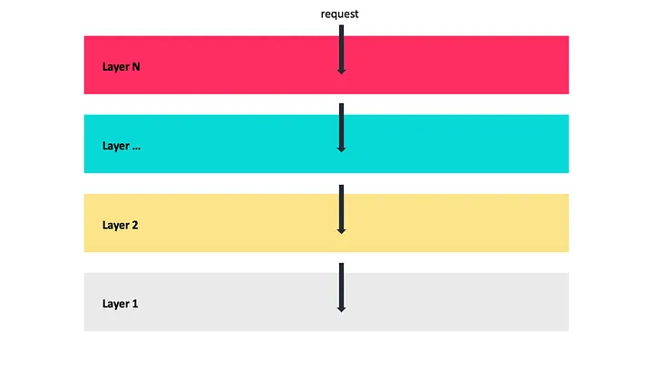
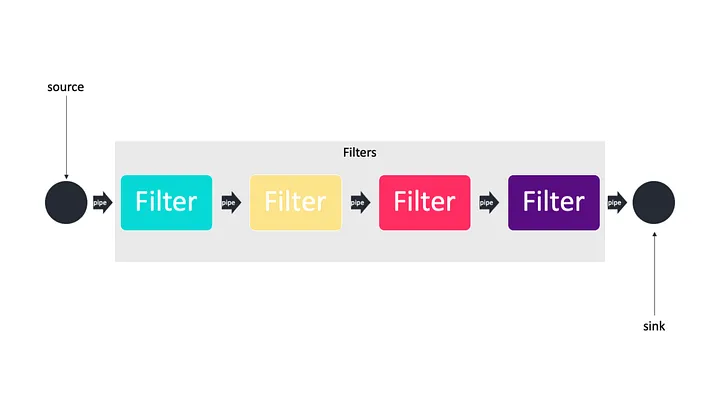
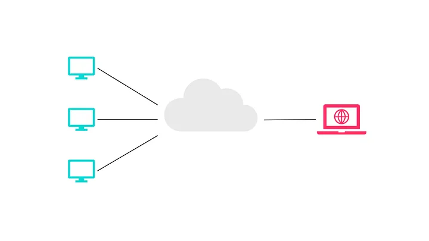
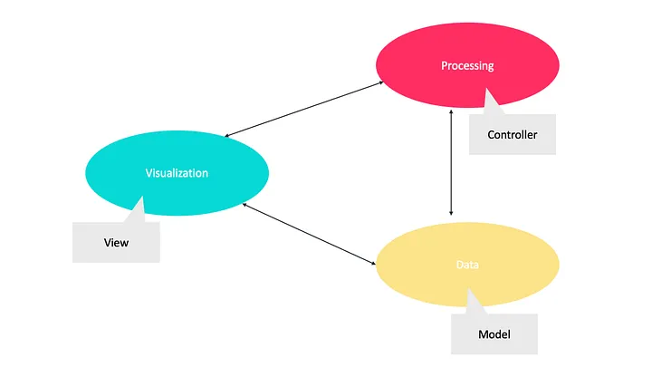
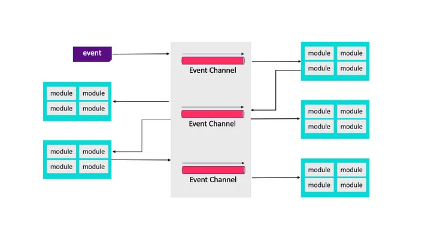

# Software Architecture: The Most Important Architectural Patterns You Need to Know

## Explaining **common** different **architecture patterns**

[

An architectural pattern is a general, reusable solution to a commonly occurring problem in software architecture within a given context.

> A pattern is a solution to a problem in a context.

Many programmers are nowadays still confused about the difference between architecture patterns or don’t even know much about it.

Let me explain to you…!

- Layered Architecture
- Pipe and Filter
- Client Server
- Model View Controller
- Event Driven Architecture
- Microservices Architecture

# **Layered Architecture**

The most common architecture pattern is the layered architecture or known as the n-tier architecture. It is widely known by most software architects, designers, developers. Although, there are no specific restrictions in terms of the number and type of layers that must exist, most layered architecture consists of four tiers: presentation, business, persistence and database as follows.

an popular example of n-tier architecture

## **Context**

All complex systems experience the need to develop and evolve portions of the system independently. For this reason, the developers of the system need clear and well-documented separation of concerns, so that modules of the system may be independently developed and maintained.

## **Problem**

The software needs to be segmented in such a way that the modules can be developed and evolved separately with little interaction among the parts, supporting portability, modifiability, and reuse.

## **Solution**

To achieve this separation of concerns, the layered pattern divides the software into units called layers. Each layer is a grouping of modules that offers a cohesive set of services. The usage must be unidirectional. Layers completely partition a set of software, and each partition is exposed through a public interface.

- The first concept is each of the layers has a specific role and responsibility. For example, the presentation layer would be responsible for handling all UI. Because this separation of concerns within the layered architecture makes it easy to build effective roles and responsibility.
- On the second concept, the layered architecture pattern is a technically partitioned architecture as opposed to a domain partitioned architecture. They are groups of components, rather being by domain.
- The last concept is that each of the layers in the layered architecture is marked as being either closed or open. A closed layer means that a request moves from layer to layer, it must go through the layer right below it to get to the next layer below that one. The request cannot skip any layers.

_Closed layers and request access_

## Weakness

Layers contribute to a performance penalty. The pattern does not lend itself to high-performance applications because it is not efficient to go through multiple layers of the architecture to fulfill a business request.

The addition of layers also adds up-front cost and complexity to a system.

## Usages

We should use this style for small, simple applications or websites. It is a good choice for situations with a very tight budget and time constraints.

# Multi-Tier Pattern

## Context

In a distributed deployment, there is often a need to distribute a system’s infrastructure into distinct subsets.

## Problem

How can we split the system into a number of computationally independent execution structures: groups of software and hardware connected by some communications media?

## Solution

a multi-tier example — consumer website J2EE

The execution structures of many systems are organized as a set of logical groupings of components. Each grouping is termed a tier.

## Weakness

Substantial up-front cost and complexity.

## Usages

Used in distributed systems.

# Pipe and Filter

One of the patterns in software architecture that appears, again and again, is the pipe-filter pattern.

the pipe filter style

## Context

Many systems are required to transform streams of discrete data items, from input to output. Many types of transformations occur repeatedly in practice, and so it is desirable to create these as independent, reusable parts.

## Problem

Such systems need to be divided into reusable, loosely coupled components with simple, generic interactionmechanisms. In this way they can be flexibly combined with each other. The components, being generic and loosely coupled, are easily reused. The components, being independent, can execute in parallel.

## Solution

Pipes in this architecture form the communication channel between filters. The first concept is each of the pipes is un-directional and point to point for performance reasons, accepting input from one source and always directing output to another.

There are four types of filters exist within this style as follows.

- producer (`source`): the starting point of a process.
- transformer (`map`): performs a transformation on some or all of the data.
- tester (`reduce`): tests one or more criteria.
- consumer (`sink`): the terminating point.

## Weakness

Not good choice for interactive systems, because of their transformational character.

Excessive parsing and unparsing leads toloss of performance and increased complexity in writing the filters themselves.

## Usages

The pipe-filter architecture uses in a variety of applications, especially tasks that facilitate simple, one-way processing such as EDI, ETL tools.

Compilers: the consecutive filters perform lexical analysis, parsing, semantic analysis, and code generation.

# Client Server

## Context

There are shared resources and services that large numbers of distributed clients wish to access, and for which we wish to control access or quality of service.

## Problem

By managing a set of shared resources and services, we can promote modifiability and reuse, by factoring out common services and having to modify these in a single location, or a small number of locations. We want to improve scalability and availability by centralizing the control of these resources and services while distributing the resources themselves across multiple physical servers.

## Solution

In a client-server style, components and connectors have a particular behavior.

- Components, called “clients,” send requests to a component, called “server,” and wait for a reply.
- A server component receives a request from a client and sends it the reply.

## Weakness

The server can be a performance bottleneck and a single point of failure.

Decisions about where to locate functionality (in the client or in the server) are often complex and costly to change after a system has been built.

## Usages

We can use the client-server style to model a part of a system that has many components sending requests (clients) to another component (server) that offer services: online applications such as email, document sharing and banking.

# Model View Controller

## Context

The user interface is typically the most frequently modified portion of an interactive application. Users often wish to look at data from different perspectives, such as a bar graph or a pie chart. These representations should both reflect the current state of the data.

## Problem

How can user interface functionality be kept separate from application functionality and yet still be responsive to user input, or to changes in the underlying application’s data?

And how can multiple views of the user interface be created, maintained, and coordinated when the underlying application data changes?

## Solution

The model-view-controller (MVC) pattern separates application functionality into three kinds of components as follows.

- A model, which contains the application’s data.
- A view, which displays some portion of the underlying data and interacts with the user.
- A controller, which mediates between the model and the viewand manages the notifications of state changes.

## Weakness

The complexity may not be worth it for simple user interfaces.

The model, view, and controller abstractions may not be good fits for some user interface toolkits.

## Usages

MVC is an architectural pattern that is commonly used in web, mobile applications while developing user interfaces.

# Event Driven Architecture

## Context

Computational and information resources need to be provided to handle incoming independent asynchronous application-generated events in a manner that can scale up as demand increases.

## Problem

Construct distributed systems that can service asynchronous arriving messages associated with an event, and that can scale from small and simple to large and complex.

## Solution

Deploy independent event processes/processors for event handling. Arriving events are queued. A scheduler pulls events from the queue and distributes them to the appropriate event handler based on a scheduling policy.

## Weakness

Performance and error recovery may be issues.

## Usages

An e-commerce application that uses this approach would work as follows:  
The Order Service creates an Order in a pending state and publishes an `OrderCreated` event.

- The Customer Service receives the event and attempts to reserve credit for that Order. It then publishes either a Credit Reserved event or a `CreditLimitExceeded` event.
- The Order Service receives the event from the Customer Service and changes the state of the order to either approved or canceled

# Microservices Architecture

## Context

Deploy server-based enterprise applications that support a variety of browsers and native mobile clients. The application handles client requests by executing business logic, accessing a database, exchanging messages with other systems, and returning responses. The application might expose a 3rd party API.

## Problem

Monolithic applications can become too large and complex for efficient support, and deployment for optimal distributed resource utilization such as in cloud environments.

## Solution

Build applications as suites of services. Each service is independently deployable and scalable and has its own API boundary. Different services can be written in different programming languages, manage their own database, and developed by different teams.

## Weakness

Systems must be designed to tolerate service failures that require more system monitoring. Service choreography and event collaboration overhead.

We also need more memory.

## Usages

Many use cases are applicable for a microservices architecture, especially those that involve an extensive data pipeline. For example, a microservices-based system would be ideal for a reporting system on a company’s retail store sales. Each step in the data preparation process would be handled by a microservice: data collection, cleansing, normalization, enrichment, aggregation, reporting, etc.

Easy, right?