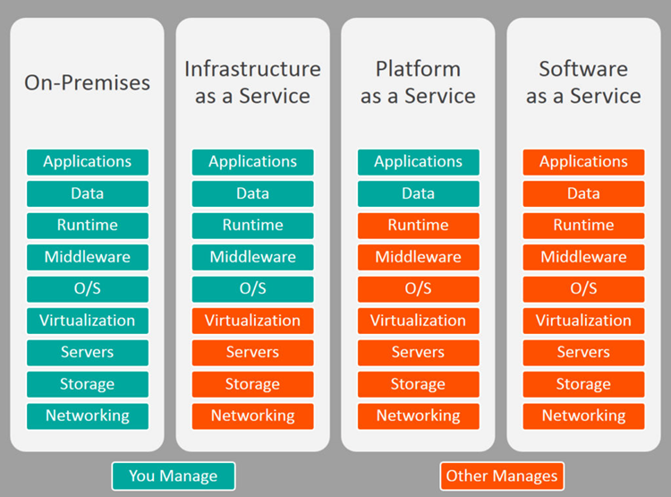

# P

##  PaaS

Platform As A Service

Platform as a Service (PaaS) or Application Platform as a Service
(aPaaS) or platform-based service is a category of cloud computing
services that provides a platform allowing customers to develop, run,
and manage applications without the complexity of building and
maintaining the infrastructure typically associated with developing and
launching an app



##  packet sniffing

A packet analyzer (also known as a packet sniffer) is a computer program
or piece of computer hardware (such as a packet capture appliance) that
can intercept and log traffic that passes over a digital network or part
of a network. Packet capture is the process of intercepting and logging
traffic. As data streams flow across the network, the sniffer captures
each packet and, if needed, decodes the packet's raw data, showing the
values of various fields in the packet, and analyzes its content
according to the appropriate RFC or other specifications.

A packet analyzer used for intercepting traffic on wireless networks is
known as a wireless analyzer or WiFi analyzer. A packet analyzer can
also be referred to as a network analyzer or protocol analyzer though
these terms also have other meanings.

Capabilities\
On wired shared medias networks, such as Ethernet, Token Ring, and FDDI
networks, depending on the network structure (hub or switch), it may be
possible to capture all traffic on the network from a single machine on
the network. On modern networks, traffic can be captured using a network
switch with a so-called monitoring port that mirrors all packets that
pass through designated ports of the switch. A network tap is an even
more reliable solution than to use a monitoring port, since taps are
less likely to drop packets during high traffic load.

On wireless LANs, traffic can be captured on one channel at a time, or
by using multiple adapters, on several channels simultaneously.

On wired broadcast and wireless LANs, to capture unicast traffic between
other machines, the network adapter capturing the traffic must be in
promiscuous mode. On wireless LANs, even if the adapter is in
promiscuous mode, packets not for the service set the adapter is
configured for are usually ignored. To see those packets, the adapter
must be in monitor mode. No special provisions are required to capture
multicast traffic to a multicast group the packet analyzer is already
monitoring, or broadcast traffic.

When traffic is captured, either the entire contents of packets are
recorded, or just the headers are recorded. Recording just headers
reduces storage requirements, and avoids some legal issues, yet often
provides sufficient information to diagnose problems.

Captured information is decoded from raw digital form into a
human-readable format that lets users easily review exchanged
information. Protocol analyzers vary in their abilities to display and
analyze data.

Some protocol analyzers can also generate traffic and thus act as the
reference device. These can act as protocol testers. Such testers
generate protocol-correct traffic for functional testing, and may also
have the ability to deliberately introduce errors to test the DUT's
ability to handle errors.

Protocol analyzers can also be hardware-based, either in probe format
or, as is increasingly common, combined with a disk array. These devices
record packets (or a slice of the packet) to a disk array. This allows
historical forensic analysis of packets without users having to recreate
any fault.

##  Packet Switched

Packet switching is a method of grouping data which is transmitted over
a digital network into packets which are made of a header and a payload.
Data in the header is used by networking hardware to direct the packet
to its destination where the payload is extracted and used by
application software. Packet switching is the primary basis for data
communications in computer networks worldwide.


##  PAF

Postal Address File

Royal Mail Postal Address File data

##  Pair Programming

Pair programming consists of two programmers sharing a single
workstation (one screen, keyboard and mouse among the pair).

##  PAP

Password Authentication Protocol

Password Authentication Protocol (PAP) is a password-based
authentication protocol used by Point to Point Protocol (PPP) to
validate users. Almost all network operating system remote servers
support PAP.

PAP is considered a weak authentication scheme (weak schemes are simple
and have lighter computational overhead but are much more vulnerable to
attack; while weak schemes may have limited application in some
constrained environments, they are avoided in general). Among PAP's
deficiencies is the fact that it transmits unencrypted passwords over
the network. PAP is therefore used only as a last resort when the remote
server does not support a stronger scheme such as CHAP or EAP


##  Parametric Estimation

Estimation using an algorithmic model, normally as part of a software
tool. Models work by taking input factors and calculating outputs with
algorithms based on historical data.

##  Pascal

Pascal is an imperative and procedural programming language, which
Niklaus Wirth designed in 1968--69 and published in 1970, as a small,
efficient language intended to encourage good programming practices
using structured programming and data structuring. It is named in honor
of the French mathematician, philosopher and physicist Blaise Pascal.

Pascal was developed on the pattern of the ALGOL 60 language. Wirth had
already developed several improvements to this language as part of the
ALGOL X proposals, but these were not accepted and Pascal was developed
separately and released in 1970. A derivative known as Object Pascal
designed for object-oriented programming was developed in 1985; this was
used by Apple Computer and Borland in the late 1980s and later developed
into Delphi on the Microsoft Windows platform. Extensions to the Pascal
concepts led to the Pascal-like languages Modula-2 and Oberon

##  Pattern

CxPattern

CxOne pattern material type. A predefined model or template used to
create an artifact or accomplish a goal. See *CxOneOverview* for
description.

##  PCM

Pulse-code modulation

Pulse-code modulation (PCM) is a method used to digitally represent
sampled analog signals. It is the standard form of digital audio in
computers, compact discs, digital telephony and other digital audio
applications. In a PCM stream, the amplitude of the analog signal is
sampled regularly at uniform intervals, and each sample is quantized to
the nearest value within a range of digital steps.

Linear pulse-code modulation (LPCM) is a specific type of PCM where the
quantization levels are linearly uniform. This is in contrast to PCM
encodings where quantization levels vary as a function of amplitude (as
with the A-law algorithm or the μ-law algorithm). Though PCM is a more
general term, it is often used to describe data encoded as LPCM.

A PCM stream has two basic properties that determine the stream's
fidelity to the original analog signal: the sampling rate, which is the
number of times per second that samples are taken; and the bit depth,
which determines the number of possible digital values that can be used
to represent each sample.

##  PCP

Primary Connection Point

Part of the line plant, in the form of a metal cabinet at the roadside,
that enables flexibility between the main cables from the exchange and
the smaller cables to individual streets or premises, also known as a
Cabinet, or Cab\" \"Primary Cross-connection Point - this is the local
street cabinet in which cables extending out to local distribution
points are aggregated and connected to larger copper and fibre optic
cables to move the voice and data signals to and from the local exchange


##  PCRF

Policy and Charging Rules Function

Policy and Charging Rules Function (PCRF) is the software node
designated in real-time to determine policy rules in a multimedia
network. As a policy tool, the PCRF plays a central role in
next-generation networks. Unlike earlier policy engines that were added
onto an existing network to enforce policy, the PCRF is a software
component that operates at the network core and accesses subscriber
databases and other specialized functions, such as a charging system, in
a centralized manner. Because it operates in real time, the PCRF has an
increased strategic significance and broader potential role than
traditional policy engines. This has led to a proliferation of PCRF
products since 2008.

The PCRF is the part of the network architecture that aggregates
information to and from the network, operational support systems, and
other sources (such as portals) in real time, supporting the creation of
rules and then automatically making policy decisions for each subscriber
active on the network. Such a network might offer multiple services,
quality of service (QoS) levels, and charging rules. PCRF can provide a
network agnostic solution (wire line and wireless) and can also enable
multi-dimensional approach which helps in creating a lucrative and
innovative platform for operators. PCRF can also be integrated with
different platforms like billing, rating, charging, and subscriber
database or can also be deployed as a standalone entity.

PCRF plays a key role in VoLTE as a mediator of network resources for
the IP Multimedia Systems network for establishing the calls and
allocating the requested bandwidth to the call bearer with configured
attributes.

##  PCS

Physical Coding Sub-layer

The Physical Coding Sublayer (PCS) is a networking protocol sublayer in
the Fast Ethernet, Gigabit Ethernet, and 10 Gigabit Ethernet standards.
It resides at the top of the physical layer (PHY), and provides an
interface between the Physical Medium Attachment (PMA) sublayer and the
Media Independent Interface (MII). It is responsible for data encoding
and decoding, scrambling and descrambling, alignment marker insertion
and removal, block and symbol redistribution, and lane block
synchronization and deskew.

##  PDCP

Packet Data Convergence Protocol

PDCP is an abbreviation for Packet Data Convergence Protocol. This
protocol is specified by 3GPP in TS 25.323 for UMTS, TS 36.323 for LTE
and TS 38.323 for 5G New Radio \[NR). The PDCP is located in the Radio
Protocol Stack in the UMTS/LTE/5G Air interface on top of the RLC layer.

PDCP provides its services to the RRC and user plane upper layers,
e.g. IP at the UE or to the relay at the base station.

##  PDH

plesiochronous digital hierarchy

The plesiochronous digital hierarchy (PDH) is a technology used in
telecommunications networks to transport large quantities of data over
digital transport equipment such as fibre optic and microwave radio
systems. The term plesiochronous is derived from Greek plēsios, meaning
near, and chronos, time, and refers to the fact that PDH networks run in
a state where different parts of the network are nearly, but not quite
perfectly, synchronized.

Backbone transport networks replaced PDH networks with synchronous
digital hierarchy (SDH) or synchronous optical networking (SONET)
equipment over the ten years ending around the turn of the millennium
(2000), whose floating payloads relaxed the more stringent timing
requirements of PDH network technology.

PDH allows transmission of data streams that are nominally running at
the same rate, but allowing some variation on the speed around a nominal
rate. By analogy, any two watches are nominally running at the same
rate, clocking up 60 seconds every minute. However, there is no link
between watches to guarantee that they run at exactly the same rate, and
it is highly likely that one is running slightly faster than the other.

##  PDU

Protocol Data Unit

In telecommunications, a protocol data unit (PDU) is information that is
transmitted as a single unit among peer entities of a computer network.
A PDU may contain user data or control information and network
addressing. In layered architectures of communication protocol stacks,
each layer implements protocols tailored to the specific type or mode of
data exchange, or network function of the layer. For example, the
Transmission Control Protocol (TCP) implements a connection-oriented
transfer mode, and the PDU of this protocol is called a segment, while
the User Datagram Protocol (UDP) uses datagrams as protocol data unit
for connection-less transfer. A layer lower in the Internet Protocol
Suite, at the Internet Layer, the PDU is called a packet, irrespective
of its payload type.\


##  PEAP

Protected Extensible Authentication Protocol

The Protected Extensible Authentication Protocol, also known as
Protected EAP or simply PEAP, is a protocol that encapsulates the
Extensible Authentication Protocol (EAP) within an encrypted and
authenticated Transport Layer Security (TLS) tunnel. The purpose was to
correct deficiencies in EAP; EAP assumed a protected communication
channel, such as that provided by physical security, so facilities for
protection of the EAP conversation were not provided.

PEAP was jointly developed by Cisco Systems, Microsoft, and RSA
Security. PEAPv0 was the version included with Microsoft Windows XP and
was nominally defined in draft-kamath-pppext-peapv0-00. PEAPv1 and
PEAPv2 were defined in different versions of
draft-josefsson-pppext-eap-tls-eap. PEAPv1 was defined in
draft-josefsson-pppext-eap-tls-eap-00 through
draft-josefsson-pppext-eap-tls-eap-05, and PEAPv2 was defined in
versions beginning with draft-josefsson-pppext-eap-tls-eap-06.

The protocol only specifies chaining multiple EAP mechanisms and not any
specific method. However, use of the EAP-MSCHAPv2 and EAP-GTC methods
are the most commonly supported\


##  peer review

a process used for checking the work performed by one's equals (peers)
to ensure it meets specific criteria.

##  Pen testing

Penetration Testing

A penetration test, colloquially known as a pen test, is an authorized
simulated attack on a computer system, performed to evaluate the
security of the system. The test is performed to identify both
weaknesses (also referred to as vulnerabilities), including the
potential for unauthorized parties to gain access to the system's
features and data, as well as strengths, enabling a full risk assessment
to be completed.

The process typically identifies the target systems and a particular
goal---then reviews available information and undertakes various means
to attain the goal. A penetration test target may be a white box (which
provides background and system information) or black box (which provides
only basic or no information except the company name). A penetration
test can help determine whether a system is vulnerable to attack if the
defenses were sufficient, and which defenses (if any) the test defeated.

Security issues that the penetration test uncovers should be reported to
the system owner. Penetration test reports may also assess potential
impacts to the organization and suggest countermeasures to reduce risk.

The goals of a penetration test vary depending on the type of approved
activity for any given engagement with the primary goal focused on
finding vulnerabilities that could be exploited by a nefarious actor and
informing the client of those vulnerabilities along with recommended
mitigation strategies.

Penetration tests are a component of a full security audit. For example,
the Payment Card Industry Data Security Standard requires penetration
testing on a regular schedule, and after system changes.

Flaw hypothesis methodology is a systems analysis and penetration
prediction technique where a list of hypothesized flaws in a software
system are compiled through analysis of the specifications and
documentation for the system. The list of hypothesized flaws is then
prioritized on the basis of the estimated probability that a flaw
actually exists, and on the ease of exploiting it to the extent of
control or compromise. The prioritized list is used to direct the actual
testing of the system.

##  PER

Packed Encoding Rules

Packed Encoding Rules (PER) are ASN.1 encoding rules for producing a
compact transfer syntax for data structures described in ASN.1, defined
in 1994.

This Recommendation or International Standard describes a set of
encoding rules that can be applied to values of all ASN.1 types to
achieve a much more compact representation than that achieved by the BER
and its derivatives (described in ITU-T Rec. X.690 ISO/IEC 8825-1).

It uses additional information, such as the lower and upper limits for
numeric values, from the ASN.1 specification to represent the data units
using the minimum number of bits. The compactness requires that the
decoder knows the complete abstract syntax of the data structure to be
decoded, however.

There are two variations of packed encoding rules: unaligned and
aligned. With the unaligned encoding, the bits are packed with no regard
for octet (byte) boundaries. With aligned encoding, certain types of
data structures are aligned on octet boundaries, meaning there may be
some number of wasted padding bits. Unaligned encoding uses the least
number of bits, but presumably at some cost in processing time.

##  Performance

May be used to describe the combination
of *feature* and *quality* a *system* has (or that
a *project* delivers).\
Also used in relation to the level of support for various non-functional
system requirements such as speed, resource usage, reliability,
availability, etc.

##  Perl

Perl is a family of two high-level, general-purpose, interpreted,
dynamic programming languages, Perl 5 and Perl 6.

Though Perl is not officially an acronym, there are various backronyms
in use, including "Practical Extraction and Reporting Language". Perl
was originally developed by Larry Wall in 1987 as a general-purpose Unix
scripting language to make report processing easier. Since then, it has
undergone many changes and revisions. Perl 6, which began as a redesign
of Perl 5 in 2000, eventually evolved into a separate language. Both
languages continue to be developed independently by different
development teams and liberally borrow ideas from one another.

The Perl languages borrow features from other programming languages
including C, shell script (sh), AWK, and sed; Wall also alludes to Basic
and Lisp in the introduction to Learning Perl (Schwartz & Christiansen)
and so on. They provide text processing facilities without the arbitrary
data-length limits of many contemporary Unix commandline tools,
facilitating manipulation of text files. Perl 5 gained widespread
popularity in the late 1990s as a CGI scripting language, in part due to
its then unsurpassed regular expression and string parsing abilities.

``` {.perl}
## !/usr/bin/perl
use warnings;
print("Hello, World!\n");
```

##  Personas

Personas are synthetic biographies of fictitious users of the future
product.

##  Perspective

During an *inspection*, an assigned focus used to increase the
likelihood that each inspector will find unique issues or to focus
attention an particular aspects of an artifact.

##  PERT chart

The program (or project) evaluation and review technique, commonly
abbreviated PERT, is a statistical tool, used in project management,
which was designed to analyze and represent the tasks involved in
completing a given project.

First developed by the United States Navy in the 1950s, it is commonly
used in conjunction with the critical path method (CPM).


##  PGP

Pretty Good Privacy

Pretty Good Privacy (PGP) is an encryption program that provides
cryptographic privacy and authentication for data communication. PGP is
used for signing, encrypting, and decrypting texts, e-mails, files,
directories, and whole disk partitions and to increase the security of
e-mail communications. Phil Zimmermann developed PGP in 1991.

PGP and similar software follow the OpenPGP standard (RFC
4880) for encrypting and decrypting data.


##  PGW

Packet Data Network Gateway

The PDN Gateway provides connectivity from the UE to external packet
data networks by being the point of exit and entry of traffic for the
UE. A UE may have simultaneous connectivity with more than one PGW for
accessing multiple PDNs. The PGW performs policy enforcement, packet
filtering for each user, charging support, lawful interception and
packet screening. Another key role of the PGW is to act as the anchor
for mobility between 3GPP and non-3GPP technologies such as WiMAX and
3GPP2 (CDMA 1X and EvDO).


##  Phase

A translation of a group of *activities* onto a portion of
a *lifecycle* or a period of time defined by a *schedule*. Often used in
conjunction with denoting a major transition in project activities or
lifecycle processes.\
Sometimes used as a synonym for *stage*. Sometimes used (incorrectly) as
a synonym for *milestone*.

##  Phased Estimation

The practice of creating *estimates* throughout a project's lifecycle,
utilizing groups of estimation techniques optimized for each lifecycle
phase.

##  PHP

PHP: Hypertext Preprocessor (or simply PHP) is a server-side scripting
language designed for Web development, but also used as a
general-purpose programming language. It was originally created by
Rasmus Lerdorf in 1994, the PHP reference implementation is now produced
by The PHP Group.\[6\] PHP originally stood for Personal Home Page, but
it now stands for the recursive acronym PHP: Hypertext Preprocessor.

PHP code may be embedded into HTML code, or it can be used in
combination with various web template systems, web content management
systems, and web frameworks. PHP code is usually processed by a PHP
interpreter implemented as a module in the web server or as a Common
Gateway Interface (CGI) executable. The web server combines the results
of the interpreted and executed PHP code, which may be any type of data,
including images, with the generated web page. PHP code may also be
executed with a command-line interface (CLI) and can be used to
implement standalone graphical applications.

The standard PHP interpreter, powered by the Zend Engine, is free
software released under the PHP License. PHP has been widely ported and
can be deployed on most web servers on almost every operating system and
platform, free of charge.

The PHP language evolved without a written formal specification or
standard until 2014, with the original implementation acting as the de
facto standard which other implementations aimed to follow. Since 2014
work has gone on to create a formal PHP specification.

``` {.html}
<!DOCTYPE html>
<html lang="en">
<head>
    <meta charset="UTF-8">
    <meta name="viewport" content="width=device-width, initial-scale=1.0">
    <title>PHP - Hello, World!</title>
</head>
<body>
        <h1><?php echo 'Hello, World!'; ?></h1>
</body>
</html>
```

##  Planning and Tracking Lead

PTL

Directs overall flow of technical work on the project. Directly
responsible for project planning and overseeing the execution of work
breakdown, estimation, scheduling, and tracking.

##  Planning Poker

An approach to estimation used by Agile teams. Each team member "plays"
a card bearing a numerical value corresponding to a point estimation for
a user story.

##  PLL

Phase Locked Loop

A phase-locked loop or phase lock loop abbreviated as PLL is a control
system that generates an output signal whose phase is related to the
phase of an input signal. There are several different types; the
simplest is an electronic circuit consisting of a variable frequency
oscillator and a phase detector in a feedback loop. The oscillator
generates a periodic signal, and the phase detector compares the phase
of that signal with the phase of the input periodic signal, adjusting
the oscillator to keep the phases matched.

Keeping the input and output phase in lock step also implies keeping the
input and output frequencies the same. Consequently, in addition to
synchronizing signals, a phase-locked loop can track an input frequency,
or it can generate a frequency that is a multiple of the input
frequency. These properties are used for computer clock synchronization,
demodulation, and frequency synthesis.

Phase-locked loops are widely employed in radio, telecommunications,
computers and other electronic applications. They can be used to
demodulate a signal, recover a signal from a noisy communication
channel, generate a stable frequency at multiples of an input frequency
(frequency synthesis), or distribute precisely timed clock pulses in
digital logic circuits such as microprocessors. Since a single
integrated circuit can provide a complete phase-locked-loop building
block, the technique is widely used in modern electronic devices, with
output frequencies from a fraction of a hertz up to many gigahertz.

##  PNT

Pointer data

OSNI Pointer data

##  Points

(estimates in) Agile teams generally prefer to express estimates in
units other than the time-honored "man-hours." Possibly the most
widespread unit is "story points."

##  polymorphism

from the Greek meaning "having multiple forms," the characteristic of
being able to assign a different meaning or usage to something in
different contexts - specifically, to allow an entity such as a
variable, a function, or an object to have more than one form.

##  POP

Point Of Presence

A point of presence (PoP) is an artificial demarcation point or
interface point between communicating entities.\


##  portability

a characteristic attributed to a computer program if it can be used in
an operating systems other than the one in which it was created without
requiring major rework.

##  POSIX

The Portable Operating System Interface (POSIX) is a family of standards
specified by the IEEE Computer Society for maintaining compatibility
between operating systems. POSIX defines the application programming
interface (API), along with command line shells and utility
interfaces, for software compatibility with variants of Unix and other
operating systems.

##  Postmortem

A phase at the end of a software project during which project team
members evaluate the project and learn lessons that can be applied to
the next project. "Postmortem" also refers to the report created during
the postmortem phase.

##  POTS

Plain Old Telephone Service or\
Plain Ordinary Telephone Service

POTS is a retronym for voice-grade telephone service employing analog
signal transmission over copper loops\
See FXO & FXS


##  PPP

Point-to-Point Protocol

In computer networking, Point-to-Point Protocol (PPP) is a data link
layer (layer 2) communications protocol used to establish a direct
connection between two nodes. It connects two routers directly without
any host or any other networking device in between. It can provide
connection authentication, transmission encryption,\[1\] and
compression.

PPP is used over many types of physical networks including serial cable,
phone line, trunk line, cellular telephone, specialized radio links, and
fiber optic links such as SONET. Internet service providers (ISPs) have
used PPP for customer dial-up access to the Internet, since IP packets
cannot be transmitted over a modem line on their own, without some data
link protocol.

Two derivatives of PPP, Point-to-Point Protocol over Ethernet (PPPoE)
and Point-to-Point Protocol over ATM (PPPoA), are used most commonly by
Internet Service Providers (ISPs) to establish a Digital Subscriber Line
(DSL) Internet service connection with customers.

##  PPPoE

PPP over Ethernet

The Point-to-Point Protocol over Ethernet (PPPoE) is a network protocol
for encapsulating PPP frames inside Ethernet frames. It appeared in
1999, in the context of the boom of DSL as the solution for tunneling
packets over the DSL connection to the ISP's IP network, and from there
to the rest of the Internet. A 2005 networking book noted that "Most DSL
providers use PPPoE, which provides authentication, encryption, and
compression." Typical use of PPPoE involves leveraging the PPP
facilities for authenticating the user with a username and password,
predominately via the PAP protocol and less often via CHAP.

##  PPTP

Point-to-Point Tunneling Protocol

The Point-to-Point Tunneling Protocol (PPTP) is an obsolete method for
implementing virtual private networks, with many known security issues.
PPTP uses a TCP control channel and a Generic Routing Encapsulation
tunnel to encapsulate PPP packets.

The PPTP specification does not describe encryption or authentication
features and relies on the Point-to-Point Protocol being tunneled to
implement security functionality. However, the most common PPTP
implementation shipping with the Microsoft Windows product families
implements various levels of authentication and encryption natively as
standard features of the Windows PPTP stack. The intended use of this
protocol is to provide security levels and remote access levels
comparable with typical VPN products.\


##  Preemption

In computing, preemption is the act of temporarily interrupting a task
being carried out by a computer system, without requiring its
cooperation, and with the intention of resuming the task at a later
time. Such changes of the executed task are known as context switches.
It is normally carried out by a privileged task or part of the system
known as a preemptive scheduler, which has the power to preempt, or
interrupt, and later resume, other tasks in the system.

##  Preview

An *engineering discussion* where materials have been prepared ahead of
time for review and discussion in a meeting. The goal is to probe
proposed solution to detect *defects* and suggest alternatives.\
*Previews* differ from *reviews* in that they are solution oriented
rather than detection oriented.

##  PRINCE2

a project management methodology developed by the government of the
United Kingdom that makes use of the best proven practices from a
variety of industries and backgrounds.

##  Process

A standard method for performing an *activity* or *task*.\
Processes may or may not be documented; a defined process implies that
it is documented. Processes are often supported by materials, tools,
conventions, and other infrastructure. The terms process may also refer
to the execution of the activities and tasks that make up the process,
e.g., "the outcome of the build process".

##  Process Flow

A process model which defines the materials, structure, techniques,
actions, events, and other elements necessary to implement a lifecycle,
workflow, or methodology.

##  Product Owner

The product owner is a role created by the Scrum Framework responsible
for making sure the team delivers the desired outcome.

##  Product Release

A *release* that is produced for distribution and/or deployment to end
users.

##  programming language

A programming language is a formal language which comprises a set of
instructions used to produce various kinds of output. Programming
languages are used to create programs that implement specific
algorithms.\


##  Programming paradigm

Programming paradigms are a way to classify programming languages based
on their features. Languages can be classified into multiple paradigms.

Some paradigms are concerned mainly with implications for the execution
model of the language, such as allowing side effects, or whether the
sequence of operations is defined by the execution model. Other
paradigms are concerned mainly with the way that code is organized, such
as grouping a code into units along with the state that is modified by
the code. Yet others are concerned mainly with the style of syntax and
grammar.

Common programming paradigms include:

-   imperative which allows side effects,

    -   object-oriented which groups code together with the state the
        code modifies,

    -   procedural which groups code into functions,

-   declarative which does not state the order in which operations
    execute,

    -   functional which disallows side effects,

    -   logic which has a particular style of execution model coupled to
        a particular style of syntax and grammar, and

-   symbolic programming which has a particular style of syntax and
    grammar.

    For example, languages that fall into the imperative paradigm have
    two main features: they state the order in which operations occur,
    with constructs that explicitly control that order, and they allow
    side effects, in which state can be modified at one point in time,
    within one unit of code, and then later read at a different point in
    time inside a different unit of code. The communication between the
    units of code is not explicit. Meanwhile, in object-oriented
    programming, code is organized into objects that contain state that
    is only modified by the code that is part of the object. Most
    object-oriented languages are also imperative languages. In
    contrast, languages that fit the declarative paradigm do not state
    the order in which to execute operations. Instead, they supply a
    number of operations that are available in the system, along with
    the conditions under which each is allowed to execute. The
    implementation of the language's execution model tracks which
    operations are free to execute and chooses the order on its own.
    More at Comparison of multi-paradigm programming languages.

    

##  Progressive Elaboration

PMBOK term for iteratively defining a project's requirements, moving
from the general to the specific as the project is underway. Most
software lifecycles and projects employ some degree of progressive
elaboration. Relates to *project headlights* and *rolling wave
planning*.

##  Project

A temporary endeavor undertaken to create a unique product or service.
Normally used with CxOne to refer to a project creating a
software *system*.

##  Project Build

PB

*Build* performed as part of a shared project build process, usually in
a dedicated *build environment*. Compare to *local build*.

##  Project Business Manager

PBM

Responsible for successful business outcome of the project. In charge of
project staffing, acquiring resources for the project, personnel issues,
top-level work assignments, and client interaction. Is the top decision
maker on the project, but normally defers technical decisions to the
appropriate technical lead.

##  Project Charter

Used to incept and define a project. Documents the objectives, business
case, risks and assets, resources, and constraints of a project.

##  Project Chartering

A high-level summary of the project's key success factors displayed on
one wall of the team room as a flipchart-sized sheet of paper.

##  Project Estimate

An *estimate* that characterizes work on an entire project or large
portion of a project. Project estimates are often the result of
significant effort to predict a large phase of a project, and utilize
several different techniques. Compare to *task estimate*.

##  Project Headlights

The concept that there is a sliding window of time that a project's plan
can be clearly defined with confidence. Beyond this "lighted" area,
project planning is less precise and entails more uncertainty. Derives
from the phrase "don't drive beyond your headlights".

##  Project History

Summarizes the significant information and statistics about an entire
project.

##  Project Log

Describes significant information and statistics about each phase of a
project.

##  Project Management

PM

The act of managing a project, including planning, tracking, control,
and reporting activities.

##  Project Management Body of Knowledge

PMBOK

PMI developed definition of the essential knowledge related to the
science and discipline of project management.

##  Project Management Institute

PMI

Professional organization for project managers. Developers of the
PMBOK.\
[www.pmi.org](http://www.pmi.org/)

##  Project Manager

PM

Often used as synonym for *project business manager*, especially when
one person is playing both *project business manager* and *planning and
tracking lead* roles. Also used to refer generically to an individual
playing a management role on a project.

##  Project Plan

PP

The controlling document for a project that defines how the project will
be executed.

##  Project Reviewer

Performs reviews and audits on projects using personnel who are not
participating on the project. Ensures processes are being followed and
risks are being identified and managed.

##  Project Sponsor

Individual or entity responsible for sponsoring a *project*. Synonym
for *authority* in a *project charter*. Initiates and staffs a project,
directly oversees the *project business manager*. Ensures that the
project is meeting the technical and business needs of external and
internal *stakeholders*.

##  pseudocode

a detailed yet readable description of what a computer program or
algorithm must do, expressed in a formally-styled natural language
rather than in a programming language.

##  PSTN

Public Switched Telephone Network

The public switched telephone network (PSTN) is the aggregate of the
world's circuit-switched telephone networks that are operated by
national, regional, or local telephony operators, providing
infrastructure and services for public telecommunication.\
The PSTN consists of telephone lines, fiber optic cables, microwave
transmission links, cellular networks, communications satellites, and
undersea telephone cables, all interconnected by switching centers, thus
allowing most telephones to communicate with each other.\
Originally a network of fixed-line analog telephone systems, the PSTN is
now almost entirely digital in its core network and includes mobile and
other networks, as well as fixed telephones\


##  PTP

Precision Time Protocol

The Precision Time Protocol (PTP) is a protocol used to synchronize
clocks throughout a computer network. On a local area network, it
achieves clock accuracy in the sub-microsecond range, making it suitable
for measurement and control systems.

PTP was originally defined in the IEEE 1588-2002 standard, officially
entitled "Standard for a Precision Clock Synchronization Protocol for
Networked Measurement and Control Systems" and published in 2002. In
2008, IEEE 1588-2008 was released as a revised standard; also known as
PTP Version 2, it improves accuracy, precision and robustness but is not
backward compatible with the original 2002 version.

"IEEE 1588 is designed to fill a niche not well served by either of the
two dominant protocols, NTP and GPS. IEEE 1588 is designed for local
systems requiring accuracies beyond those attainable using NTP. It is
also designed for applications that cannot bear the cost of a GPS
receiver at each node, or for which GPS signals are inaccessible."

##  PTT

Push-to-talk

Push-to-talk (PTT), also known as press-to-transmit, is a method of
having conversations or talking on half-duplex communication lines,
including two-way radio, using a momentary button to switch from voice
reception mode to transmit mode.

##  PVC

Permanent Virtual Circuit

A permanent virtual circuit (PVC) is a virtual circuit established for
repeated/continuous use between the same DTE. In a PVC, the long-term
association is identical to the data transfer phase of a virtual call.
Permanent virtual circuits eliminate the need for repeated call set-up
and clearing. Frame relay is typically used to provide PVCs.

##  PW

PseudoWire

A pseudowire (or pseudo-wire) is an emulation of a point-to-point
connection over a packet-switching network\


##  PWFQ

Priority-based Weighted Fair Queueing

See WFQ

##  Python (2.x & 3.x)

Python is an interpreted high-level programming
language for general-purpose programming. Created by Guido van Rossum
and first released in 1991, Python has a design philosophy that
emphasizes code readability, notably using significant whitespace. It
provides constructs that enable clear programming on both small and
large scales. In July 2018, the creator Van Rossum stepped down as the
leader in the language community after 30 years.

Python features a dynamic type system and automatic memory management.
It supports multiple programming paradigms, including object-oriented,
imperative, functional and procedural, and has a large and comprehensive
standard library

Python 2.0 was released on 16 October 2000 and had many
major new features, including a cycle-detecting garbage collector and
support for Unicode. With this release, the development process became
more transparent and community-backed.

Python 3.0 (initially called Python 3000 or py3k) was released on 3
December 2008 after a long testing period. It is a major revision of the
language that is not completely backward-compatible with previous
versions. However, many of its major features have been backported to
the Python 2.6.x and 2.7.x version series, and releases of Python 3
include the 2to3 utility, which automates the translation of Python 2
code to Python 3

``` {.python}
##  This program prints Hello, world!

print('Hello, world!')
```
