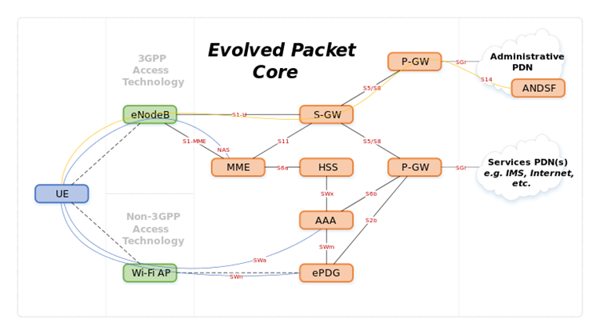

# S

## S- Tag

Service VLAN Tag

The IEEE standard 802.1ad provides for double-tagging by service
providers so that they can use VLANs allocated internally together with
traffic already tagged as VLANs by service provider customers.

In this double tagging, the S-Tag comes first followed by the C-Tag
(customer tag). The standard 802.1ad specifies a TPID of 0x88a8 for the
outer S-Tag.\


## S-GW

Serving Gateway

The SGW routes and forwards user data packets, while also acting as the
mobility anchor for the user plane during inter-eNodeB handovers and as
the anchor for mobility between LTE and other 3GPP technologies
(terminating S4 interface and relaying the traffic between 2G/3G systems
and PGW). For idle state UEs, the SGW terminates the downlink data path
and triggers paging when downlink data arrives for the UE. It manages
and stores UE contexts, e.g. parameters of the IP bearer service,
network internal routing information. It also performs replication of
the user traffic in case of lawful interception.



## SAAL

Signalling ATM Adaptation Layer

In ATM (Asynchronous Transfer Mode), the SAAL (ATM Adaptation Layer for
Signalling) provides reliable transport of signalling messages between
peer entities. These signalling messages are carried over a PVC
(Permanent Virtual Circuit).

## SaaS

Software As A Service

Software as a service is a software licensing and delivery model in
which software is licensed on a subscription basis and is centrally
hosted. It is sometimes referred to as "on-demand software". SaaS is
typically accessed by users using a thin client, e.g. via a web browser.


## SaaS

Software as a Service

Software as a service (SaaS /sæs/) is a software licensing and delivery
model in which software is licensed on a subscription basis and is
centrally hosted. It is sometimes referred to as "on-demand software",
and was formerly referred to as "software plus services" by Microsoft.
SaaS is typically accessed by users using a thin client via a web
browser. SaaS has become a common delivery model for many business
applications, including office software, messaging software, payroll
processing software, DBMS software, management software, CAD software,
development software, gamification, virtualization, accounting,
collaboration, customer relationship management (CRM), Management
Information Systems (MIS), enterprise resource planning (ERP),
invoicing, human resource management (HRM), talent acquisition, learning
management systems, content management (CM), and service desk
management. SaaS has been incorporated into the strategy of nearly all
leading enterprise software companies

## SAE

System Architecture Evolution

System Architecture Evolution (SAE) is the core network architecture of
3GPP's LTE wireless communication standard.

SAE is the evolution of the GPRS Core Network, with some differences:

- simplified architecture

- all-IP Network (AIPN)

- support for higher throughput and lower latency radio access
    networks (RANs)

- support for, and mobility between, multiple heterogeneous access
    networks, including E-UTRA (LTE and LTE Advanced air interface),
    3GPP legacy systems (for example GERAN or UTRAN, air interfaces of
    GPRS and UMTS respectively), but also non-3GPP systems (for example
    WiFi, WiMAX or cdma2000)

## SAFe

scaled agile framework enterprise

agile methodology used for software development.

## SBC

Session Border Controller

A session border controller (SBC) is a device regularly deployed in
Voice over Internet Protocol (VoIP) networks to exert control over the
signalling and usually also the media streams involved in setting up,
conducting, and tearing down telephone calls or other interactive media
communications.\


## SC-FDMA

Single-carrier FDMA

Single-carrier FDMA (SC-FDMA) is a frequency-division multiple access
scheme. It is also called Linearly precoded OFDMA (LP-OFDMA). Like other
multiple access schemes (TDMA, FDMA, CDMA, OFDMA), it deals with the
assignment of multiple users to a shared communication resource. SC-FDMA
can be interpreted as a linearly precoded OFDMA scheme, in the sense
that it has an additional DFT processing step preceding the conventional
OFDMA processing.\
SC-FDMA has drawn great attention as an attractive alternative to OFDMA,
especially in the uplink communications where lower peak-to-average
power ratio (PAPR) greatly benefits the mobile terminal in terms of
transmit power efficiency and reduced cost of the power amplifier. It
has been adopted as the uplink multiple access scheme in 3GPP Long Term
Evolution (LTE), or Evolved UTRA (E-UTRA).

## Scala

Scala is a general-purpose programming language providing
support for functional programming and a strong static type system.
Designed to be concise, many of Scala's design decisions aimed to
address criticisms of Java.

Scala source code is intended to be compiled to Java bytecode, so that
the resulting executable code runs on a Java virtual machine. Scala
provides language interoperability with Java, so that libraries written
in both languages may be referenced directly in Scala or Java code. Like
Java, Scala is object-oriented, and uses a curly-brace syntax
reminiscent of the C programming language. Unlike Java, Scala has many
features of functional programming languages like Scheme, Standard ML
and Haskell, including currying, type inference, immutability, lazy
evaluation, and pattern matching. It also has an advanced type system
supporting algebraic data types, covariance and contravariance,
higher-order types (but not higher-rank types), and anonymous types.
Other features of Scala not present in Java include operator
overloading, optional parameters, named parameters, and raw strings.
Conversely, a feature of Java not in Scala is checked exceptions, which
have proved controversial.

## Scaled Agile

agile scaled up to large projects or programmes, for example by having
multiple sub-projects, creating tranches of projects, etc.

## SCCP

Signalling Connection Control Part

The (SCCP) is a network layer protocol that provides extended routing,
flow control, segmentation, connection-orientation, and error correction
facilities in Signaling System 7 telecommunications networks. SCCP
relies on the services of MTP for basic routing and error detection.

## Scenario

A narrative description of an activity or activities which take the form
of a story

## Schedule

General term for a plan that defines calendar timing, resources,
dependencies, and other details for *tasks* necessary to complete a
project or part of a project. CxOne defines two major classes of
schedules, *business schedules* and *detailed schedules*.

## Scheduler

In computing, scheduling is the method by which work specified by some
means is assigned to resources that complete the work. The work may be
virtual computation elements such as threads, processes or data flows,
which are in turn scheduled onto hardware resources such as processors,
network links or expansion cards.

A scheduler is what carries out the scheduling activity. Schedulers are
often implemented so they keep all computer resources busy (as in load
balancing), allow multiple users to share system resources effectively,
or to achieve a target quality of service. Scheduling is fundamental to
computation itself, and an intrinsic part of the execution model of a
computer system; the concept of scheduling makes it possible to have
computer multitasking with a single central processing unit (CPU).

A scheduler may aim at one or more of many goals, for example:
maximizing throughput (the total amount of work completed per time
unit); minimizing wait time (time from work becoming enabled until the
first point it begins execution on resources); minimizing latency or
response time (time from work becoming enabled until it is finished in
case of batch activity, or until the system responds and hands the first
output to the user in case of interactive activity); or maximizing
fairness (equal CPU time to each process, or more generally appropriate
times according to the priority and workload of each process). In
practice, these goals often conflict (e.g. throughput versus latency),
thus a scheduler will implement a suitable compromise. Preference is
measured by any one of the concerns mentioned above, depending upon the
user's needs and objectives.

In real-time environments, such as embedded systems for automatic
control in industry (for example robotics), the scheduler also must
ensure that processes can meet deadlines; this is crucial for keeping
the system stable. Scheduled tasks can also be distributed to remote
devices across a network and managed through an administrative back end.

## SCM

software configuration management

In software engineering, software configuration management (SCM or S/W
CM) is the task of tracking and controlling changes in the software,
part of the larger cross-disciplinary field of configuration
management.\[2\] SCM practices include revision control and the
establishment of baselines. If something goes wrong, SCM can determine
what was changed and who changed it. If a configuration is working well,
SCM can determine how to replicate it across many hosts.

## Scratch

Scratch is a visual programming language and online community targeted
primarily at children. Using Scratch, users can create online projects
and develop them into almost anything by using a simple block-like
interface. When they are ready, they then share, and also discuss their
creations with each other. Developed by the Lifelong Kindergarten group
at the MIT Media Lab, the service is designed to help children (ages 8
and up) learn to utilize their imaginations, practice common sense, and,
most importantly, to interact with computers.

## Scribe

Records issues during an *inspection* or other formal meeting.

## Scrum

Scrum is a process framework used to manage product development and
other knowledge work.

## Scrum Master

The scrum master is responsible for ensuring the team lives agile values
and principles and follows the practices that the team agreed they would
use.

## Scrum of Scrums

A technique to scale Scrum up to large groups (over a dozen people),
consisting of dividing the groups into Agile teams of 5-10.

## SCTP

Stream Control Transmission Protocol

The (SCTP) is a computer networking communications protocol which
operates at the transport layer and serves a role similar to the popular
protocols TCP and UDP. It is standardized by IETF in RFC 4960.

SCTP provides some of the features of both UDP and TCP: it is
message-oriented like UDP and ensures reliable, in-sequence transport of
messages with congestion control like TCP. It differs from those
protocols by providing multi-homing and redundant paths to increase
resilience and reliability.

## SDES

Session Description protocol Security

SDES (Session Description Protocol Security Descriptions) for Media
Streams is a way to negotiate the key for Secure Real-time Transport
Protocol.

## SDH

Synchronous Digital Hierarchy

Synchronous optical networking (SONET) and synchronous digital hierarchy
(SDH) are standardized protocols that transfer multiple digital bit
streams synchronously over optical fiber using lasers or highly coherent
light from light-emitting diodes (LEDs). At low transmission rates data
can also be transferred via an electrical interface. The method was
developed to replace the plesiochronous digital hierarchy (PDH) system
for transporting large amounts of telephone calls and data traffic over
the same fiber without synchronization problems.

SONET and SDH, which are essentially the same, were originally designed
to transport circuit mode communications (e.g., DS1, DS3) from a variety
of different sources, but they were primarily designed to support
real-time, uncompressed, circuit-switched voice encoded in PCM
format.\[1\] The primary difficulty in doing this prior to SONET/SDH was
that the synchronization sources of these various circuits were
different. This meant that each circuit was actually operating at a
slightly different rate and with different phase. SONET/SDH allowed for
the simultaneous transport of many different circuits of differing
origin within a single framing protocol. SONET/SDH is not a
communications protocol in itself, but a transport protocol.

Due to SONET/SDH's essential protocol neutrality and transport-oriented
features, SONET/SDH was the obvious choice for transporting the fixed
length Asynchronous Transfer Mode (ATM) frames also known as cells. It
quickly evolved mapping structures and concatenated payload containers
to transport ATM connections. In other words, for ATM (and eventually
other protocols such as Ethernet), the internal complex structure
previously used to transport circuit-oriented connections was removed
and replaced with a large and concatenated frame (such as STS-3c) into
which ATM cells, IP packets, or Ethernet frames are placed.

## SDK

Software Development Kit

a set of programs used by a computer programmer to write application
programs.

## SDLC

Synchronous Data Link Control

Synchronous Data Link Control (SDLC) is a computer communications
protocol. It is the layer 2 protocol for IBM's Systems Network
Architecture (SNA). SDLC supports multipoint links as well as error
correction. It also runs under the assumption that an SNA header is
present after the SDLC header.\[1\] SDLC was mainly used by IBM
mainframe and midrange systems; however, implementations exist on many
platforms from many vendors. The use of SDLC (and SNA) is becoming more
and more rare, mostly replaced by IP-based protocols or being tunnelled
through IP (using AnyNet or other technologies)

## SDLC

systems development life cycle model

one of a number of structured approaches to information system
development, created to guide all the processes involved, from an
initial feasibility study through maintenance of the completed
application. Models include the waterfall model; rapid application
development (RAD); joint application development (JAD); the fountain
model; the spiral model; build and fix; and synchronize-and-stabilize.

## SDMA

Space-division multiple access

Space-division multiple access (SDMA) is a channel access method based
on creating parallel spatial pipes\[clarification needed\] next to
higher capacity pipes through spatial multiplexing and/or diversity, by
which it is able to offer superior performance in radio multiple access
communication systems.\[clarification needed\] In traditional mobile
cellular network systems, the base station has no information on the
position of the mobile units within the cell and radiates the signal in
all directions within the cell in order to provide radio coverage. This
results in wasting power on transmissions when there are no mobile units
to reach, in addition to causing interference for adjacent cells using
the same frequency, so called co-channel cells. Likewise, in reception,
the antenna receives signals coming from all directions including noise
and interference signals. By using smart antenna technology and
differing spatial locations of mobile units within the cell,
space-division multiple access techniques offer attractive performance
enhancements. The radiation pattern of the base station, both in
transmission and reception, is adapted to each user to obtain highest
gain in the direction of that user. This is often done using phased
array techniques.

In GSM cellular networks, the base station is aware of the distance (but
not direction) of a mobile phone by use of a technique called "timing
advance" (TA). The base transceiver station (BTS) can determine how far
the mobile station (MS) is by interpreting the reported TA. This
information, along with other parameters, can then be used to power down
the BTS or MS, if a power control feature is implemented in the network.
The power control in either BTS or MS is implemented in most modern
networks, especially on the MS, as this ensures a better battery life
for the MS. This is also why having a BTS close to the user results in
less exposure to electromagnetic radiation.

## SDN

Software Defined Network

Software-defined networking (SDN) technology is an approach to cloud
computing that facilitates network management and enables
programmatically efficient network configuration in order to improve
network performance and monitoring. SDN is meant to address the fact
that the static architecture of traditional networks is decentralized
and complex while current networks require more flexibility and easy
troubleshooting. SDN suggests to centralize network intelligence in one
network component by disassociating the forwarding process of network
packets (data plane) from the routing process (control plane). The
control plane consists of one or more controllers which are considered
as the brain of SDN network where the whole intelligence is
incorporated. However, the intelligence centralization has its own
drawbacks when it comes to security, scalability and elasticity and this
is the main issue of SDN

## SDP

Session Description Protocol

The Session Description Protocol (SDP) is a format for describing
streaming media communications parameters. The IETF published the
original specification as an IETF Proposed Standard in April 1998, and
subsequently published a revised specification as an IETF Proposed
Standard as RFC 4566 in July 2006.

SDP is used for describing multimedia communication sessions for the
purposes of session announcement, session invitation, and parameter
negotiation. SDP does not deliver any media by itself but is used
between endpoints for negotiation of media type, format, and all
associated properties. The set of properties and parameters are often
called a session profile.

SDP is designed to be extensible to support new media types and formats.
SDP started off as a component of the Session Announcement Protocol
(SAP), but found other uses in conjunction with Real-time Transport
Protocol (RTP), Real-time Streaming Protocol (RTSP), Session Initiation
Protocol (SIP) and even as a standalone format for describing multicast
sessions.

## SDSL

Symmetrical Digital Subscriber Line

A symmetric digital subscriber line (SDSL) is a digital subscriber line
(DSL) that transmits digital data over the copper wires of the telephone
network, where the bandwidth in the downstream direction, from the
network to the subscriber, is identical to the bandwidth in the upstream
direction, from the subscriber to the network. This symmetric bandwidth
can be considered to be the opposite of the asymmetric bandwidth offered
by asymmetric digital subscriber line (ADSL) technologies, where the
upstream bandwidth is lower than the downstream bandwidth. SDSL is
generally marketed at business customers, while ADSL is marketed at
private as well as business customers.

More specifically, SDSL can be understood as:

- in the wider sense, an umbrella term for all DSL variant which offer
    symmetric bandwidth, including IDSL, which offers 144 kbit/s, HDSL,
    HDSL2, G.SHDSL, which offers up to 22.784 Mbit/s over four pairs of
    copper wires, as well as the SDSL variant below

- in the narrow sense, a particular proprietary and non-standardized
    DSL variant for operation at 1.544 Mbit/s or 2.048 Mbit/s over a
    single pair of copper wires, without support for analog calls on the
    same line

- a term used by ETSI to refer to G.SHDSL

## Sed

sed (stream editor) is a Unix utility that parses and transforms text,
using a simple, compact programming language. sed was developed from
1973 to 1974 by Lee E. McMahon of Bell Labs, and is available
today for most operating systems. sed was based on the scripting
features of the interactive editor ed ("editor", 1971) and the earlier
qed ("quick editor", 1965--66). sed was one of the earliest tools to
support regular expressions, and remains in use for text processing,
most notably with the substitution command. Popular alternative
tools for plaintext string manipulation and "stream editing" include AWK
and Perl.

## Semaphore

In computer science, a semaphore is a variable or abstract data type
used to control access to a common resource by multiple processes in a
concurrent system such as a multitasking operating system. Semaphore is
simply a variable. This variable is used to solve critical section
problems and to achieve process synchronization in the multi processing
environment.

A trivial semaphore is a plain variable that is changed (for example,
incremented or decremented, or toggled) depending on programmer-defined
conditions.

A useful way to think of a semaphore as used in the real-world systems
is as a record of how many units of a particular resource are available,
coupled with operations to adjust that record safely (i.e. to avoid race
conditions) as units are required or become free, and, if necessary,
wait until a unit of the resource becomes available.

Semaphores are a useful tool in the prevention of race conditions;
however, their use is by no means a guarantee that a program is free
from these problems. Semaphores which allow an arbitrary resource count
are called counting semaphores, while semaphores which are restricted to
the values 0 and 1 (or locked/unlocked, unavailable/available) are
called binary semaphores and are used to implement locks.

## Sematic Versioning

Given a version number MAJOR.MINOR.PATCH, increment the:

1. MAJOR version when you make incompatible API changes,

2. MINOR version when you add functionality in a backwards compatible
    manner, and

3. PATCH version when you make backwards compatible bug fixes.

Additional labels for pre-release and build metadata are available as
extensions to the MAJOR.MINOR.PATCH format.


`<valid semver>`{=html} ::= `<version core>`{=html}
`<version core>`{=html} "-" `<pre-release>`{=html}
`<version core>`{=html} "+" `<build>`{=html} `<version core>`{=html} "-"
`<pre-release>`{=html} "+" `<build>`{=html}

`<version core>`{=html} ::= `<major>`{=html} "." `<minor>`{=html} "."
`<patch>`{=html}

`<major>`{=html} ::= `<numeric identifier>`{=html}

`<minor>`{=html} ::= `<numeric identifier>`{=html}

`<patch>`{=html} ::= `<numeric identifier>`{=html}

`<pre-release>`{=html} ::=
`<dot-separated pre-release identifiers>`{=html}

`<dot-separated pre-release identifiers>`{=html} ::=
`<pre-release identifier>`{=html} `<pre-release identifier>`{=html} "."
`<dot-separated pre-release identifiers>`{=html}

`<build>`{=html} ::= `<dot-separated build identifiers>`{=html}

`<dot-separated build identifiers>`{=html} ::=
`<build identifier>`{=html} `<build identifier>`{=html} "."
`<dot-separated build identifiers>`{=html}

`<pre-release identifier>`{=html} ::= `<alphanumeric identifier>`{=html}
`<numeric identifier>`{=html}

`<build identifier>`{=html} ::= `<alphanumeric identifier>`{=html}
`<digits>`{=html}

`<alphanumeric identifier>`{=html} ::= `<non-digit>`{=html}
`<non-digit>`{=html} `<identifier characters>`{=html}
`<identifier characters>`{=html} `<non-digit>`{=html}
`<identifier characters>`{=html} `<non-digit>`{=html}
`<identifier characters>`{=html}

`<numeric identifier>`{=html} ::= "0" `<positive digit>`{=html}
`<positive digit>`{=html} `<digits>`{=html}

`<identifier characters>`{=html} ::= `<identifier character>`{=html}
`<identifier character>`{=html} `<identifier characters>`{=html}

`<identifier character>`{=html} ::= `<digit>`{=html}
`<non-digit>`{=html}

`<non-digit>`{=html} ::= `<letter>`{=html} "-"

`<digits>`{=html} ::= `<digit>`{=html} `<digit>`{=html}
`<digits>`{=html}

`<digit>`{=html} ::= "0" `<positive digit>`{=html}

`<positive digit>`{=html} ::= "1" "2" "3" "4" "5" "6" "7" "8" "9"

`<letter>`{=html} ::= "A" "B" "C" "D" "E" "F" "G" "H" "I" "J" "K" "L"
"M" "N" "O" "P" "Q" "R" "S" "T" "U" "V" "W" "X" "Y" "Z" "a" "b" "c" "d"
"e" "f" "g" "h" "i" "j" "k" "l" "m" "n" "o" "p" "q" "r" "s" "t" "u" "v"
"w" "x" "y" "z"

## Sequence Model

Specifies the set of object roles and their interactions by showing and
describing the messages exchanged. The focus is on the timing of
messages.

## SF

Super Frame

In telecommunications, superframe (SF) is a T1 framing standard. In the
1970s it replaced the original T1/D1 framing scheme of the 1960s in
which the framing bit simply alternated between 0 and 1.

## SFTP

Secure File Transfer Protocol

In computing, the SSH File Transfer Protocol (also Secure File Transfer
Protocol, or SFTP) is a network protocol that provides file access, file
transfer, and file management over any reliable data stream. It was
designed by the Internet Engineering Task Force (IETF) as an extension
of the Secure Shell protocol (SSH) version 2.0 to provide secure file
transfer capabilities. The IETF Internet Draft states that, even though
this protocol is described in the context of the SSH-2 protocol, it
could be used in a number of different applications, such as secure file
transfer over Transport Layer Security (TLS) and transfer of management
information in VPN applications.

This protocol assumes that it is run over a secure channel, such as SSH,
that the server has already authenticated the client, and that the
identity of the client user is available to the protocol.

## SGML

Standard Generalized Markup Language

The Standard Generalized Markup Language (SGML; ISO 8879:1986) is a
standard for defining generalized markup languages for documents. ISO
8879 Annex A.1 defines generalized markup:

Generalized markup is based on two postulates:

- Markup should be declarative: it should describe a document's
    structure and other attributes, rather than specify the processing
    to be performed on it. Declarative markup is less likely to conflict
    with unforeseen future processing needs and techniques.\
    Markup should be rigorous so that the techniques
    available for processing rigorously-defined objects like programs
    and databases can be used for processing documents as well.

```{=html}
<!-- Lunch at the steakhouse -->
```

\<!ELEMENT lunch (meal)+ -- one meal per person --\>

\<!ELEMENT meal (appetiz?, steak, dessert?, custname, whopays) +(drink)
\>

```{=html}
<!-- The plus sign after the content model followed by
one or more elements within parentheses declares an
"inclusion". An inclusion indicates that the elements
can appear anywhere in the element to which they are
attached and in any of its subelements. You can have
one or more DRINK elements any time during MEAL. -->
```

\<!ELEMENT appetiz (soup salad) \>

\<!ELEMENT soup EMPTY --soup of the day --\>

\<!ELEMENT salad EMPTY\>

\<!ATTLIST salad kind NAME \#REQUIRED dressing (french 1000isl bluechse)
\#REQUIRED\>

```{=html}
<!-- The declared value for the attribute DRESSING is
called a "name token group", a series of values separated
by a vertical bar (). They represent the only possible
values for the attribute. the declared value NAME requires
a value usually comprising up to 8 letters and numbers.
REQUIRED means that one value must be specified for the
attribute. -->
```

\<!ELEMENT steak EMPTY\>

\<!ATTLIST steak cook (raremedraremedium) "medrare" side
(potatofriesrice) "fries"\>

```{=html}
<!--The value between quotes is used to force a default
value in case no value is specified for the attribute. -->
```

\<!ELEMENT dessert (cakeapplepie)\>

\<!ELEMENT (cakeapplepie) EMPTY\>

\<!ATTLIST cake kind CDATA \#REQUIRED\>

```{=html}
<!-- CDATA means any letters, numbers, punctuation,
spaces, or other special characters. This gives you
the possibility of creating long and unique values
for an attribute. This means you can ask for any
cake you want; if the system doesn't recognize the
name, you may not get it. -->
```

\<!ATTLIST applepie hot (hotwarmcool) \#IMPLIED icecream (yesno)
\#IMPLIED

```{=html}
<!--   IMPLIED is an equivalent for optional. The
APPLEPIE comes the way the waiter or waitress prefers
unless you specify otherwise. -->
```

\<!ELEMENT drink (waterbeercola)\>

\<!ELEMENT (waterbeercola) EMPTY\>

\<!ATTLIST water kind (tap) \#FIXED tap\>

```{=html}
<!-- The declared value for WATER is fixed by the
system. You can order any kind of fancy water you
want, but all they've got here is tap water. -->
```

\<!ATTLIST beer number NUMBER \#REQUIRED\>

\<!ATTLIST cola type (regular diet) \#CURRENT\>

```{=html}
<!-- Beer is ordered by NUMBER from the beer list.
The Default Value CURRENT says that the first time
the element COLA appears, a type must be specified.
That value will be used for the next occurrences
unless you specify another. In other words, you
don't have to re-specify the type of COLA every
time you ask for a refill.-->
```

\<!ELEMENT (custname whopays) (\#PCDATA) \>

\<!ATTLIST custname account ID \#IMPLIED\>

\<!ATTLIST whopays charge IDREF \#REQUIRED\>

```{=html}
<!-- The customer's name is not critical data within
the content of the element CUSTNAME: The cashier could
make a typo or use a nickname and the computer would
have difficulty tracking the charge. Instead a unique
identifier is requested - but only if the customer has
an account. However, WHOPAYS has a required IDREF. The
system knows that WHOPAYS may have the same value for
many people's meals (when someone buys for the whole
table) but each CUSTNAME will have a unique ID. The
system will check that the value of the IDREF will be
a legitimate ID. The example below illustrates only
one of several MEALS in the LUNCH. A separate MEAL in
the same LUNCH must include a CUSTNAME with an
ACCOUNTID of "ALEXF" for the CHARGE IDREF to work -->
```

## SGSN

Serving GPRS support node

The Serving GPRS Support Node (SGSN) is the node that is serving the
MS/UE. The SGSN supports GPRS and/or UMTS. The SGSN keeps track of the
location of an individual MS/UE and performs security functions and
access control. The SGSN is connected to the GERAN base station system
through the Gb or Iu interface and/or to the UTRAN through the Iu
interface. A SGSN is responsible for the delivery of data packets from
and to the mobile stations within its geographical service area. Its
tasks include packet routing and transfer, mobility management
(attach/detach and location management), logical link management, and
authentication and charging functions. The location register of the SGSN
stores location information (e.g., current cell, current VLR) and user
profiles (e.g., IMSI, address(es) used in the packet data network) of
all GPRS users registered with it.


## SGW

signalling gateway

A signalling gateway (SGW) interfaces with the signalling plane of the
CS. It transforms lower layer protocols as Stream Control Transmission
Protocol (SCTP, an IP protocol) into Message Transfer Part (MTP, an
Signalling System 7 (SS7) protocol), to pass ISDN User Part (ISUP) from
the MGCF to the CS network.


## Sh

The Bourne shell (sh) is a shell, or command-line
interpreter, for computer operating systems.

The Bourne shell was the default shell for Version 7 Unix. Most
Unix-like systems continue to have /bin/sh---which will be the Bourne
shell, or a symbolic link or hard link to a compatible shell---even when
other shells are used by most users.

## SHA

Secure Hash Algorithm

The Secure Hash Algorithms are a family of cryptographic hash functions
published by the National Institute of Standards and Technology (NIST)
as a U.S. Federal Information Processing Standard (FIPS), including:

- SHA-0: A retronym applied to the original version of the 160-bit
    hash function published in 1993 under the name "SHA". It was
    withdrawn shortly after publication due to an undisclosed
    "significant flaw" and replaced by the slightly revised version
    SHA-1.

- SHA-1: A 160-bit hash function which resembles the earlier MD5
    algorithm. This was designed by the National Security Agency (NSA)
    to be part of the Digital Signature Algorithm. Cryptographic
    weaknesses were discovered in SHA-1, and the standard was no longer
    approved for most cryptographic uses after 2010.

- SHA-2: A family of two similar hash functions, with different block
    sizes, known as SHA-256 and SHA-512. They differ in the word size;
    SHA-256 uses 32-bit words where SHA-512 uses 64-bit words. There are
    also truncated versions of each standard, known as SHA-224, SHA-384,
    SHA-512/224 and SHA-512/256. These were also designed by the NSA.

- SHA-3: A hash function formerly called Keccak, chosen in 2012 after
    a public competition among non-NSA designers. It supports the same
    hash lengths as SHA-2, and its internal structure differs
    significantly from the rest of the SHA family.\
    The corresponding standards are FIPS PUB 180 (original SHA), FIPS
    PUB 180-1 (SHA-1), FIPS PUB 180-2 (SHA-1, SHA-256, SHA-384, and
    SHA-512). NIST has updated Draft FIPS Publication 202, SHA-3
    Standard separate from the Secure Hash Standard (SHS).

## Shell Scripting

A shell script is a computer program designed to be run by the Unix
shell, a command-line interpreter. The various dialects of shell scripts
are considered to be scripting languages. Typical operations performed
by shell scripts include file manipulation, program execution, and
printing text. A script which sets up the environment, runs the program,
and does any necessary cleanup, logging, etc. is called a wrapper.

The term is also used more generally to mean the automated mode of
running an operating system shell; in specific operating systems they
are called other things such as batch files (MSDos-Win95 stream, OS/2),
command procedures (VMS), and shell scripts (Windows NT stream and
third-party derivatives like 4NT---article is at cmd.exe), and mainframe
operating systems are associated with a number of terms.

## Sidetone

Sidetone is audible feedback to someone speaking when using a handset or
headset as an indication of an active transmission. The term is often
used in the telecommunication field.

## Sign Up

for Tasks Members of an Agile development team normally choose which
tasks to work on, rather than being assigned work by a manager. (see
more

## SIM

Subscriber Identity Module

A subscriber identity module or subscriber identification module (SIM),
widely known as a SIM card, is an integrated circuit that is intended to
securely store the international mobile subscriber identity (IMSI)
number and its related key, which are used to identify and authenticate
subscribers on mobile telephony devices (such as mobile phones and
computers). It is also possible to store contact information on many SIM
cards. SIM cards are always used on GSM phones; for CDMA phones, they
are only needed for newer LTE-capable handsets. SIM cards can also be
used in satellite phones, smart watches, computers, or cameras.

The SIM circuit is part of the function of a universal integrated
circuit card (UICC) physical smart card, which is usually made of PVC
with embedded contacts and semiconductors. SIM cards are transferable
between different mobile devices. The first UICC smart cards were the
size of credit and bank cards; sizes were reduced several times over the
years, usually keeping electrical contacts the same, so that a larger
card could be cut down to a smaller size.

A SIM card contains its unique serial number (ICCID), international
mobile subscriber identity (IMSI) number, security authentication and
ciphering information, temporary information related to the local
network, a list of the services the user has access to, and two
passwords: a personal identification number (PIN) for ordinary use, and
a personal unblocking code (PUC) for PIN unlocking.

SIM cards have been made smaller over the years; functionality is
independent of format. Full-size SIM were followed by mini-SIM,
micro-SIM, and nano-SIM. SIM cards are also made to embed in devices.


## SIMPLE

Session Initiation Protocol for Instant Messaging and Presence
Leveraging Extensions

SIMPLE, the Session Initiation Protocol for Instant Messaging and
Presence Leveraging Extensions, is an instant messaging (IM) and
presence protocol suite based on Session Initiation Protocol (SIP)
managed by the Internet Engineering Task Force. Contrary to the vast
majority of IM and presence protocols used by software deployed today,
SIMPLE is an open standard like XMPP.

## Simple Design

A team adopting the "simple design" practice bases its software design
strategy on a set of "simple design" principles.

## Simplex

Simplex communication is a communication channel that sends information
in one direction only.

The International Telecommunication Union definition is a communications
channel that operates in one direction at a time, but that may be
reversible; this is termed half duplex in other contexts. A duplex
communication channel requires two simplex channels operating in
opposite directions.

\


## Single Step Test

Test conducted in a debugging environment by stepping through the source
code while executing.

## SIP

Session Initiation Protocol

The Session Initiation Protocol (SIP) is a communications protocol for
signaling and controlling multimedia communication sessions in
applications of Internet telephony for voice and video calls, in private
IP telephone systems, as well as in instant messaging over Internet
Protocol (IP) networks.

The protocol defines the specific format of messages exchanged and the
sequence of communications for cooperation of the participants. SIP is a
text-based protocol, incorporating many elements of the Hypertext
Transfer Protocol (HTTP) and the Simple Mail Transfer Protocol
(SMTP).\[1\] A call established with SIP may consist of multiple media
streams, but no separate streams are required for applications, such as
text messaging, that exchange data as payload in the SIP message.

SIP works in conjunction with several other protocols that specify and
carry the session media. Media type and parameter negotiation and media
setup is performed with the Session Description Protocol (SDP), which is
carried as payload in SIP messages. SIP is designed to be independent of
the underlying transport layer protocol, and can be used with the User
Datagram Protocol (UDP), the Transmission Control Protocol (TCP), and
the Stream Control Transmission Protocol (SCTP). For the transmission of
media streams (voice, video) SIP typically employs the Real-time
Transport Protocol (RTP) or the Secure Real-time Transport Protocol
(SRTP). For secure transmissions of SIP messages over insecure network
links, the protocol may be encrypted with Transport Layer Security
(TLS)\
\


## SIP Trunk

SIP trunking enables the end point's PBX (Phone Exchange System) to send
and receive calls via Internet. As SIP is applied for the signalling
protocol for multiple real-time application, SIP trunk is able to
control voice, video and messaging applications.\
It is also a voice over Internet Protocol (VoIP) technology and
streaming media service based on the Session Initiation Protocol (SIP)
by which Internet telephony service providers (ITSPs) deliver telephone
services and unified communications to customers equipped with SIP-based
private branch exchange (IP-PBX) and unified communications facilities.

## SISO

single-input and single-output

A single-input and single-output (SISO) system is a simple single
variable control system with one input and one output. In radio it is
the use of only one antenna both in the transmitter and receiver.

## Skew

Clock skew (sometimes called timing skew) is a phenomenon in synchronous
digital circuit systems (such as computer systems) in which the same
sourced clock signal arrives at different components at different times
i.e. the instantaneous difference between the readings of any two clocks
is called their skew.

## SLA

Service Level Agreement

A service-level agreement (SLA) is a commitment between a service
provider and a client. Particular aspects of the service -- quality,
availability, responsibilities -- are agreed between the service
provider and the service user. The most common component of SLA is that
the services should be provided to the customer as agreed upon in the
contract. As an example, Internet service providers and telcos will
commonly include service level agreements within the terms of their
contracts with customers to define the level(s) of service being sold in
plain language terms. In this case the SLA will typically have a
technical definition in mean time between failures (MTBF), mean time to
repair or mean time to recovery (MTTR); identifying which party is
responsible for reporting faults or paying fees; responsibility for
various data rates; throughput; jitter; or similar measurable details.

## SLIP

Serial Line Interface Protocol

The Serial Line Internet Protocol (also SLIP) is an encapsulation of the
Internet Protocol designed to work over serial ports and modem
connections. It is documented in RFC 1055. On personal computers, SLIP
has been largely replaced by the Point-to-Point Protocol (PPP), which is
better engineered, has more features and does not require its IP address
configuration to be set before it is established. On microcontrollers,
however, SLIP is still the preferred way of encapsulating IP packets due
to its very small overhead.

## SME

Subject Matter Expert

A subject-matter expert (SME) or domain expert is a person who is an
authority in a particular area or topic. The term domain expert is
frequently used in expert systems software development, and there the
term always refers to the domain other than the software domain. A
domain expert is a person with special knowledge or skills in a
particular area of endeavour (e.g. an accountant is an expert in the
domain of accountancy). The development of accounting software requires
knowledge in two different domains: accounting and software. Some of the
development workers may be experts in one domain and not the other.

## Smoke Test

Test conducted to prove a *build*.

## smoke testing

non-exhaustive software testing, ascertaining that the most crucial
functions of a prog

## SMP

Symmetric Multiprocessing

Symmetric multiprocessing (SMP) involves a multiprocessor computer
hardware and software architecture where two or more identical
processors are connected to a single, shared main memory, have full
access to all input and output devices, and are controlled by a single
operating system instance that treats all processors equally, reserving
none for special purposes. Most multiprocessor systems today use an SMP
architecture. In the case of multi-core processors, the SMP architecture
applies to the cores, treating them as separate processors.

Professor John D. Kubiatowicz considers traditionally SMP systems to
contain processors without caches. Culler and Pal-Singh in their 1998
book "Parallel Computer Architecture: A Hardware/Software Approach"
mention: "The term SMP is widely used but causes a bit of confusion.
\[...\] The more precise description of what is intended by SMP is a
shared memory multiprocessor where the cost of accessing a memory
location is the same for all processors; that is, it has uniform access
costs when the access actually is to memory. If the location is cached,
the access will be faster. but cache access times and memory access
times are the same on all processors."

SMP systems are tightly coupled multiprocessor systems with a pool of
homogeneous processors running independently of each other. Each
processor, executing different programs and working on different sets of
data, has the capability of sharing common resources (memory, I/O
device, interrupt system and so on) that are connected using a system
bus or a crossbar.


## SMPF

Shared Metallic Path Facility

A copper pair to the exchange that goes to two telcos, one for telephone
service and one for broadband. Normally this means telephone from BT,
and can mean broadband from BT or from another provider.

## SMSC

Short Message service center

A Short Message Service Center (SMSC) is a network element in the mobile
telephone network. Its purpose is to store, forward, convert and deliver
Short Message Service (SMS) messages.

The full designation of an SMSC according to 3GPP is Short Message
Service - Service Center (SMS-SC).

Basic Trajectories of SMS are

1. From mobile to another mobile - referred to as MO-MT (Mobile
    Originated - Mobile Terminated)

2. From mobile to a content provider (also known as Large Account /
    ESME) - referred to as MO-AT (Mobile Originated - Application
    Terminated)

3. From application to a mobile - referred to as AO-MT (Application
    Originated - Mobile Terminated)

## Snake Case

Snake case (or snake\_case) is the practice of writing compound words or
phrases in which the elements are separated with one underscore
character (\_) and no spaces, with each element's initial letter usually
lowercased within the compound and the first letter either upper- or
lowercase---as in "foo\_bar" and "Hello\_world". It is commonly used in
computer code for variable names, and function names, and sometimes
computer filenames.

## SNMP

Simple Network Management Protocol

Simple Network Management Protocol (SNMP) is an Internet Standard
protocol for collecting and organizing information about managed devices
on IP networks and for modifying that information to change device
behavior. Devices that typically support SNMP include cable modems,
routers, switches, servers, workstations, printers, and more.

SNMP is widely used in network management for network monitoring. SNMP
exposes management data in the form of variables on the managed systems
organized in a management information base (MIB) which describe the
system status and configuration. These variables can then be remotely
queried (and, in some circumstances, manipulated) by managing
applications.

Three significant versions of SNMP have been developed and deployed.
SNMPv1 is the original version of the protocol. More recent versions,
SNMPv2c and SNMPv3, feature improvements in performance, flexibility and
security.

SNMP is a component of the Internet Protocol Suite as defined by the
Internet Engineering Task Force (IETF). It consists of a set of
standards for network management, including an application layer
protocol, a database schema, and a set of data objects.


## SNTP

Simple Network time Protocol

A less complex implementation of NTP, using the same protocol but
without requiring the storage of state over extended periods of time, is
known as the Simple Network Time Protocol (SNTP). It is used in some
embedded devices and in applications where full NTP capability is not
required.

## SOA

Service-oriented architecture

Service-oriented architecture (SOA) is a style of software design where
services are provided to the other components by application components,
through a communication protocol over a network. The basic principles of
service-oriented architecture are independent of vendors, products and
technologies. A service is a discrete unit of functionality that can be
accessed remotely and acted upon and updated independently, such as
retrieving a credit card statement online.

A service has four properties according to one of many definitions of
SOA:

1. It logically represents a business activity with a specified
    outcome.

2. It is self-contained.

3. It is a black box for its consumers.

4. It may consist of other underlying services.

    Different services can be used in conjunction to provide the
    functionality of a large software application, a principle SOA
    shares with modular programming. Service-oriented architecture
    integrates distributed, separately-maintained and -deployed software
    components. It is enabled by technologies and standards that
    facilitate components' communication and cooperation over a network,
    especially over an IP network.

## SOAP

Simple Object Access Protocol

SOAP (originally Simple Object Access Protocol) is a messaging protocol
specification for exchanging structured information in the
implementation of web services in computer networks. Its purpose is to
induce extensibility, neutrality and independence. It uses XML
Information Set for its message format, and relies on application layer
protocols, most often Hypertext Transfer Protocol (HTTP) or Simple Mail
Transfer Protocol (SMTP), for message negotiation and transmission.

SOAP allows processes running on disparate operating systems (such as
Windows and Linux) to communicate using Extensible Markup Language
(XML). Since Web protocols like HTTP are installed and running on all
operating systems, SOAP allows clients to invoke web services and
receive responses independent of language and platforms.\


## Softswitch

A softswitch (software switch) is a central device in a
telecommunications network which connects telephone calls from one phone
line to another, across a telecommunication network or the public
Internet, entirely by means of software running on a general-purpose
computer system. Most landline calls are routed by purpose-built
electronic hardware; however, soft switches using general purpose
servers and VoIP technology are becoming more popular.\[1\]

Many telecommunications networks now make use of combinations of
softswitches and more traditional purpose-built hardware.

Although the term softswitch technically refers to any such device, it
is more conventionally applied to a device that handles IP-to-IP phone
calls, while the phrase "access server" or "media gateway" is used to
refer to devices that either originate or terminate traditional "land
line" (hard wired) phone calls. In practice, such devices can often do
both. As a practical distinction, a Skype-to-Skype phone call is
entirely IP (internet) based, and so uses a softswitch somewhere in the
middle connecting the calling party with the called party. In contrast,
access servers might take a mobile call or a call originating from a
traditional phone line, convert it to IP traffic, then send it over the
internet to another such device, which terminates the call by reversing
the process and converting the Voice over IP call back to older circuit
switched digital systems using traditional digital ISDN / PSTN protocols
that transmit voice traffic using non-IP systems.

The Call Agent takes care of functions such as billing, call routing,
signaling, call services and the like, supplying the functional logic to
accomplish these telephony meta-tasks. A call agent may control several
different media gateways in geographically dispersed areas via a TCP/IP
link. It is also used to control the functions of media gateway, in
order to connect with media as well as other interfaces. This procedure
is utilized to keep the interfaces clear as crystal for receiving calls
from any phone lines.\[2\]

The softswitch generally resides in a building owned by the telephone
company called a telephone exchange (UK/IRL/AUS/NZ) or central office
(US/CAN). The central office or telephone exchange has high capacity
connections to carry calls to other offices owned by the
telecommunication company and to other telecommunication companies via
the PSTN.

Looking towards the end users from the switch, the softswitch may be
connected to several access devices via TCP/IP network. These access
devices can range from small and large Analog Telephone Adaptors (ATA)
which provide from one to hundreds of Telephone Pairs to an Integrated
Access Device (IAD), eMTA s (embedded Multimedia Terminal Adapters)
using MGCP/NCS protocol over cable (VoCable) or PBX which may provide
several hundred telephone connections

Note here that Analogue (ATA), PSTN telephone devices can only be
reached by a softswitch that has embedded SS7 or SIGTRAN cards, software
in terms of signalling AND Trunking Gateway for Voice traffic IP/TDM,
TDM/IP, TDM/TDM functions.

Typically the larger access devices will be located in a building owned
by the telecommunication company near to the customers they serve. Each
end user can be connected to the IAD by a simple pair of copper wires.

The medium-sized devices and PBXs are most commonly used by business
that locate them on their own premises, and single-line devices are
mostly found at private residences.

At the turn of the 21st century with IP Multimedia Subsystem (or IMS),
the Softswitch element is represented by the Media Gateway Controller
(MGC) element, and the term "Softswitch" is rarely used in the IMS
context. Rather, it is called an AGCF (Access Gateway Control Function).

## Software Change Request

SCR

See c*hange request.*

## Software Configuration Management

SCM

See *configuration management*.

## Software Development Plan

SDP

Sometimes used as a synonym for *project plan* on software focused
projects.

## Software Engineering Body of Knowledge

SWEBOK

IEEE led industry effort to define a body of knowledge for software
engineering. Is intended to support defining software engineering as a
profession. CxOne bases its top-level organization on SWEBOK.\
[www.swebok.org](http://www.swebok.org/)

## Software Engineering Lab

SEL

NASA lab developed to improving the software process used to develop
systems at Goddard.

## Software Engineering Process Group

SEPG

Provides experienced and objective technical oversight from individuals
who are not directly involved in the project. Also provides process
improvement input for projects and the organization.

## Software Requirements Specification

SRS

A text based document that captures the requirements for a software
system. Often used in conjunction with other requirements techniques
such as *modeling* and *prototyping* to provide a complete view of
system requirements.

## SoGEA

Single Order Generic Ethernet Access

- Single order Generic Ethernet Access.\
- Copper bearer to the cabinet and IP FTTC service delivered in a
    single order.\
- No voice service services provided on copper bearer.


## SONET

Synchronous Optical Network

Synchronous optical networking (SONET) and synchronous digital hierarchy
(SDH) are standardized protocols that transfer multiple digital bit
streams synchronously over optical fiber using lasers or highly coherent
light from light-emitting diodes (LEDs). At low transmission rates data
can also be transferred via an electrical interface. The method was
developed to replace the plesiochronous digital hierarchy (PDH) system
for transporting large amounts of telephone calls and data traffic over
the same fiber without synchronization problems.

SONET and SDH, which are essentially the same, were originally designed
to transport circuit mode communications (e.g., DS1, DS3) from a variety
of different sources, but they were primarily designed to support
real-time, uncompressed, circuit-switched voice encoded in PCM
format.\[1\] The primary difficulty in doing this prior to SONET/SDH was
that the synchronization sources of these various circuits were
different. This meant that each circuit was actually operating at a
slightly different rate and with different phase. SONET/SDH allowed for
the simultaneous transport of many different circuits of differing
origin within a single framing protocol. SONET/SDH is not a
communications protocol in itself, but a transport protocol.

Due to SONET/SDH's essential protocol neutrality and transport-oriented
features, SONET/SDH was the obvious choice for transporting the fixed
length Asynchronous Transfer Mode (ATM) frames also known as cells. It
quickly evolved mapping structures and concatenated payload containers
to transport ATM connections. In other words, for ATM (and eventually
other protocols such as Ethernet), the internal complex structure
previously used to transport circuit-oriented connections was removed
and replaced with a large and concatenated frame (such as STS-3c) into
which ATM cells, IP packets, or Ethernet frames are placed.

## Source Code

In computing, source code is any collection of code, possibly with
comments, written using a human-readable programming language, usually
as plain text. The source code of a program is specially designed to
facilitate the work of computer programmers, who specify the actions to
be performed by a computer mostly by writing source code. The source
code is often transformed by an assembler or compiler into binary
machine code understood by the computer. The machine code might then be
stored for execution at a later time. Alternatively, source code may be
interpreted and thus immediately executed.

Most application software is distributed in a form that includes only
executable files. If the source code were included it would be useful to
a user, programmer or a system administrator, any of whom might wish to
study or modify the program.

## SPEEX

Speex is an audio compression format specifically tuned for the
reproduction of human speech and also a free software speech codec that
may be used on VoIP applications and podcasts. It is based on the CELP
speech coding algorithm. Speex claims to be free of any patent
restrictions and is licensed under the revised (3-clause) BSD license.
It may be used with the Ogg container format or directly transmitted
over UDP/RTP. It may also be used with the FLV container format.

The Speex designers see their project as complementary to the Vorbis
general-purpose audio compression project.

Speex is a lossy format, i.e. quality is permanently degraded to reduce
file size.

The Speex project was created on February 13, 2002. The first
development versions of Speex were released under LGPL license, but as
of version 1.0 beta 1, Speex is released under Xiph's version of the
(revised) BSD license. Speex 1.0 was announced on March 24, 2003, after
a year of development. The last stable version of Speex encoder and
decoder is 1.2.0.

Xiph.Org now considers Speex obsolete; its successor is the more modern
Opus codec, which surpasses its performance in all areas.

## SPI

Serial Peripheral Interface


## Spiral Lifecycle

A set of mini-projects cumulating in final delivery. Each mini-project
focuses on addressing the current major project risk(s).

## Sponsor

Synonym for *project sponsor*.

## Sprial Model

The spiral model is a risk-driven process model generator for software
projects. Based on the unique risk patterns of a given project, the
spiral model guides a team to adopt elements of one or more process
models, such as incremental, waterfall, or evolutionary prototyping.\


## Sprint Planning

Sprint planning is an event that occurs at the beginning of a sprint
where the team determines the product backlog items they will work on
during that sprint.

## Sprint retrospective

a review of a Sprint providing lessons learned with the aim of promoting
continuous improvement.

## Sprints

a short development phase within a larger project defined by available
time ('timeboxes') and resources.

## SQL

SQL is a domain-specific language used in programming and
designed for managing data held in a relational database management
system (RDBMS), or for stream processing in a relational data stream
management system (RDSMS). It is particularly useful in handling
structured data where there are relations between different
entities/variables of the data. SQL offers two main advantages over
older read/write APIs like ISAM or VSAM: first, it introduced the
concept of accessing many records with one single command; and second,
it eliminates the need to specify how to reach a record, e.g. with or
without an index.

Originally based upon relational algebra and tuple relational calculus,
SQL consists of many types of statements, which may be informally
classed as sublanguages, commonly: a data query language (DQL), a data
definition language (DDL), a data control language (DCL), and a data
manipulation language (DML). The scope of SQL includes data query, data
manipulation (insert, update and delete), data definition (schema
creation and modification), and data access control. Although SQL is
often described as, and to a great extent is, a declarative language
(4GL), it also includes procedural elements.

## SS7

Signaling System 7

Signaling System No. 7 (SS7) is a set of telephony signaling protocols
developed in 1975, which is used to set up and tear down most of the
world's public switched telephone network (PSTN) telephone calls. It
also performs number translation, local number portability, prepaid
billing, Short Message Service (SMS), and other mass market services.

In North America it is often referred to as CCSS7, abbreviated for
Common Channel Signaling System 7. In the United Kingdom, it is called
C7 (CCITT number 7), number 7 and CCIS7 (Common Channel Interoffice
Signaling 7). In Germany, it is often called ZZK-7 (Zentraler
ZeichengabeKanal Nummer 7).

The only international SS7 protocol is defined by ITU-T's Q.700-series
recommendations in 1988.\[1\] Of the many national variants of the SS7
protocols, most are based on variants of the international protocol as
standardized by ANSI and ETSI. National variants with striking
characteristics are the Chinese and Japanese (TTC) national variants.

The Internet Engineering Task Force (IETF) has defined the SIGTRAN
protocol suite that impinaplements levels 2, 3, and 4 protocols
compatible with SS7. Sometimes also called Pseudo SS7, it is layered on
the Stream Control Transmission Protocol (SCTP) transport mechanism.

SS7 protocol suite

The SS7 protocol stack may be partially mapped to the OSI Model of a
packetized digital protocol stack. OSI layers 1 to 3 are provided by the
Message Transfer Part (MTP) and the Signalling Connection Control Part
(SCCP) of the SS7 protocol (together referred to as the Network Service
Part (NSP)); for circuit related signaling, such as the BT IUP,
Telephone User Part (TUP), or the ISDN User Part (ISUP), the User Part
provides layer 7. Currently there are no protocol components that
provide OSI layers 4 through 6.\[1\] The Transaction Capabilities
Application Part (TCAP) is the primary SCCP User in the Core Network,
using SCCP in connectionless mode. SCCP in connection oriented mode
provides transport layer for air interface protocols such as BSSAP and
RANAP. TCAP provides transaction capabilities to its Users (TC-Users),
such as the Mobile Application Part, the Intelligent Network Application
Part and the CAMEL Application Part.\[citation needed\]


The Message Transfer Part (MTP) covers a portion of the functions of the
OSI network layer including: network interface, information transfer,
message handling and routing to the higher levels. Signaling Connection
Control Part (SCCP) is at functional Level 4. Together with MTP Level 3
it is called the Network Service Part (NSP). SCCP completes the
functions of the OSI network layer: end-to-end addressing and routing,
connectionless messages (UDTs), and management services for users of the
Network Service Part (NSP).\[12\] Telephone User Part (TUP) is a
link-by-link signaling system used to connect calls. ISUP is the key
user part, providing a circuit-based protocol to establish, maintain,
and end the connections for calls. Transaction Capabilities Application
Part (TCAP) is used to create database queries and invoke advanced
network functionality, or links to Intelligent Network Application Part
(INAP) for intelligent networks, or Mobile Application Part (MAP) for
mobile services.

## SSADM

Structured Systems Analysis & Design Method

a widely-used computer application development method in the UK that
divides an application development project into modules, stages, steps,
and tasks, and provides a framework for describing projects in a fashion
suited to managing the project.

## SSH

Secure Shell

Secure Shell (SSH) is a cryptographic network protocol for operating
network services securely over an unsecured network. The best known
example application is for remote login to computer systems by users.

SSH provides a secure channel over an unsecured network in a
client-server architecture, connecting an SSH client application with an
SSH server. Common applications include remote command-line login and
remote command execution, but any network service can be secured with
SSH. The protocol specification distinguishes between two major
versions, referred to as SSH-1 and SSH-2.

## SSID

Service Set Identifier

Logical wireless networks (including extended service sets) are
identified by SSIDs, which serve as "network names" and are typically
natural language labels.

## SSIS

SQL Server Integration Services

SQL Server Integration Services (SSIS) is a component of the Microsoft
SQL Server database software that can be used to perform a broad range
of data migration tasks.

SSIS is a platform for data integration and workflow applications. It
features a data warehousing tool used for data extraction,
transformation, and loading (ETL). The tool may also be used to automate
maintenance of SQL Server databases and updates to multidimensional cube
data

## SSL

Secure Sockets Layer

See TLS

## Stack

The protocol stack or network stack is an implementation of a computer
networking protocol suite or protocol family. The terms are often used
interchangeably; strictly speaking, the suite is the definition of the
Communications protocols, and the stack is the software implementation
of them.

Individual protocols within a suite are often designed with a single
purpose in mind. This modularization makes design and evaluation easier.
Because each protocol module usually communicates with two others, they
are commonly imagined as layers in a stack of protocols. The lowest
protocol always deals with low-level interaction with the communications
hardware. Every higher layer adds more features and capability. User
applications usually deal only with the topmost layers (see also OSI
model)\


## Staff Days

A measure of effort indicating how much work needs to take place on an
activity or artifact. Is often used to differentiate from *calendar
days*. Also applies to other units of time.

## Stage

Often used as a synonym for *phase.* May be more precisely used to
define groupings of milestones, in terms of a hierarchy
with *phases* that are made up of *stages*.

## Staged Delivery Lifecycle

Project development occurs in stages, where the most critical
functionality is delivered first

## Stakeholder

Individuals or entities with significant investment in the outcome of a
project. Normally includes clients, customers, internal/external
organizations affected by the project, etc.

## Standard

CxStand

CxOne standard material type. Defined terminology, processes, policies,
knowledge, and/or guidelines. See *CxOneOverview* for description.

## Statistical Estimation

Estimation techniques that utilize historical data coupled with a
statistically derived model to provide output estimates based on input
characteristics. Most often use size as an input to predict effort and
time. Works best when calibrated with relevant historical data and
influence modifiers.

## STB

Set Top Box

A set-top box (STB) or set-top unit (STU) (one type also colloquially
known as a cable box) is an information appliance device that generally
contains a TV-tuner input and displays output to a television set and an
external source of signal, turning the source signal into content in a
form that then be displayed on the television screen or other display
device. They are used in cable television, satellite television, and
over-the-air television systems, as well as other uses.

## Story Mapping

Story mapping consists of ordering user stories along two independent
dimensions.

## Story Splitting

Splitting consists of breaking up one user story into smaller ones,
while preserving the property that each user story separately has
measurable business value.

## Storyboard

A sequence of images which depict a *scenario* or *use case*.

## STP

Spanning Tree Protocol

The Spanning Tree Protocol (STP) is a network protocol that builds a
loop-free logical topology for Ethernet networks. The basic function of
STP is to prevent bridge loops and the broadcast radiation that results
from them. Spanning tree also allows a network design to include backup
links to provide fault tolerance if an active link fails.

As the name suggests, STP creates a spanning tree within a network of
connected layer-2 bridges, and disables those links that are not part of
the spanning tree, leaving a single active path between any two network
nodes. STP is based on an algorithm that was invented by Radia Perlman
while she was working for Digital Equipment Corporation.

In 2001, the IEEE introduced Rapid Spanning Tree Protocol (RSTP) as
802.1w. RSTP provides significantly faster recovery in response to
network changes or failures, introducing new convergence behaviors and
bridge port roles to do this. RSTP was designed to be
backwards-compatible with standard STP.

## Strategy

The way a problem or issue is approached.

## STUN

Session Traversal Utilities for NAT

(STUN) is a standardized set of methods, including a network protocol,
for traversal of network address translator (NAT) gateways in
applications of real-time voice, video, messaging, and other interactive
communications.

STUN is a tool used by other protocols, such as Interactive Connectivity
Establishment (ICE), the Session Initiation Protocol (SIP), or WebRTC.
It provides a tool for hosts to discover the presence of a network
address translator, and to discover the mapped, usually public, Internet
Protocol (IP) address and port number that the NAT has allocated for the
application's User Datagram Protocol (UDP) flows to remote hosts. The
protocol requires assistance from a third-party network server (STUN
server) located on the opposing (public) side of the NAT, usually the
public Internet.

Originally, STUN was an acronym for Simple Traversal of User Datagram
Protocol (UDP) through Network Address Translators, but this title was
changed in a specification of an updated set of methods published as RFC
5389, retaining the same acronym

## Subversion

Apache Subversion (often abbreviated SVN, after its command name svn) is
a software versioning and revision control system distributed as open
source under the Apache License. Software developers use Subversion to
maintain current and historical versions of files such as source code,
web pages, and documentation. Its goal is to be a mostly compatible
successor to the widely used Concurrent Versions System (CVS).

## Sustainable Pace

The team aims for a work pace that they would be able to sustain
indefinitely.

## SVC

Soft Virtual Service

Switched virtual circuits (SVCs) are generally set up on a per-call
basis and are disconnected when the call is terminated; however, a
permanent virtual circuit (PVC) can be established as an option to
provide a dedicated circuit link between two facilities. PVC
configuration is usually preconfigured by the service provider. Unlike
SVCs, PVC are usually very seldom broken/disconnected.

A switched virtual circuit (SVC) is a virtual circuit that is
dynamically established on demand and is torn down when transmission is
complete, for example after a phone call or a file download. SVCs are
used in situations where data transmission is sporadic and/or not always
between the same data terminal equipment (DTE) endpoints.

## Swift

Swift is a general-purpose, multi-paradigm, compiled programming
language developed by Apple Inc. for iOS, macOS, watchOS, tvOS, and
Linux. Swift is designed to work with Apple's Cocoa and Cocoa Touch
frameworks and the large body of existing Objective-C (ObjC) code
written for Apple products. It is built with the open source LLVM
compiler framework and has been included in Xcode since version 6. On
platforms other than Linux, it uses the Objective-C runtime library
which allows C, Objective-C, C++ and Swift code to run within one
program

## Switch

A network switch (also called switching hub, bridging hub, officially
MAC bridge) is a computer networking device that connects devices
together on a computer network by using packet switching to receive,
process, and forward data to the destination device.

A network switch is a multiport network bridge that uses hardware
addresses to process and forward data at the data link layer (layer 2)
of the OSI model. Some switches can also process data at the network
layer (layer 3) by additionally incorporating routing functionality.
Such switches are commonly known as layer-3 switches or multilayer
switches.

Switches for Ethernet are the most common form of network switch. The
first Ethernet switch was introduced by Kalpana in 1990. Switches also
exist for other types of networks including Fibre Channel, Asynchronous
Transfer Mode, and InfiniBand.

Unlike less advanced repeater hubs, which broadcast the same data out of
each of its ports and let the devices decide what data they need, a
network switch forwards data only to the devices that need to receive it

## System

A functional entity, normally composed of software, hardware, and
closely related operational processes.\
In CxOne, *system* is often used to refer to the software portions of a
system.\
Also used in CxOne to refer to the end output of a project, i.e., the
system a project was chartered to create. This is useful when discussing
attributes of a the *system* separate from attributes of the *project*.

## System Test

Test focused on verifying operational behavior of the entire system,
using a *project build* and the *system test environment*.

## System Test Environment

Environment that simulates operational environment and conditions as
closely as possible.

## SystemX

2nd national digital telephone exchange system to be used in the United
Kingdom.

System X was developed by the UK Post Office (later to become British
Telecom), GEC, Plessey (later to be Marconi), and Standard Telephones
and Cables (STC).

System X covers three main types of telephone switching equipment. Many
of these switches reside all over the United Kingdom. Concentrators are
usually kept in local telephone exchanges but can be housed remotely in
less populated areas. DLEs and DMSUs operate in major towns and cities
and provide call routing functions.

Concentrator unit\
The concentrator unit consists of four main sub-systems, line modules,
digital concentrator switch, digital line termination (DLT) units and
control unit. Its purpose is to convert speech from analogue signals to
digital format and concentrate the traffic for onward transmission to
the digital local exchange (DLE). It also receives dialled information
from the subscriber and passes this to the DLE, so that the call can be
routed to its destination. In normal circumstances, it does not switch
signals between subscriber lines but has limited capacity to do this if
the connection to the DLE is lost.

Digital local exchange\
The Digital Local Exchange (DLE) connects to the concentrator and routes
calls to different DLEs or DMSUs depending on the destination of the
call. The heart of the DLE is the Digital Subscriber Switching Subsystem
(DSSS) which consists of Time Switches and a Space Switch. Incoming
traffic on the 30 channel PCM highways from the Concentrator Units is
connected to Time Switches. The purpose of these is to take any incoming
individual Time Slot and connect it to an outgoing Time Slot and so
perform a switching and routing function.

Digital main switching unit\
The Digital Main Switching Unit (DMSU) deals with calls that have been
routed by DLEs or another DMSU and is a 'trunk switch', i.e. it is not
connected to any concentrators. As with DLEs, DMSUs are made up of a
Digital Switching Subsystem and a Processor Utility Subsystem, amongst
other things. In the British PSTN network, each DMSU is connected to
every other DMSU in the country, enabling almost congestion-proof
connectivity for calls through the network.

Replacement system\
Many of the switches installed during the 1980s are near to or over 30
years old and still in use within local exchanges, giving an idea of
their reliability.

System X was scheduled for replacement with Next Generation softswitch
equipment as part of the BT 21st Century Network (21CN) programme. Some
other users of System X -- in particular Jersey Telecom and Kingston
Communications -- replaced their circuit switched System X equipment
with Marconi XCD5000 softswitches (which are the NGN replacement for
System X) and Access Hub multiservice access nodes. However, the
omission of Marconi from the BT 21CN supplier list, the lack of a
suitable replacement softswitch to match System X reliability, and the
shift in focus away from telephony onto broadband -- all led to much of
the System X estate being maintained.
