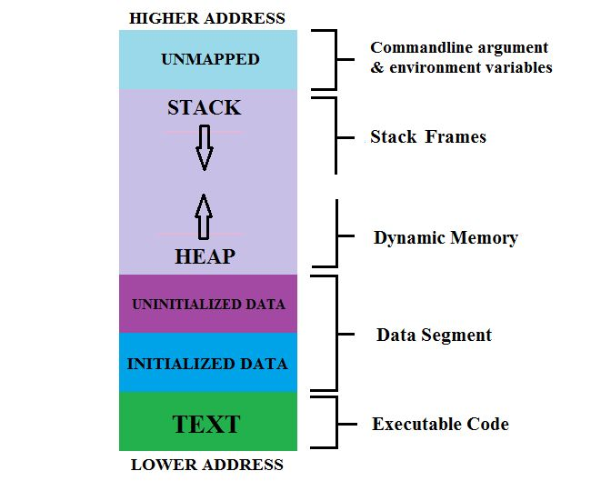

- SPI - serial peripheral interface
- I2C
- 1-wire
- USB
- Thunderbolt
- SATA
- RS-232
- RS-422
- RS-485
- RS-423
- Modbus
- EEbus
- Thread
- Matter
- TRL - test readiness level
- memory map layout (e.g for a c program) 
- Java card
- rpipins 
- Harvard Architecture
- Von Neumann Architecture
- 
