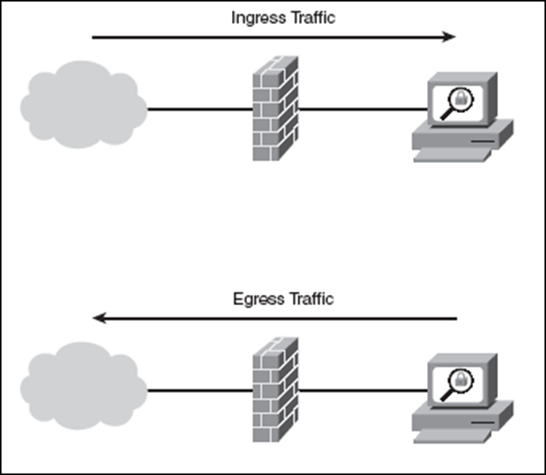

# Ingress

Ingress traffic is network traffic that originates from outside of the
network's routers and proceeds toward a destination inside of the
network. For example, an email message that is considered ingress
traffic will originate somewhere outside of a enterprise's LAN, pass
over the Internet and enter the company's LAN before it is delivered to
the recipient.

