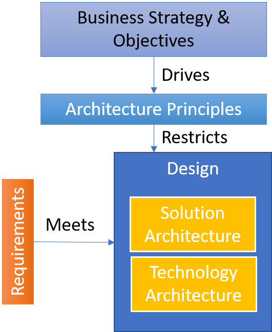

# **Arhcitectural Principles**

Overview of Architectural Principles

https://arch.simplicable.com/arch/new/7-reasons-you-need-architecture-principles
https://www.forbes.com/sites/forbestechcouncil/2020/12/01/nine-architectural-principles-to-consider-before-building-an-iot-platform/?sh=529113b52278
https://sensative.com/iot-use-cases-by-sensative/8-guiding-principles-for-iot-it-architects/
https://www.itarch.info/2020/01/it-architecture-principles.html?m=1
https://pubs.opengroup.org/architecture/togaf8-doc/arch/chap29.html#:~:text=Architecture%20principles%20define%20the%20underlying,for%20making%20future%20IT%20decisions.
https://cio-wiki.org/wiki/Architectural_Principles

---

# Why Principles

---
# Business Principles
---
## Interaction with other organizations is necessary

- Partners, customers, suppliers all need access to data and functionality
---
## Standards and interoperability is key

- Avoid vendor lock-in, avoid proprietary solutions, avoid home-cooked quick-n-dirty hacks
---
## Change is constant and fast

- Make sure you have the flexibility to adopt to new tech, new regulations, new demands
---
# Data Principles
---
## Data Security
---
## Information and Data is a strategic asset
---
## Information wants to be free

- Enable and manage the sharing and re-use of data, since data is expensive, not cost free
---
# Application Principles
---
## Requirements based change
---
# Technology Principles
---
## Secutrity be default

- Combine overall security architecture and use-case based assessments. 
Use ZeroTrust, on-premises, end-to-end encryption where appropriate

---
