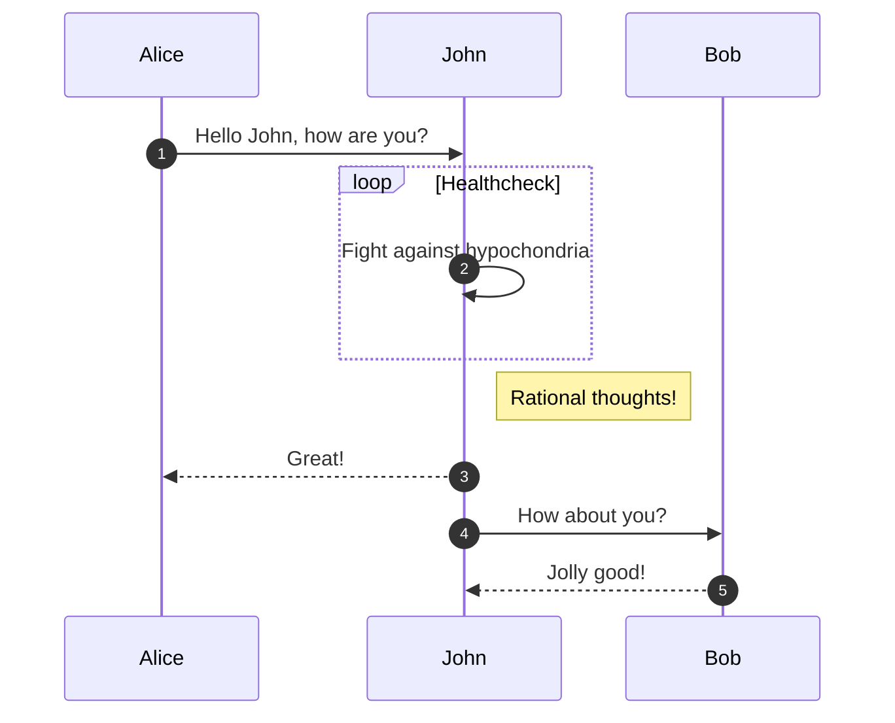
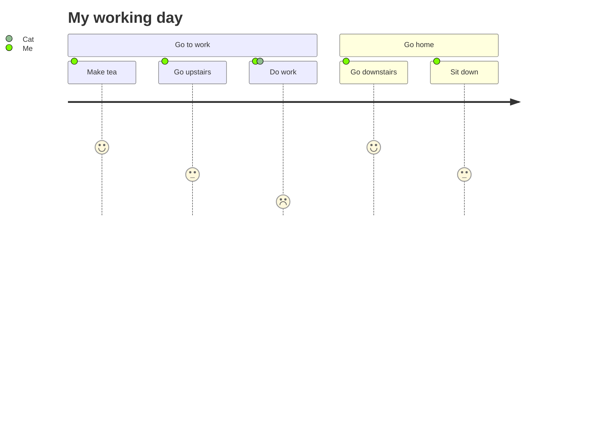

# Mermaid

## A mermaid diag in markdown

```mermaid
sequenceDiagram
   autonumber
   Alice->>John: Hello John, how are you?
   loop Healthcheck
       John->>John: Fight against hypochondria
   end
   Note right of John: Rational thoughts!
   John-->>Alice: Great!
   John->>Bob: How about you?
   Bob-->>John: Jolly good!
```

See the above diagram

```mermaid
journey
    title My working day
    section Go to work
      Make tea: 5: Me
      Go upstairs: 3: Me
      Do work: 1: Me, Cat
    section Go home
      Go downstairs: 5: Me
      Sit down: 3: Me

```
