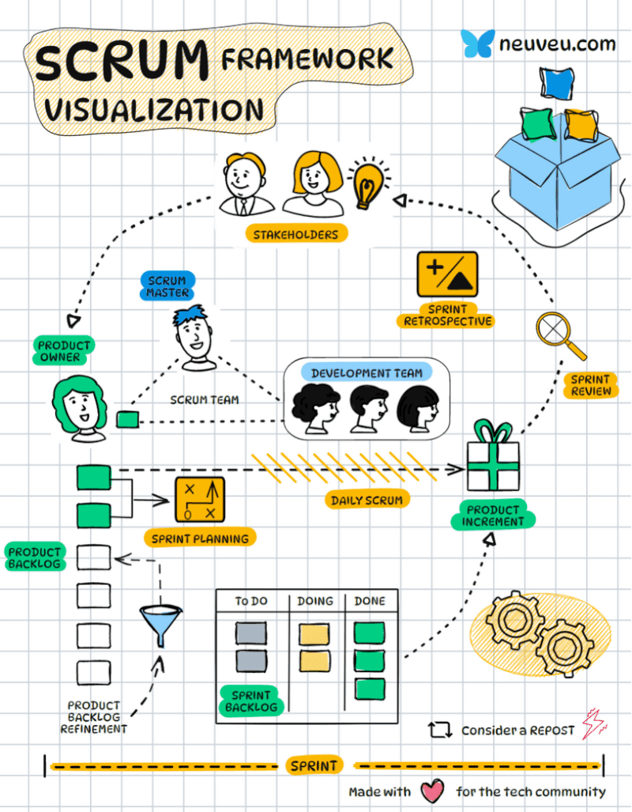

#  w

Here's a summary of Scrum framework, incorporating visuals to enhance understanding:  
  
Key Components:  
  
1\. Scrum Team:  
👉Product Owner: Manages the product backlog, prioritizes features, and communicates customer needs.  
👉Developers: Cross-functional team responsible for building the product increments.  
  
2\. Scrum Events:  
👉Sprint Planning: Team plans work for the upcoming sprint.  
👉Daily Scrum: 15-minute daily meeting for team synchronization.  
👉Sprint Review: Team demonstrates work to stakeholders and gathers feedback.  
👉Sprint Retrospective: Team reflects on the sprint and identifies improvements.  
  
3\. Scrum Artifacts:  
  
👉Product Backlog: Prioritized list of features to be developed.  
👉Increment: Potentially shippable product at the end of each sprint.  
  
Key Principles:  
  
👉Iterative Development: Work is broken down into small, time-boxed sprints.  
👉Transparency: Progress and challenges are visible to everyone.  
👉Adaptability: Teams respond quickly to change.  
👉Self-Organization: Teams manage their own work.  
👉Inspection and Adaptation: Regular feedback cycles ensure continuous improvement.  
  
Benefits:  
  
👉Improved product quality  
👉Increased customer satisfaction  
👉Faster time to market  
👉Greater team productivity  
👉Enhanced adaptability to change

